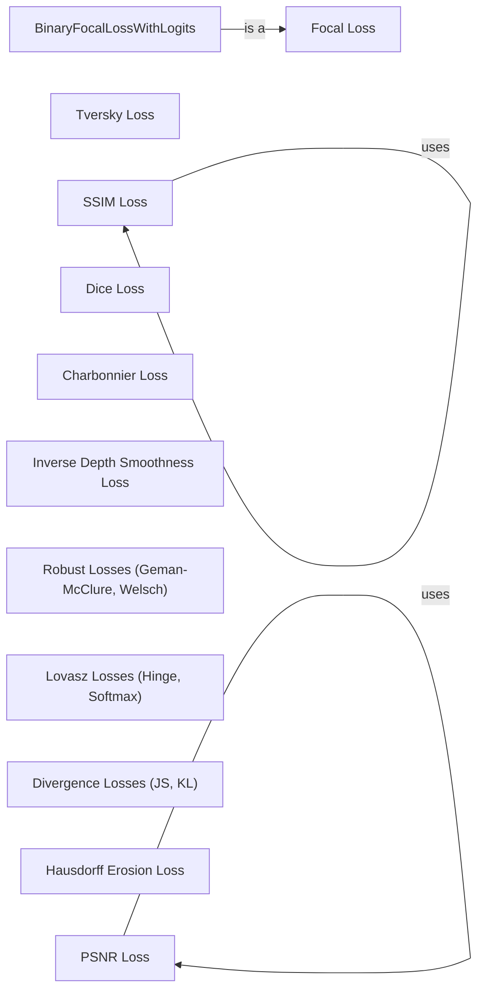

## Component Details

### SSIM Loss
This component calculates the Structural Similarity Index (SSIM) loss between two images, providing a measure of perceptual similarity. It uses a gaussian kernel to smooth the images and computes the SSIM index, which is then used to calculate the loss. The component includes both a functional form (`ssim_loss`) and a class-based implementation (`SSIMLoss`) for flexibility.
- **Related Classes/Methods**: `kornia.losses.ssim.SSIMLoss`, `kornia.metrics.ssim.ssim`

### Focal Loss
This component implements the Focal Loss, a loss function designed to address class imbalance in classification tasks. It applies a modulating term to the cross-entropy loss, focusing on misclassified examples and down-weighting the contribution of easy examples. The component includes both a functional form (`focal_loss`) and a class-based implementation (`FocalLoss`) for flexibility. It also includes `BinaryFocalLossWithLogits` for binary classification problems.
- **Related Classes/Methods**: `kornia.losses.focal.FocalLoss`

### Tversky Loss
This component calculates the Tversky loss, a generalization of the Dice loss that allows for adjusting the penalty for false positives and false negatives. It is commonly used in segmentation tasks. The component includes both a functional form (`tversky_loss`) and a class-based implementation (`TverskyLoss`) for flexibility.
- **Related Classes/Methods**: `kornia.losses.tversky.TverskyLoss`

### PSNR Loss
This component calculates the Peak Signal-to-Noise Ratio (PSNR) loss between two images. It uses the kornia.metrics.psnr module to compute the PSNR value and returns the loss. The component includes both a functional form (`psnr_loss`) and a class-based implementation (`PSNRLoss`) for flexibility.
- **Related Classes/Methods**: `kornia.losses.psnr.PSNRLoss`, `kornia.metrics.psnr.psnr`

### Dice Loss
This component calculates the Dice loss, a loss function based on the Dice coefficient, which measures the overlap between two samples. It is commonly used in segmentation tasks. The component includes both a functional form (`dice_loss`) and a class-based implementation (`DiceLoss`) for flexibility.
- **Related Classes/Methods**: `kornia.losses.dice.DiceLoss`

### Charbonnier Loss
This component calculates the Charbonnier loss, a robust loss function that is less sensitive to outliers than the squared error loss. It is often used in image processing tasks. The component includes both a functional form (`charbonnier_loss`) and a class-based implementation (`CharbonnierLoss`) for flexibility.
- **Related Classes/Methods**: `kornia.losses.charbonnier.CharbonnierLoss`

### Inverse Depth Smoothness Loss
This component calculates the inverse depth smoothness loss, a regularization term that encourages smoothness in depth maps, particularly in regions with small depth values. The component includes both a functional form (`inverse_depth_smoothness_loss`) and a class-based implementation (`InverseDepthSmoothnessLoss`) for flexibility.
- **Related Classes/Methods**: `kornia.losses.depth_smooth.InverseDepthSmoothnessLoss`

### Robust Losses (Geman-McClure, Welsch)
This component provides a collection of robust loss functions, including Geman-McClure and Welsch losses, which are less sensitive to outliers compared to the squared error loss. They are often used in regression problems. Each loss has both a functional form (e.g., `geman_mcclure_loss`) and a class-based implementation (e.g., `GemanMcclureLoss`).
- **Related Classes/Methods**: `kornia.losses.geman_mcclure.GemanMcclureLoss`, `kornia.losses.welsch.WelschLoss`

### Lovasz Losses (Hinge, Softmax)
This component implements Lovasz Hinge and Softmax losses, surrogate loss functions for the mean Intersection-Over-Union (IoU) measure. They are used for optimizing segmentation tasks, with Lovasz Hinge suitable for binary segmentation and Lovasz Softmax for multi-class segmentation. Each loss has both a functional form (e.g., `lovasz_hinge_loss`) and a class-based implementation (e.g., `LovaszHingeLoss`).
- **Related Classes/Methods**: `kornia.losses.lovasz_hinge.LovaszHingeLoss`, `kornia.losses.lovasz_softmax.LovaszSoftmaxLoss`

### Divergence Losses (JS, KL)
This component includes a set of divergence losses, such as Kullback-Leibler divergence and Jensen-Shannon divergence, used to measure the difference between two probability distributions. These losses are commonly used in tasks such as generative modeling and image registration. The component provides functional forms for each divergence loss (e.g., `js_div_loss_2d`).
- **Related Classes/Methods**: `kornia.losses.divergence.js_div_loss_2d`

### Hausdorff Erosion Loss
This component calculates the Hausdorff distance based on Erosion. It is used for optimizing segmentation tasks. The component includes both a functional form and a class-based implementation for flexibility.
- **Related Classes/Methods**: `kornia.losses.hausdorff.HausdorffERLoss`
