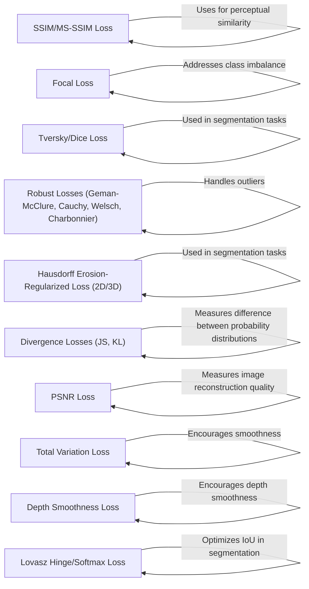

## Component Details

The `Loss Functions` component in Kornia provides a comprehensive suite of loss functions commonly used in computer vision tasks. These loss functions, implemented as both classes and standalone functions, are designed to be used with PyTorch tensors and serve as crucial components in training deep learning models. They guide the model's learning process by quantifying the difference between predicted outputs and ground truth values, enabling the optimization of model parameters to achieve desired performance.

### SSIM/MS-SSIM Loss
Calculates the Structural Similarity Index Measure (SSIM) or Multi-Scale SSIM loss between two images. SSIM focuses on perceptual similarity by considering luminance, contrast, and structure. MS-SSIM extends this to multiple scales for improved quality assessment. The losses are computed using `ssim_loss` and `MS_SSIMLoss`.
- **Related Classes/Methods**: `kornia.losses.ssim.SSIMLoss`, `kornia.losses.ssim:ssim_loss`, `kornia.losses.ms_ssim.MS_SSIMLoss`

### Focal Loss
Computes the focal loss for handling class imbalance in classification tasks. It assigns higher weights to misclassified examples, focusing training on hard-to-classify samples. It supports both multi-class and binary classification with logits via `FocalLoss` and `BinaryFocalLossWithLogits`.
- **Related Classes/Methods**: `kornia.losses.focal.FocalLoss`, `kornia.losses.focal:focal_loss`, `kornia.losses.focal.BinaryFocalLossWithLogits`, `kornia.losses.focal:binary_focal_loss_with_logits`

### Tversky/Dice Loss
Calculates the Tversky or Dice loss, commonly used in segmentation tasks to address class imbalance. These losses measure the overlap between predicted and ground truth segmentations, with Tversky loss providing more flexibility through alpha and beta parameters. The losses are computed using `tversky_loss` and `dice_loss`.
- **Related Classes/Methods**: `kornia.losses.tversky.TverskyLoss`, `kornia.losses.tversky:tversky_loss`, `kornia.losses.dice.DiceLoss`, `kornia.losses.dice:dice_loss`

### Robust Losses (Geman-McClure, Cauchy, Welsch, Charbonnier)
Provides a collection of robust loss functions that are less sensitive to outliers compared to traditional squared error loss. These losses include Geman-McClure, Cauchy, Welsch, and Charbonnier losses, each with different characteristics in handling outliers. The losses are computed using `geman_mcclure_loss`, `cauchy_loss`, `welsch_loss`, and `charbonnier_loss`.
- **Related Classes/Methods**: `kornia.losses.geman_mcclure.GemanMcclureLoss`, `kornia.losses.geman_mcclure:geman_mcclure_loss`, `kornia.losses.cauchy.CauchyLoss`, `kornia.losses.cauchy:cauchy_loss`, `kornia.losses.welsch.WelschLoss`, `kornia.losses.welsch:welsch_loss`, `kornia.losses.charbonnier.CharbonnierLoss`, `kornia.losses.charbonnier:charbonnier_loss`

### Hausdorff Erosion-Regularized Loss (2D/3D)
Calculates the Hausdorff distance-based loss, specifically the Erosion-Regularized (ER) version, for segmentation tasks. Includes 2D and 3D variants to measure the similarity between predicted and ground truth segmentations based on the Hausdorff distance, regularized by erosion operations. The loss is computed in `forward` method of `HausdorffERLoss`, `HausdorffERLoss3D` and `_HausdorffERLossBase`.
- **Related Classes/Methods**: `kornia.losses.hausdorff._HausdorffERLossBase:__init__`, `kornia.losses.hausdorff._HausdorffERLossBase:forward`, `kornia.losses.hausdorff.HausdorffERLoss:forward`, `kornia.losses.hausdorff.HausdorffERLoss3D:forward`

### Divergence Losses (JS, KL)
Includes functions for calculating Jensen-Shannon (JS) divergence and Kullback-Leibler (KL) divergence losses, used to measure the difference between two probability distributions. These losses are useful when comparing predicted probability maps with target distributions. It uses `_js_div_2d` for JS divergence calculation.
- **Related Classes/Methods**: `kornia.losses.divergence:_js_div_2d`, `kornia.losses.divergence:js_div_loss_2d`, `kornia.losses.divergence:kl_div_loss_2d`

### PSNR Loss
Calculates the Peak Signal-to-Noise Ratio (PSNR) loss, a measure of the quality of a reconstructed image compared to the original. It quantifies the amount of noise present in the reconstructed image relative to the original signal. The loss is computed using `psnr_loss` function.
- **Related Classes/Methods**: `kornia.losses.psnr.PSNRLoss`, `kornia.losses.psnr:psnr_loss`

### Total Variation Loss
Computes the total variation loss, a regularization term that encourages smoothness in images or other signals. It penalizes large differences between neighboring pixels, promoting piecewise smooth solutions. The loss is computed using `total_variation` function.
- **Related Classes/Methods**: `kornia.losses.total_variation.TotalVariation`, `kornia.losses.total_variation:total_variation`

### Depth Smoothness Loss
Computes the inverse depth smoothness loss, a regularization term used in depth estimation to encourage smoothness in the estimated depth map. It penalizes large variations in depth values between neighboring pixels, promoting smooth depth transitions. The loss is computed using `inverse_depth_smoothness_loss` function.
- **Related Classes/Methods**: `kornia.losses.depth_smooth.InverseDepthSmoothnessLoss`, `kornia.losses.depth_smooth:inverse_depth_smoothness_loss`

### Lovasz Hinge/Softmax Loss
Calculates the Lovasz hinge or softmax loss, surrogate losses for the mean Intersection-Over-Union (IoU) score, often used in semantic segmentation. These losses directly optimize for IoU, a common evaluation metric for segmentation tasks. The losses are computed using `lovasz_hinge_loss` and `lovasz_softmax_loss`.
- **Related Classes/Methods**: `kornia.losses.lovasz_hinge.LovaszHingeLoss`, `kornia.losses.lovasz_hinge:lovasz_hinge_loss`, `kornia.losses.lovasz_softmax.LovaszSoftmaxLoss`, `kornia.losses.lovasz_softmax:lovasz_softmax_loss`
