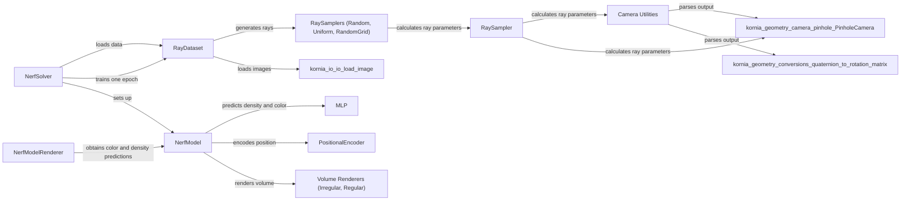

## Component Details

### RayDataset
The RayDataset is responsible for loading and processing image data to generate rays for training the NeRF model. It handles different input formats, initializes rays based on sampling strategies, and ensures data consistency. It interacts with kornia.io.io.load_image to load images and with RaySamplers to generate rays.
- **Related Classes/Methods**: `repos.kornia.kornia.nerf.data_utils.RayDataset`

### NerfModel
The NerfModel defines the neural network architecture for representing the scene. It uses positional encoding to map input 3D coordinates and viewing directions to higher-dimensional spaces, and then feeds them into an MLP to predict density and color values. It interacts with PositionalEncoder and MLP for feature extraction and prediction, and with IrregularRenderer or RegularRenderer for volume rendering.
- **Related Classes/Methods**: `repos.kornia.kornia.nerf.nerf_model.NerfModel`

### NerfModelRenderer
The NerfModelRenderer renders the scene from a given camera pose. It creates rays, samples points along the rays, and uses the NerfModel to predict the color and density at each point. It then uses a volume renderer to integrate these values and produce a final image. It interacts with the NerfModel to obtain color and density predictions.
- **Related Classes/Methods**: `repos.kornia.kornia.nerf.nerf_model.NerfModelRenderer`

### RaySampler
The RaySampler provides the base functionality for sampling rays from images. It calculates ray parameters based on camera intrinsics and extrinsics, and transforms ray parameters between world and normalized device coordinates (NDC). It interacts with camera_utils to obtain camera parameters and kornia.geometry.camera.pinhole.PinholeCamera to unproject points.
- **Related Classes/Methods**: `repos.kornia.kornia.nerf.samplers.RaySampler`

### RaySamplers (Random, Uniform, RandomGrid)
These classes (RandomRaySampler, UniformRaySampler, RandomGridRaySampler) inherit from RaySampler and implement different strategies for sampling rays from images. They generate 2D points within the image and use the base class functionality to calculate the corresponding ray parameters. They interact with RaySampler to calculate ray parameters.
- **Related Classes/Methods**: `repos.kornia.kornia.nerf.samplers.RandomRaySampler`, `repos.kornia.kornia.nerf.samplers.UniformRaySampler`, `repos.kornia.kornia.nerf.samplers.RandomGridRaySampler`

### NerfSolver
The NerfSolver manages the training process of the NeRF model. It sets up the optimizer, data loaders, and other training parameters. It also defines the training loop, which iterates over the data, computes the loss, and updates the model parameters. It interacts with the RayDataset to load data and the NerfModel to compute predictions.
- **Related Classes/Methods**: `repos.kornia.kornia.nerf.nerf_solver.NerfSolver`

### Camera Utilities
The camera utilities module provides functions for parsing COLMAP output and retrieving camera parameters. It converts COLMAP camera parameters into Kornia's PinholeCamera format. It interacts with kornia.geometry.camera.pinhole.PinholeCamera to create camera objects.
- **Related Classes/Methods**: `repos.kornia.kornia.nerf.camera_utils`

### Volume Renderers (Irregular, Regular)
These classes (IrregularRenderer, RegularRenderer) implement volume rendering using irregular or regular sampling along rays. They take as input the ray parameters, density, and color values, and integrate them to produce a final color value for each ray.
- **Related Classes/Methods**: `repos.kornia.kornia.nerf.volume_renderer.IrregularRenderer`, `repos.kornia.kornia.nerf.volume_renderer.RegularRenderer`

### PositionalEncoder
The PositionalEncoder implements positional encoding, which maps input coordinates and viewing directions to higher-dimensional spaces. This helps the NeRF model to learn high-frequency details in the scene.
- **Related Classes/Methods**: `repos.kornia.kornia.nerf.positional_encoder.PositionalEncoder`

### MLP
The MLP implements a multi-layer perceptron, which is used in the NerfModel to predict density and color values from the encoded input coordinates and viewing directions.
- **Related Classes/Methods**: `repos.kornia.kornia.nerf.nerf_model.MLP`
