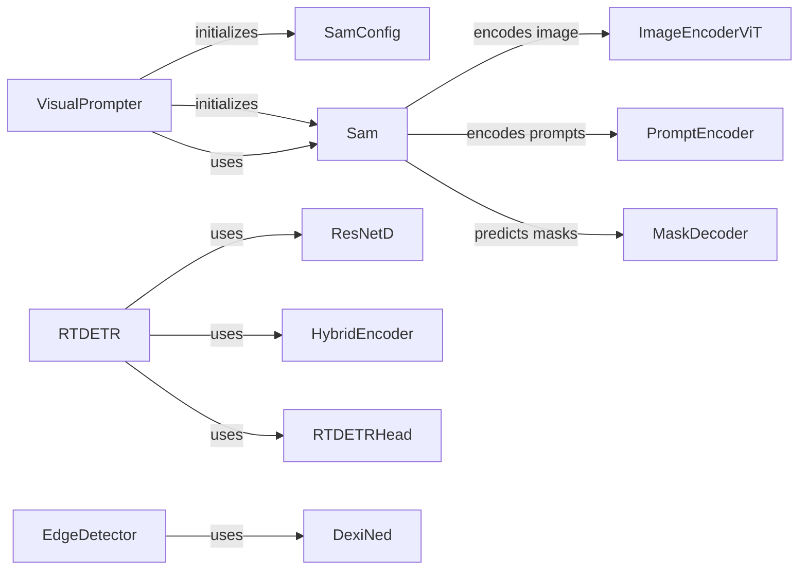

## Component Details

### VisualPrompter
The VisualPrompter class implements a visual prompting technique using SAM (Segment Anything Model) for image segmentation. It allows users to provide prompts such as keypoints, boxes, or masks to guide the segmentation process. It preprocesses the image and prompts, uses the SAM model to predict segmentation masks, and post-processes the results.
- **Related Classes/Methods**: `kornia.contrib.visual_prompter.VisualPrompter`

### Sam
The Segment Anything Model (SAM) is a foundational model for image segmentation. This component represents the SAM model and its configuration. It encodes the image, encodes the prompts, fuses the image and prompts, and predicts the masks.
- **Related Classes/Methods**: `kornia.contrib.models.sam.model.Sam`, `kornia.contrib.models.sam.model.SamConfig`

### ImageEncoderViT
The ImageEncoderViT is a Vision Transformer (ViT) based image encoder used within the SAM model. It encodes the input image into a latent representation.
- **Related Classes/Methods**: `kornia.contrib.models.sam.architecture.image_encoder.ImageEncoderViT`

### PromptEncoder
The PromptEncoder is responsible for encoding the user-provided prompts (keypoints, boxes, masks) into a format that can be used by the SAM model.
- **Related Classes/Methods**: `kornia.contrib.models.sam.architecture.prompt_encoder.PromptEncoder`

### MaskDecoder
The MaskDecoder takes the image embedding and the encoded prompts as input and predicts segmentation masks.
- **Related Classes/Methods**: `kornia.contrib.models.sam.architecture.mask_decoder.MaskDecoder`

### RTDETR
RT-DETR is a real-time object detection model. This component represents the RT-DETR model and its configuration. It uses ResNetD for feature extraction, HybridEncoder for feature fusion, and RTDETRHead for detection.
- **Related Classes/Methods**: `kornia.contrib.models.rt_detr.model.RTDETR`, `kornia.contrib.models.rt_detr.model.RTDETRConfig`

### ResNetD
ResNetD is a modified ResNet architecture used as the backbone for RT-DETR. It extracts features from the input image.
- **Related Classes/Methods**: `kornia.contrib.models.rt_detr.architecture.resnet_d.ResNetD`

### HybridEncoder
The HybridEncoder is a module within RT-DETR that combines features from different levels of the ResNetD backbone.
- **Related Classes/Methods**: `kornia.contrib.models.rt_detr.architecture.hybrid_encoder.HybridEncoder`

### RTDETRHead
The RTDETRHead is the detection head of the RT-DETR model. It predicts bounding boxes and class probabilities based on the features extracted by the backbone and encoder.
- **Related Classes/Methods**: `kornia.contrib.models.rt_detr.architecture.rtdetr_head.RTDETRHead`

### EdgeDetector
The EdgeDetector is a module for detecting edges in an image using the DexiNed model.
- **Related Classes/Methods**: `kornia.contrib.edge_detection.EdgeDetector`
