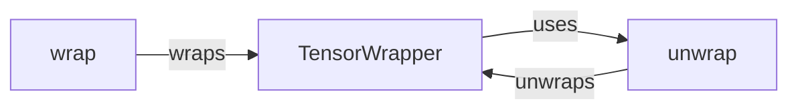

## Component Details

The Tensor Management component in Kornia provides a unified and consistent way to handle tensors across different modules. It revolves around the `TensorWrapper` class, which intercepts tensor operations and allows for custom behavior, such as device management and data type conversions. The `wrap` and `unwrap` functions facilitate the conversion between standard PyTorch tensors and `TensorWrapper` instances, ensuring seamless integration with existing PyTorch code. This system abstracts away the complexities of tensor handling, allowing developers to focus on the core computer vision algorithms.

### wrap
The `wrap` function converts a standard PyTorch tensor into a `TensorWrapper` instance. This allows Kornia to manage the tensor's device, data type, and other properties consistently throughout its operations.
- **Related Classes/Methods**: `kornia.core.tensor_wrapper:wrap`

### unwrap
The `unwrap` function extracts the underlying PyTorch tensor from a `TensorWrapper` instance. This is necessary when interacting with standard PyTorch functions that do not recognize `TensorWrapper` objects.
- **Related Classes/Methods**: `kornia.core.tensor_wrapper:unwrap`

### TensorWrapper
The `TensorWrapper` class wraps a PyTorch tensor and overrides its methods to enable custom behavior. It intercepts operations like arithmetic operations, indexing, and attribute access, allowing Kornia to manage tensors in a consistent and controlled manner. It serves as the core of the tensor management system, providing a consistent interface for tensor manipulation within Kornia.
- **Related Classes/Methods**: `kornia.core.tensor_wrapper.TensorWrapper:unwrap`, `kornia.core.tensor_wrapper.TensorWrapper:__getattr__`, `kornia.core.tensor_wrapper.TensorWrapper:__getitem__`, `kornia.core.tensor_wrapper.TensorWrapper:__torch_function__`, `kornia.core.tensor_wrapper.TensorWrapper:__add__`, `kornia.core.tensor_wrapper.TensorWrapper:__radd__`, `kornia.core.tensor_wrapper.TensorWrapper:__mul__`, `kornia.core.tensor_wrapper.TensorWrapper:__rmul__`, `kornia.core.tensor_wrapper.TensorWrapper:__sub__`, `kornia.core.tensor_wrapper.TensorWrapper:__rsub__`, `kornia.core.tensor_wrapper.TensorWrapper:__truediv__`, `kornia.core.tensor_wrapper.TensorWrapper:__floordiv__`, `kornia.core.tensor_wrapper.TensorWrapper:__ge__`, `kornia.core.tensor_wrapper.TensorWrapper:__gt__`, `kornia.core.tensor_wrapper.TensorWrapper:__lt__`, `kornia.core.tensor_wrapper.TensorWrapper:__le__`, `kornia.core.tensor_wrapper.TensorWrapper:__eq__`, `kornia.core.tensor_wrapper.TensorWrapper:__ne__`, `kornia.core.tensor_wrapper.TensorWrapper:__bool__`, `kornia.core.tensor_wrapper.TensorWrapper:__int__`, `kornia.core.tensor_wrapper.TensorWrapper:__neg__`, `kornia.core.tensor_wrapper.TensorWrapper:__unary_op__`
