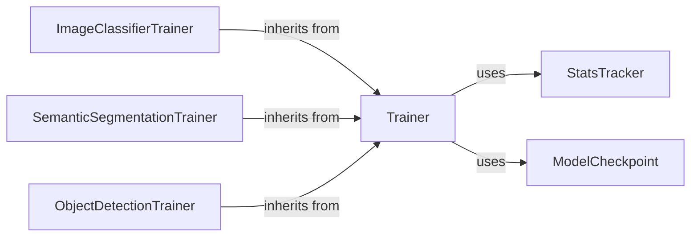

## Component Details

The Training Utilities component provides a set of high-level tools for training and evaluating deep learning models, particularly for computer vision tasks. It offers a streamlined approach to model training, simplifying experimentation with different architectures and hyperparameters. The core of this component revolves around the `Trainer` class, which encapsulates the training and evaluation loop. Specialized trainers like `ImageClassifierTrainer`, `SemanticSegmentationTrainer`, and `ObjectDetectionTrainer` extend the base `Trainer` to handle task-specific metrics and data processing. The `StatsTracker` helps monitor training progress, while `ModelCheckpoint` ensures that the best-performing models are saved.

### Trainer
The base trainer class that provides the core training and evaluation loop. It handles fitting the model over epochs and evaluating its performance. It interacts with callbacks for actions like model checkpointing and uses a stats tracker to monitor training progress.
- **Related Classes/Methods**: `kornia.x.trainer.Trainer`

### ImageClassifierTrainer
A specialized trainer for image classification tasks. It inherits from the base `Trainer` and overrides the `compute_metrics` method to calculate classification-specific metrics.
- **Related Classes/Methods**: `kornia.x.trainers.ImageClassifierTrainer`

### SemanticSegmentationTrainer
A specialized trainer for semantic segmentation tasks. It inherits from the base `Trainer` and overrides the `compute_metrics` method to calculate segmentation-specific metrics.
- **Related Classes/Methods**: `kornia.x.trainers.SemanticSegmentationTrainer`

### ObjectDetectionTrainer
A specialized trainer for object detection tasks. It inherits from the base `Trainer` and overrides the `compute_metrics` method to calculate object detection-specific metrics. It also likely handles specific data loading and preprocessing steps relevant to object detection.
- **Related Classes/Methods**: `kornia.x.trainers.ObjectDetectionTrainer`

### StatsTracker
A utility class for tracking training statistics such as loss and metrics. It provides methods for updating and retrieving these statistics, allowing for monitoring of the training process.
- **Related Classes/Methods**: `kornia.x.utils.StatsTracker`

### ModelCheckpoint
A callback that saves the model's state during training. It allows for saving the best-performing models or models at specific intervals, ensuring that progress is not lost.
- **Related Classes/Methods**: `kornia.x.callbacks.ModelCheckpoint`
