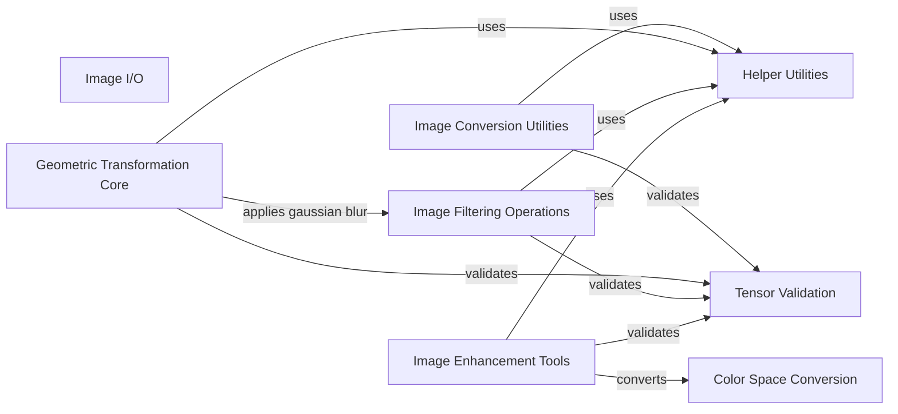

## Component Details

### Image I/O
This component handles loading and saving images in various formats. It provides functionalities to read image data from files and write image data to files, supporting formats like PNG, JPG, and others. It interacts with other components by providing image data for processing and storing processed images.
- **Related Classes/Methods**: `kornia.io.io`

### Tensor Validation
This component focuses on ensuring the validity of tensor shapes, types, and devices within Kornia's operations. It provides a set of functions to check tensor properties, ensuring data integrity and preventing unexpected errors during computation. It interacts with various other components by providing tensor validation services.
- **Related Classes/Methods**: `kornia.core.check`

### Image Conversion Utilities
This component provides a collection of utility functions for image conversion, including converting images to tensors and vice versa. It offers essential tools for data handling, image manipulation, and general-purpose operations. It interacts with other components by providing image conversion services.
- **Related Classes/Methods**: `kornia.utils.image`

### Helper Utilities
This component offers a collection of helper functions for various tasks, such as checking for autocast, inverting tensors, and other miscellaneous operations. It provides reusable utilities to simplify common tasks and improve code readability. It interacts with various other components by providing general-purpose helper functions.
- **Related Classes/Methods**: `kornia.utils.helpers`

### Geometric Transformation Core
This component provides core functionalities for geometric transformations, including affine transformations, image warping, and geometric representation conversions. It offers a set of functions to manipulate images and geometric data, enabling various image processing tasks. It interacts with components that require geometric transformations, such as image augmentation and registration.
- **Related Classes/Methods**: `kornia.geometry.transform.affwarp`, `kornia.geometry.transform.imgwarp`, `kornia.geometry.conversions`

### Image Filtering Operations
This component implements various image filtering operations, such as Gaussian blur, Canny edge detection, and other spatial filtering techniques. It provides a set of functions to enhance or extract features from images, enabling various image processing tasks. It interacts with components that require image filtering, such as image enhancement and feature extraction.
- **Related Classes/Methods**: `kornia.filters.gaussian`, `kornia.filters.kernels`, `kornia.filters.sobel`, `kornia.filters.canny`

### Image Enhancement Tools
This component provides a collection of image enhancement functions, including adjusting brightness, contrast, saturation, and other image properties. It offers a set of tools to improve the visual quality of images or highlight specific features. It interacts with components that require image enhancement, such as image preprocessing and visualization.
- **Related Classes/Methods**: `kornia.enhance.core`, `kornia.enhance.adjust`, `kornia.enhance.equalization`

### Color Space Conversion
This component provides functions for converting between different color spaces, such as RGB, grayscale, HLS, HSV, Lab, Luv, and XYZ. It offers tools for manipulating color information, enabling various image processing tasks. It interacts with components that require color space conversion, such as image enhancement and visualization.
- **Related Classes/Methods**: `kornia.color.colormap`, `kornia.color.gray`
