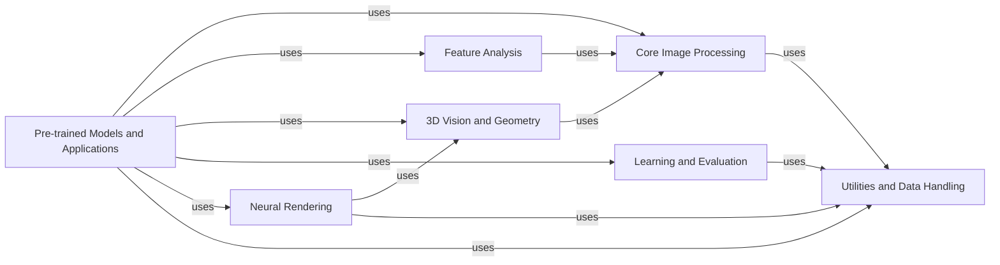

## Component Details

### Core Image Processing
This component provides fundamental image processing operations, including image transformations, filtering, enhancement, and color processing. It offers a wide range of functionalities for manipulating and improving image data, serving as the foundation for higher-level computer vision tasks. It encompasses geometric transformations, image warping, coordinate conversions, image filtering, blurring, edge detection, morphological operations, image enhancement, color space conversions, adjustments, and colormaps.
- **Related Classes/Methods**: `kornia.geometry.transform.affwarp`, `kornia.geometry.transform.imgwarp`, `kornia.geometry.transform.homography_warper`, `kornia.geometry.transform.crop2d`, `kornia.geometry.transform.pyramid`, `kornia.geometry.transform.elastic_transform`, `kornia.geometry.transform.thin_plate_spline`, `kornia.geometry.transform.flips`, `kornia.geometry.conversions`, `kornia.geometry.linalg`, `kornia.filters.blur`, `kornia.filters.canny`, `kornia.filters.sobel`, `kornia.filters.median`, `kornia.filters.gaussian`, `kornia.filters.bilateral`, `kornia.filters.motion`, `kornia.filters.laplacian`, `kornia.filters.unsharp`, `kornia.filters.dexined`, `kornia.filters.blur_pool`, `kornia.filters.in_range`, `kornia.enhance.adjust`, `kornia.enhance.normalize`, `kornia.enhance.histogram`, `kornia.enhance.jpeg`, `kornia.enhance.core`, `kornia.enhance.integral`, `kornia.enhance.zca`, `kornia.color.rgb`, `kornia.color.gray`, `kornia.color.hsv`, `kornia.color.lab`, `kornia.color.xyz`, `kornia.color.ycbcr`, `kornia.color.colormap`, `kornia.color.yuv`, `kornia.color.raw`

### Feature Analysis
This component focuses on extracting and matching distinctive features from images. It includes functionalities for detecting keypoints, describing their local neighborhoods, and establishing correspondences between different images. It plays a crucial role in tasks such as object recognition, image retrieval, and visual localization. It encompasses feature detectors and descriptors such as SIFT, GFTT, and HardNet, as well as matching algorithms like nearest neighbor matching and RANSAC.
- **Related Classes/Methods**: `kornia.feature.integrated`, `kornia.feature.scale_space_detector`, `kornia.feature.responses`, `kornia.feature.orientation`, `kornia.feature.siftdesc`, `kornia.feature.hardnet`, `kornia.feature.mkd`, `kornia.feature.affine_shape`, `kornia.feature.lightglue`, `kornia.feature.dedode`, `kornia.feature.sold2`, `kornia.feature.matching`, `kornia.feature.adalam`, `kornia.geometry.ransac`

### 3D Vision and Geometry
This component provides tools for working with camera models and performing geometric calculations related to 3D vision. It includes functionalities for perspective projection, stereo vision, epipolar geometry, and camera calibration. It is essential for tasks such as 3D reconstruction, pose estimation, and augmented reality. It encompasses camera models, epipolar geometry calculations, calibration routines, and depth estimation techniques.
- **Related Classes/Methods**: `kornia.geometry.camera`, `kornia.geometry.epipolar`, `kornia.geometry.calibration`, `kornia.geometry.depth`, `kornia.geometry.linalg`, `kornia.geometry.vector`, `kornia.geometry.plane`, `kornia.geometry.line`, `kornia.geometry.quaternion`, `kornia.geometry.boxes`

### Learning and Evaluation
This component implements a variety of loss functions and metrics commonly used in computer vision tasks. It includes losses such as SSIM loss, focal loss, Tversky loss, and depth smoothness loss, as well as metrics like PSNR. It is used to evaluate the performance of computer vision models and guide the training process.
- **Related Classes/Methods**: `kornia.losses.ssim`, `kornia.losses.focal`, `kornia.losses.tversky`, `kornia.losses.depth_smooth`, `kornia.losses.geman_mcclure`, `kornia.losses.psnr`, `kornia.losses.charbonnier`, `kornia.losses.welsch`, `kornia.losses.lovasz_hinge`, `kornia.losses.lovasz_softmax`, `kornia.losses.dice`, `kornia.losses.hausdorff`, `kornia.losses.divergence`

### Neural Rendering
This component provides tools for working with Neural Radiance Fields (NeRF), including data loading, sampling, model definition, and rendering. It supports both irregular and regular volume rendering. It enables the creation of novel views of scenes from a set of input images.
- **Related Classes/Methods**: `kornia.nerf.data_utils`, `kornia.nerf.nerf_model`, `kornia.nerf.samplers`, `kornia.nerf.nerf_solver`, `kornia.nerf.camera_utils`, `kornia.nerf.volume_renderer`, `kornia.nerf.positional_encoder`

### Pre-trained Models and Applications
This component provides pre-trained models for various computer vision tasks, including image classification, semantic segmentation, object detection, edge detection, depth estimation, and super-resolution. It offers a convenient way to leverage existing knowledge and accelerate the development of new applications.
- **Related Classes/Methods**: `kornia.models.segmentation`, `kornia.models.depth_estimation`, `kornia.models.super_resolution`, `kornia.models.detection`, `kornia.models.edge_detection`, `kornia.models._hf_models`, `kornia.models.utils`, `kornia.contrib.models`

### Utilities and Data Handling
This component provides a collection of utility functions for image processing, including image conversion, tensor manipulation, and data structure management. It also includes functions for loading and writing images in various formats. It offers essential tools for data handling, image manipulation, and general-purpose operations.
- **Related Classes/Methods**: `kornia.utils.image`, `kornia.utils.helpers`, `kornia.utils.draw`, `kornia.utils.grid`, `kornia.utils.sample`, `kornia.utils.download`, `kornia.utils._compat`, `kornia.utils.image_print`, `kornia.core.check`, `kornia.core.external`, `kornia.io.io`