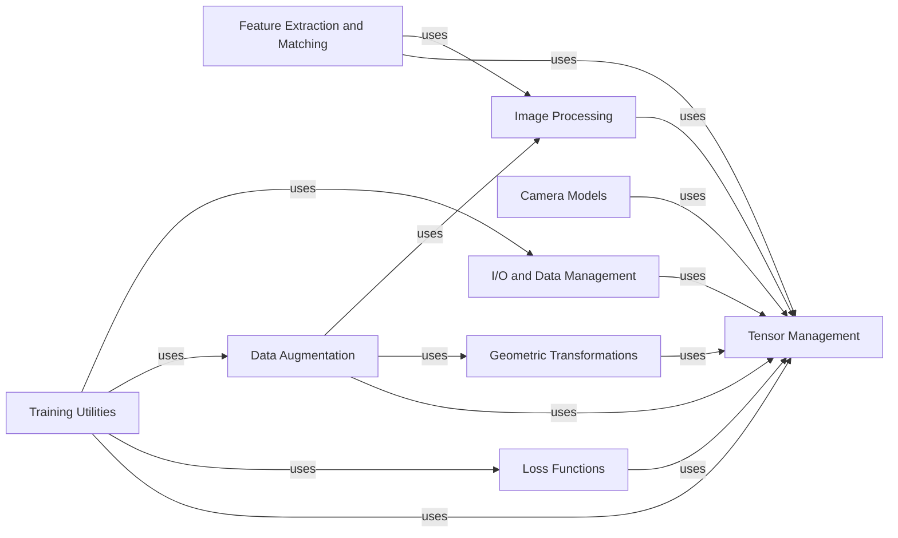

## Component Details

Kornia is a differentiable computer vision library for PyTorch. It provides a set of modules and functions that can be used to perform various computer vision tasks, such as image filtering, geometric transformations, and feature extraction. The library is designed to be used with PyTorch tensors, and it can be used to build end-to-end differentiable computer vision systems. The main flow involves processing image tensors through various modules for tasks like augmentation, transformation, feature extraction, and ultimately, training deep learning models with custom loss functions. The library aims to provide a flexible and efficient way to perform computer vision tasks in PyTorch.

### Tensor Management
This component provides a unified interface for handling tensors, ensuring compatibility and seamless integration across different Kornia modules. It abstracts away the complexities of device management, data type conversions, and input validation, allowing developers to focus on the core computer vision algorithms. It serves as the foundation for all other components, ensuring seamless integration with PyTorch's tensor operations.
- **Related Classes/Methods**: `kornia.core.tensor_wrapper`

### Image Processing
This component encompasses the core image processing functionalities, including filtering, enhancement, morphology, and color space conversions. It provides a set of differentiable operations that can be used to manipulate images represented as PyTorch tensors. It acts as the central processing unit for image-based tasks, offering a wide range of tools for image manipulation and analysis.
- **Related Classes/Methods**: `kornia.filters`, `kornia.enhance`, `kornia.morphology`, `kornia.color`

### Geometric Transformations
This component provides functionalities for performing geometric transformations on images, such as rotation, translation, scaling, and shearing. It includes functions for computing transformation matrices and warping images using these matrices. It plays a crucial role in tasks such as image registration, object tracking, and augmented reality.
- **Related Classes/Methods**: `kornia.geometry.transform`, `kornia.geometry.linalg`, `kornia.geometry.conversions`

### Camera Models
This component provides tools for working with camera models, including pinhole, orthographic, and Brown-Conrady models. It supports camera calibration, distortion, and projection/unprojection of points. It is essential for tasks such as 3D reconstruction, camera pose estimation, and augmented reality.
- **Related Classes/Methods**: `kornia.geometry.camera`, `kornia.geometry.calibration`

### Feature Extraction and Matching
This component implements various feature extraction algorithms and provides functions for matching features between images. It is used for tasks such as image matching, object recognition, and visual localization.
- **Related Classes/Methods**: `kornia.feature`

### Data Augmentation
This component provides a set of classes and functions for performing image augmentation. It includes a variety of augmentation techniques, such as geometric transformations, color jittering, and random erasing. It is used to augment images for training deep learning models, improving their generalization and robustness.
- **Related Classes/Methods**: `kornia.augmentation`

### Loss Functions
This component provides a collection of loss functions commonly used in computer vision tasks. These loss functions are designed to be used with PyTorch tensors and can be used to train deep learning models. It is a crucial part of the training pipeline, guiding the model to learn the desired task.
- **Related Classes/Methods**: `kornia.losses`

### I/O and Data Management
This component provides functions for loading and writing images and videos. It supports various image formats and can be used to load images into PyTorch tensors and write PyTorch tensors to image files. It handles the input and output of data, ensuring seamless integration with other components.
- **Related Classes/Methods**: `kornia.io`

### Training Utilities
This component provides high-level training and evaluation utilities, including trainers, callbacks, and metrics. It simplifies the process of training deep learning models for computer vision tasks. It streamlines the training process, making it easier to experiment with different models and hyperparameters.
- **Related Classes/Methods**: `kornia.x`