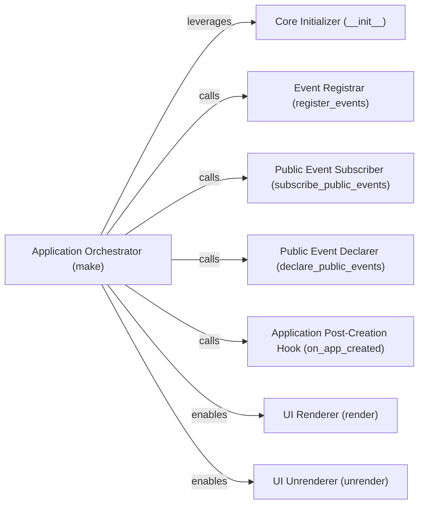

## Details

The Application Core (RAG Orchestrator) subsystem is centered around the libs.ktem.ktem.app module, which serves as the primary control plane for the entire RAG UI framework. Its boundaries are defined by the functionalities encapsulated within this module, specifically its methods responsible for initialization, orchestration, event management, and UI rendering.

### Application Orchestrator (make)
The main entry point for starting the RAG UI application. It orchestrates the entire startup sequence, ensuring all necessary components are initialized and configured, acting as the primary coordinator for the RAG pipeline flow.

**Related Classes/Methods**:

- <a href="https://github.com/Cinnamon/kotaemon/blob/main/libs/ktem/ktem/app.py" target="_blank" rel="noopener noreferrer">`libs.ktem.ktem.app:make`</a>

### Core Initializer (__init__)
Initializes the fundamental components of the RAG application, including extensions, data indexing, and reasoning modules. This is where the various pluggable RAG pipeline stages are set up and registered.

**Related Classes/Methods**:

- <a href="https://github.com/Cinnamon/kotaemon/blob/main/libs/ktem/ktem/app.py" target="_blank" rel="noopener noreferrer">`libs.ktem.ktem.app:__init__`</a>

### Public Event Declarer (declare_public_events)
Manages the eventing system within the application by defining and making events available for communication and coordination across different RAG pipeline stages and extensions.

**Related Classes/Methods**:

- <a href="https://github.com/Cinnamon/kotaemon/blob/main/libs/ktem/ktem/app.py" target="_blank" rel="noopener noreferrer">`libs.ktem.ktem.app:declare_public_events`</a>

### Public Event Subscriber (subscribe_public_events)
Manages the eventing system within the application by handling subscriptions for events that facilitate communication and coordination across different RAG pipeline stages and extensions.

**Related Classes/Methods**:

- <a href="https://github.com/Cinnamon/kotaemon/blob/main/libs/ktem/ktem/app.py" target="_blank" rel="noopener noreferrer">`libs.ktem.ktem.app:subscribe_public_events`</a>

### Event Registrar (register_events)
Manages the eventing system within the application by registering events that facilitate communication and coordination across different RAG pipeline stages and extensions.

**Related Classes/Methods**:

- <a href="https://github.com/Cinnamon/kotaemon/blob/main/libs/ktem/ktem/app.py" target="_blank" rel="noopener noreferrer">`libs.ktem.ktem.app:register_events`</a>

### Application Post-Creation Hook (on_app_created)
Executes specific tasks immediately after the RAG application has been fully initialized. This allows for final configurations, service startups, or any actions that depend on the complete application state.

**Related Classes/Methods**:

- <a href="https://github.com/Cinnamon/kotaemon/blob/main/libs/ktem/ktem/app.py" target="_blank" rel="noopener noreferrer">`libs.ktem.ktem.app:on_app_created`</a>

### UI Renderer (render)
Handles the display and update of the RAG application's user interface, making the RAG pipeline accessible to users.

**Related Classes/Methods**:

- <a href="https://github.com/Cinnamon/kotaemon/blob/main/libs/ktem/ktem/app.py" target="_blank" rel="noopener noreferrer">`libs.ktem.ktem.app:render`</a>

### UI Unrenderer (unrender)
Manages the removal and cleanup of UI components, ensuring proper resource management when the UI is no longer needed or is being reconfigured.

**Related Classes/Methods**:

- <a href="https://github.com/Cinnamon/kotaemon/blob/main/libs/ktem/ktem/app.py" target="_blank" rel="noopener noreferrer">`libs.ktem.ktem.app:unrender`</a>

### [FAQ](https://github.com/CodeBoarding/GeneratedOnBoardings/tree/main?tab=readme-ov-file#faq)