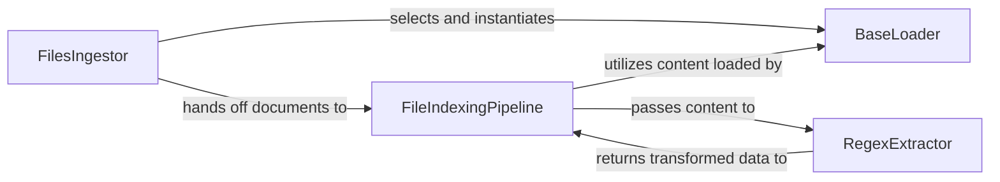

## Details

The `Document Ingestion & Processing` subsystem is responsible for the complete lifecycle of bringing raw documents into the system. This includes loading documents from various sources, parsing their content, chunking them into manageable segments, and transforming them into a suitable format for subsequent indexing, embedding, and retrieval within the RAG framework.

### BaseLoader
Defines the abstract interface (`load_data`) for all document loaders. It provides a standardized contract for reading and extracting raw content from various document sources (e.g., PDF, DOCX, web pages). This component is fundamental for the framework's extensibility, allowing new document types and loading mechanisms to be seamlessly integrated.

**Related Classes/Methods**:

- <a href="https://github.com/Cinnamon/kotaemon/blob/main/libs/kotaemon/kotaemon/loaders/base.py" target="_blank" rel="noopener noreferrer">`kotaemon.loaders.base.BaseLoader`</a>

### FilesIngestor
Acts as the initial entry point for file-based document ingestion. Its primary role is to identify and obtain the correct `BaseLoader` implementation (`_get_reader`) for a given file path or URL, initiating the loading process. It serves as a dispatcher for incoming files, abstracting the specific loading mechanism.

**Related Classes/Methods**:

- <a href="https://github.com/Cinnamon/kotaemon/blob/main/libs/kotaemon/kotaemon/indices/ingests/files.py" target="_blank" rel="noopener noreferrer">`kotaemon.indices.ingests.files.FilesIngestor`</a>

### FileIndexingPipeline
This is the central orchestrator of the document processing flow within the ingestion subsystem. It takes raw or loaded documents (from `FilesIngestor` or other sources), determines the appropriate processing path (`route`), handles document chunking (breaking down large documents into smaller, manageable segments), and directs the processed data to be stored in vector and document stores. It also manages file/URL input and deletion. This component embodies the core "Application Core / RAG Orchestration Layer" specifically for the ingestion phase, aligning with the pipeline architectural pattern.

**Related Classes/Methods**:

- <a href="https://github.com/Cinnamon/kotaemon/blob/main/libs/ktem/ktem/index/file/pipelines.py" target="_blank" rel="noopener noreferrer">`ktem.index.file.pipelines.FileIndexingPipeline`</a>

### RegexExtractor
Focuses on parsing and transforming the content extracted by loaders. It utilizes regular expressions to identify and extract specific patterns or information from the raw text, transforming it into a more structured format suitable for further processing, such as chunking or embedding. This is a specialized "Data Processing" component within the ingestion pipeline.

**Related Classes/Methods**:

- <a href="https://github.com/Cinnamon/kotaemon/blob/main/libs/kotaemon/kotaemon/indices/extractors/doc_parsers.py" target="_blank" rel="noopener noreferrer">`kotaemon.indices.extractors.doc_parsers.RegexExtractor`</a>

### [FAQ](https://github.com/CodeBoarding/GeneratedOnBoardings/tree/main?tab=readme-ov-file#faq)