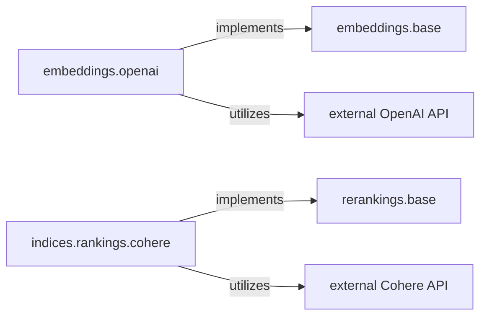

## Details

The `kotaemon` project's embedding and reranking subsystem is designed with a strong emphasis on modularity and external service integration, crucial for a flexible Retrieval-Augmented Generation (RAG) framework. At its core, the system defines abstract interfaces, `embeddings.base` and `rerankings.base`, which establish contracts for various embedding models and reranking algorithms, respectively. Concrete implementations, such as `embeddings.openai` and `indices.rankings.cohere`, extend these interfaces to integrate with external AI services like the `external OpenAI API` for embeddings and the `external Cohere API` for reranking. This architecture allows for easy interchangeability of providers, enabling the system to adapt to evolving AI models and optimize retrieval performance without significant changes to the core RAG pipeline.

### embeddings.base
This abstract component defines the interface for all embedding models within the `kotaemon` framework. It ensures that various embedding providers can be integrated seamlessly, adhering to the "Modular/Plugin Architecture" principle.

**Related Classes/Methods**:

- <a href="https://github.com/Cinnamon/kotaemon/blob/main/libs/kotaemon/kotaemon/embeddings/base.py" target="_blank" rel="noopener noreferrer">`kotaemon.embeddings.base`</a>

### rerankings.base
This abstract component establishes the interface for different reranking algorithms. It enables the flexible integration of various reranking strategies, crucial for optimizing retrieval relevance in a RAG system, aligning with the "Modular/Plugin Architecture."

**Related Classes/Methods**:

- <a href="https://github.com/Cinnamon/kotaemon/blob/main/libs/kotaemon/kotaemon/rerankings/base.py" target="_blank" rel="noopener noreferrer">`kotaemon.rerankings.base`</a>

### embeddings.openai
A concrete implementation of the `embeddings.base` interface, specifically designed to interact with the external OpenAI API for generating embeddings. This component exemplifies the "External Service Integration Layer" by providing a bridge to a widely used external AI service.

**Related Classes/Methods**:

- <a href="https://github.com/Cinnamon/kotaemon/blob/main/libs/kotaemon/kotaemon/embeddings/openai.py" target="_blank" rel="noopener noreferrer">`kotaemon.embeddings.openai`</a>

### indices.rankings.cohere
A concrete implementation of the `rerankings.base` interface, responsible for integrating with the external Cohere API to perform document reranking. This component highlights the system's capability to leverage specialized external services for enhancing retrieval quality, reinforcing the "Modular/Plugin Architecture" and "External Service Integration Layer."

**Related Classes/Methods**:

- <a href="https://github.com/Cinnamon/kotaemon/blob/main/libs/kotaemon/kotaemon/indices/rankings/cohere.py" target="_blank" rel="noopener noreferrer">`kotaemon.indices.rankings.cohere`</a>

### external OpenAI API
Represents the external OpenAI API service, which provides embedding generation capabilities. This is an external dependency utilized by the `embeddings.openai` component.

**Related Classes/Methods**: _None_

### external Cohere API
Represents the external Cohere API service, which offers document re-ranking functionalities. This is an external dependency utilized by the `indices.rankings.cohere` component.

**Related Classes/Methods**: _None_

### [FAQ](https://github.com/CodeBoarding/GeneratedOnBoardings/tree/main?tab=readme-ov-file#faq)