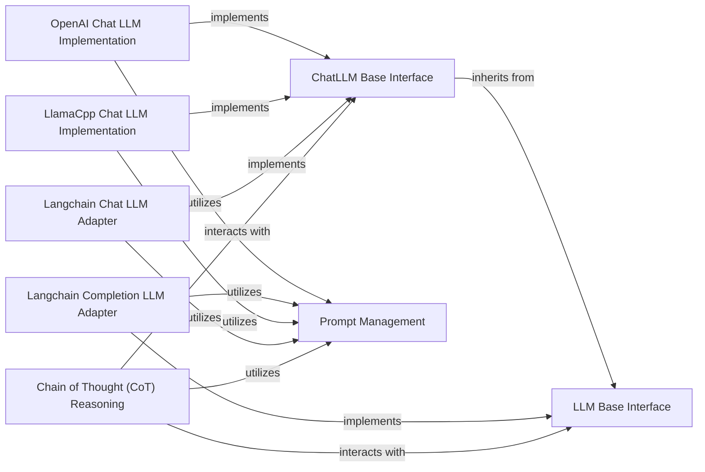

## Details

The `LLM Service` subsystem is a critical part of the `kotaemon` project, providing a flexible and standardized way to interact with various Large Language Models. It aligns perfectly with the project's architectural bias towards a highly configurable and extensible RAG pipeline, allowing different LLM implementations to be easily swapped. The subsystem is primarily defined by the `libs.kotaemon.kotaemon.llms` package, including core interfaces for LLM interaction, prompt management utilities, and concrete implementations/adapters for various LLM providers.

### LLM Base Interface
Defines the foundational abstract interface (`run`, `invoke`) for all Large Language Model interactions, ensuring a standardized contract for different LLM types (e.g., chat, completion). This is crucial for the modularity of the RAG framework, allowing different LLM implementations to be swapped in and out.

**Related Classes/Methods**:

- <a href="https://github.com/Cinnamon/kotaemon/blob/main/libs/kotaemon/kotaemon/llms/base.py#L1-L100" target="_blank" rel="noopener noreferrer">`kotaemon.llms.base.LLM`:1-100</a>

### ChatLLM Base Interface
Extends the base `LLM` interface specifically for chat-based interactions, managing conversational context and message roles. This supports the interactive nature of a RAG UI and provides a specialized contract for chat models.

**Related Classes/Methods**:

- <a href="https://github.com/Cinnamon/kotaemon/blob/main/libs/kotaemon/kotaemon/llms/chats/base.py#L11-L22" target="_blank" rel="noopener noreferrer">`kotaemon.llms.chats.base.ChatLLM`:11-22</a>

### Prompt Management
Manages the creation, validation, and population of LLM prompts using templating. This component is vital for dynamically constructing queries and instructions for the LLM within a RAG pipeline, ensuring consistent and effective communication with the models.

**Related Classes/Methods**:

- <a href="https://github.com/Cinnamon/kotaemon/blob/main/libs/kotaemon/kotaemon/llms/prompts/base.py#L1-L100" target="_blank" rel="noopener noreferrer">`kotaemon.llms.prompts.base.Prompt`:1-100</a>

### OpenAI Chat LLM Implementation
Provides a concrete implementation for integrating with OpenAI's chat models, adhering to the `ChatLLM Base Interface`. It handles model-specific configurations, API calls, message formatting, and response parsing, exemplifying the plugin architecture for LLM integration.

**Related Classes/Methods**:

- <a href="https://github.com/Cinnamon/kotaemon/blob/main/libs/kotaemon/kotaemon/llms/chats/openai.py#L1-L100" target="_blank" rel="noopener noreferrer">`kotaemon.llms.chats.openai.OpenAIChatLLM`:1-100</a>

### Langchain Completion LLM Adapter
Adapts Langchain's completion models to adhere to the `LLM Base Interface`. This component facilitates the integration of a wide range of Langchain-supported completion models into the `kotaemon` framework, showcasing the system's extensibility.

**Related Classes/Methods**:

- <a href="https://github.com/Cinnamon/kotaemon/blob/main/libs/kotaemon/kotaemon/llms/completions/langchain_based.py#L1-L100" target="_blank" rel="noopener noreferrer">`kotaemon.llms.completions.langchain_based.LangchainCompletionLLM`:1-100</a>

### Langchain Chat LLM Adapter
Adapts Langchain's chat models to adhere to the `ChatLLM Base Interface`. Similar to its completion counterpart, this adapter allows for seamless integration of Langchain-supported chat models, reinforcing the modular design.

**Related Classes/Methods**:

- <a href="https://github.com/Cinnamon/kotaemon/blob/main/libs/kotaemon/kotaemon/llms/chats/langchain_based.py#L1-L100" target="_blank" rel="noopener noreferrer">`kotaemon.llms.chats.langchain_based.LangchainChatLLM`:1-100</a>

### LlamaCpp Chat LLM Implementation
Provides a concrete implementation for integrating with LlamaCpp models, adhering to the `ChatLLM Base Interface`. This component is crucial for supporting local or self-hosted LLMs, aligning with the project's flexibility in deployment environments.

**Related Classes/Methods**:

- <a href="https://github.com/Cinnamon/kotaemon/blob/main/libs/kotaemon/kotaemon/llms/chats/llamacpp.py#L1-L100" target="_blank" rel="noopener noreferrer">`kotaemon.llms.chats.llamacpp.LlamaCppChatLLM`:1-100</a>

### Chain of Thought (CoT) Reasoning
Orchestrates multi-step reasoning processes by iteratively interacting with an LLM (via the `LLM Base Interface` or `ChatLLM Base Interface`) and leveraging `Prompt Management` to guide the LLM's thought process. This component represents a higher-level abstraction for complex LLM interactions.

**Related Classes/Methods**:

- <a href="https://github.com/Cinnamon/kotaemon/blob/main/libs/kotaemon/kotaemon/llms/cot.py#L1-L100" target="_blank" rel="noopener noreferrer">`kotaemon.llms.cot.ChainOfThought`:1-100</a>

### [FAQ](https://github.com/CodeBoarding/GeneratedOnBoardings/tree/main?tab=readme-ov-file#faq)