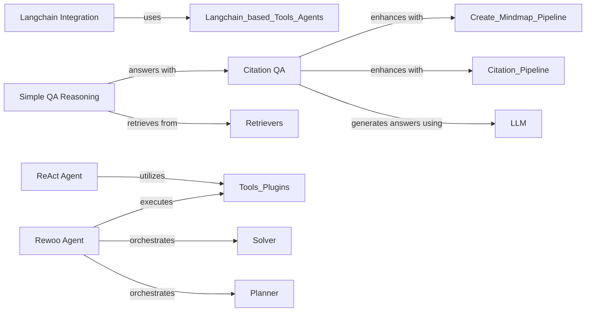

## Details

The kotaemon agent and reasoning subsystem provides a flexible framework for intelligent question answering and problem-solving, leveraging various AI paradigms. At its core, it offers specialized agents like the ReAct Agent for iterative "thought-action" processes and the Rewoo Agent for structured, parallelized planning and execution. The Langchain Integration component extends these capabilities by allowing seamless incorporation of external Langchain-based agents and tools. For robust information retrieval and synthesis, the Simple QA Reasoning pipeline orchestrates document retrieval and answer generation. This pipeline is significantly enhanced by the Citation QA component, which ensures answers are verifiable by providing direct citations from the source material, and can also generate mindmaps for better understanding. These components collectively enable the system to handle diverse queries, from simple information retrieval to complex multi-step reasoning, with an emphasis on transparency and accuracy.

### Langchain Integration
Provides an integration point for Langchain-based agents and tools within the `kotaemon` ecosystem. It acts as a bridge, allowing the system to leverage the extensive range of agents and tools available in Langchain. This component is vital for extensibility, allowing the RAG framework to incorporate diverse external agentic capabilities.

**Related Classes/Methods**:

- <a href="https://github.com/Cinnamon/kotaemon/blob/main/libs/kotaemon/kotaemon/agents/langchain_based.py#L14-L79" target="_blank" rel="noopener noreferrer">`libs.kotaemon.kotaemon.agents.langchain_based.LangchainAgent`:14-79</a>

### ReAct Agent
Implements the ReAct (Reasoning and Acting) agentic pattern. This involves an iterative process of thought, action (tool usage), and observation to solve complex problems and generate responses. It's a core reasoning pattern for complex, multi-step query processing.

**Related Classes/Methods**:

- <a href="https://github.com/Cinnamon/kotaemon/blob/main/libs/kotaemon/kotaemon/agents/react/agent.py#L18-L345" target="_blank" rel="noopener noreferrer">`libs.kotaemon.kotaemon.agents.react.agent.ReactAgent`:18-345</a>

### Rewoo Agent
Implements the Rewoo (Reasoning and Working) agentic pattern, which separates the planning (reasoning) phase from the execution (working) phase. It uses specialized "workers" for different tasks, offering a structured approach to complex problem-solving.

**Related Classes/Methods**:

- <a href="https://github.com/Cinnamon/kotaemon/blob/main/libs/kotaemon/kotaemon/agents/rewoo/agent.py#L22-L384" target="_blank" rel="noopener noreferrer">`libs.kotaemon.kotaemon.agents.rewoo.agent.RewooAgent`:22-384</a>

### Simple QA Reasoning
Provides a foundational, straightforward question-answering reasoning flow. This often involves direct information retrieval and potentially breaking down questions into sub-questions for simpler processing. It serves as a baseline or a component for less complex queries.

**Related Classes/Methods**:

- <a href="https://github.com/Cinnamon/kotaemon/blob/main/libs/ktem/ktem/reasoning/simple.py#L86-L484" target="_blank" rel="noopener noreferrer">`libs.ktem.ktem.reasoning.simple.FullQAPipeline`:86-484</a>

### Citation QA
Extends the basic QA functionality provided by `ktem.reasoning.simple` by ensuring that generated answers are directly supported by citations from the retrieved documents. This significantly enhances the trustworthiness and verifiability of the answers, which is critical for a robust RAG system.

**Related Classes/Methods**:

- <a href="https://github.com/Cinnamon/kotaemon/blob/main/libs/kotaemon/kotaemon/indices/qa/citation_qa.py#L83-L403" target="_blank" rel="noopener noreferrer">`libs.kotaemon.kotaemon.indices.qa.citation_qa.AnswerWithContextPipeline`:83-403</a>

### [FAQ](https://github.com/CodeBoarding/GeneratedOnBoardings/tree/main?tab=readme-ov-file#faq)