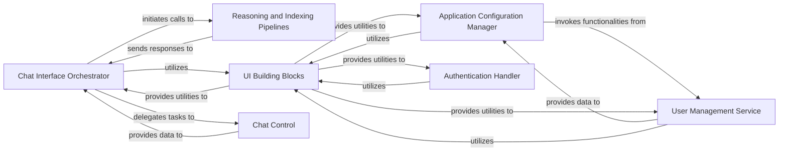

## Details

The `PromptUI` subsystem of `kotaemon` provides a comprehensive user interface for interacting with RAG capabilities. At its core, the `Chat Interface Orchestrator` manages the conversational flow, seamlessly integrating with the `Reasoning and Indexing Pipelines` to process queries and generate intelligent responses. User and application settings are handled by the `Application Configuration Manager`, which collaborates with the `User Management Service` for user-specific configurations. The `Authentication Handler` secures access to the application. A shared set of `UI Building Blocks` ensures a consistent and efficient user experience across all interactive components, while `Chat Control` assists the orchestrator in managing conversation states. This modular design facilitates clear separation of concerns, enabling robust and scalable RAG application development.

### Chat Interface Orchestrator
Manages the core chat user interface, including displaying conversation history, handling user input, submitting messages, and orchestrating interactions with the underlying reasoning and indexing pipelines. It also manages chat-related data persistence and user feedback.

**Related Classes/Methods**:

- <a href="https://github.com/Cinnamon/kotaemon/blob/main/libs/ktem/ktem/pages/chat" target="_blank" rel="noopener noreferrer">`libs.ktem.ktem.pages.chat`</a>

### Reasoning and Indexing Pipelines
Encapsulates the core logic for Retrieval-Augmented Generation (RAG) operations. This includes various reasoning strategies (e.g., ReWOO, React, Simple) for processing user queries and generating responses, as well as data indexing pipelines responsible for managing and retrieving information from various sources.

**Related Classes/Methods**:

- <a href="https://github.com/Cinnamon/kotaemon/blob/main/libs/ktem/ktem/reasoning" target="_blank" rel="noopener noreferrer">`libs.ktem.ktem.reasoning`</a>

### Application Configuration Manager
Manages the application's settings interface, allowing users to configure various parameters related to the application, reasoning pipelines, and data indexing. It handles the loading and saving of these settings.

**Related Classes/Methods**:

- <a href="https://github.com/Cinnamon/kotaemon/blob/main/libs/ktem/ktem/pages/settings.py" target="_blank" rel="noopener noreferrer">`libs.ktem.ktem.pages.settings`</a>

### Authentication Handler
Handles user authentication processes, including rendering the login user interface, processing user credentials, and managing the visibility of login-related elements.

**Related Classes/Methods**:

- <a href="https://github.com/Cinnamon/kotaemon/blob/main/libs/ktem/ktem/pages/login.py" target="_blank" rel="noopener noreferrer">`libs.ktem.ktem.pages.login`</a>

### User Management Service
Manages user account lifecycle within the application, including functionalities for creating, listing, selecting, updating, and deleting user accounts.

**Related Classes/Methods**:

- <a href="https://github.com/Cinnamon/kotaemon/blob/main/libs/ktem/ktem/pages/resources/user.py" target="_blank" rel="noopener noreferrer">`libs.ktem.ktem.pages.resources.user`</a>

### UI Building Blocks
Provides foundational and reusable Gradio UI components and event handling mechanisms. It abstracts common UI patterns, enabling consistent and efficient development of interactive elements across the PromptUI.

**Related Classes/Methods**:

- <a href="https://github.com/Cinnamon/kotaemon/blob/main/libs/kotaemon/kotaemon/contribs/promptui/ui/blocks.py" target="_blank" rel="noopener noreferrer">`kotaemon.contribs.promptui.ui.blocks`</a>

### Chat Control
Manages specific conversation state management tasks and provides utilities for the `Chat Interface Orchestrator`.

**Related Classes/Methods**:

- <a href="https://github.com/Cinnamon/kotaemon/blob/main/libs/ktem/ktem/pages/chat/control.py" target="_blank" rel="noopener noreferrer">`libs.ktem.ktem.pages.chat.control`</a>

### [FAQ](https://github.com/CodeBoarding/GeneratedOnBoardings/tree/main?tab=readme-ov-file#faq)