```mermaid
graph LR
    User_Interface_PromptUI_["User Interface (PromptUI)"]
    Application_Core_RAG_Orchestrator_["Application Core (RAG Orchestrator)"]
    Document_Ingestion_Processing["Document Ingestion & Processing"]
    Embedding_Reranking_Service["Embedding & Reranking Service"]
    Knowledge_Base_Vector_Document_Stores_["Knowledge Base (Vector & Document Stores)"]
    Reasoning_Engine_Agentic_Layer_["Reasoning Engine (Agentic Layer)"]
    LLM_Service["LLM Service"]
    User_Interface_PromptUI_ -- "User Query/Configuration Submission" --> Application_Core_RAG_Orchestrator_
    Application_Core_RAG_Orchestrator_ -- "Display Response/Status" --> User_Interface_PromptUI_
    Application_Core_RAG_Orchestrator_ -- "Initiate Document Ingestion" --> Document_Ingestion_Processing
    Document_Ingestion_Processing -- "Send Documents for Embedding" --> Embedding_Reranking_Service
    Embedding_Reranking_Service -- "Store Embeddings & Documents" --> Knowledge_Base_Vector_Document_Stores_
    Application_Core_RAG_Orchestrator_ -- "Forward User Query" --> Reasoning_Engine_Agentic_Layer_
    Reasoning_Engine_Agentic_Layer_ -- "Retrieve Relevant Documents" --> Knowledge_Base_Vector_Document_Stores_
    Knowledge_Base_Vector_Document_Stores_ -- "Send Retrieved Documents for Re-ranking" --> Embedding_Reranking_Service
    Embedding_Reranking_Service -- "Provide Re-ranked Context" --> Reasoning_Engine_Agentic_Layer_
    Reasoning_Engine_Agentic_Layer_ -- "Send Prompt for Generation" --> LLM_Service
    LLM_Service -- "Return Generated Response" --> Reasoning_Engine_Agentic_Layer_
    click User_Interface_PromptUI_ href "https://github.com/CodeBoarding/GeneratedOnBoardings/blob/main/kotaemon/User_Interface_PromptUI_.md" "Details"
    click Application_Core_RAG_Orchestrator_ href "https://github.com/CodeBoarding/GeneratedOnBoardings/blob/main/kotaemon/Application_Core_RAG_Orchestrator_.md" "Details"
    click Document_Ingestion_Processing href "https://github.com/CodeBoarding/GeneratedOnBoardings/blob/main/kotaemon/Document_Ingestion_Processing.md" "Details"
    click Embedding_Reranking_Service href "https://github.com/CodeBoarding/GeneratedOnBoardings/blob/main/kotaemon/Embedding_Reranking_Service.md" "Details"
    click Reasoning_Engine_Agentic_Layer_ href "https://github.com/CodeBoarding/GeneratedOnBoardings/blob/main/kotaemon/Reasoning_Engine_Agentic_Layer_.md" "Details"
    click LLM_Service href "https://github.com/CodeBoarding/GeneratedOnBoardings/blob/main/kotaemon/LLM_Service.md" "Details"
```

## Details

The Kotaemon RAG system is structured around a clear separation of concerns, facilitating modularity and scalability. The User Interface (PromptUI) serves as the primary interaction point, allowing users to submit queries and configure the system. These interactions are managed by the Application Core (RAG Orchestrator), which acts as the central control plane, directing requests to the appropriate downstream components. For document processing, the Document Ingestion & Processing component handles the loading, parsing, and chunking of raw data. This processed data is then passed to the Embedding & Reranking Service to generate vector representations and refine document relevance. Both raw documents and their embeddings are persistently stored in the Knowledge Base (Vector & Document Stores). User queries requiring intelligent responses are routed to the Reasoning Engine (Agentic Layer), which leverages the Knowledge Base for retrieval and the LLM Service for generating comprehensive answers. This architecture ensures a streamlined data flow from user input to intelligent response generation, with distinct components handling specialized tasks.

### User Interface (PromptUI) [[Expand]](./User_Interface_PromptUI_.md)
The primary user-facing web application built with Gradio, providing an interactive interface for chat, pipeline configuration, and system settings. It acts as the client for the RAG services.

**Related Classes/Methods**:

- <a href="https://github.com/Cinnamon/kotaemon/blob/main/libs/ktem/ktem/pages/chat" target="_blank" rel="noopener noreferrer">`libs.ktem.ktem.pages.chat`</a>
- <a href="https://github.com/Cinnamon/kotaemon/blob/main/libs/kotaemon/kotaemon/contribs/promptui/ui/blocks.py" target="_blank" rel="noopener noreferrer">`libs.kotaemon.kotaemon.contribs.promptui.ui.blocks`</a>
- <a href="https://github.com/Cinnamon/kotaemon/blob/main/libs/ktem/ktem/pages/settings.py" target="_blank" rel="noopener noreferrer">`libs.ktem.ktem.pages.settings`</a>
- <a href="https://github.com/Cinnamon/kotaemon/blob/main/libs/ktem/ktem/pages/login.py" target="_blank" rel="noopener noreferrer">`libs.ktem.ktem.pages.login`</a>
- <a href="https://github.com/Cinnamon/kotaemon/blob/main/libs/ktem/ktem/pages/resources/user.py" target="_blank" rel="noopener noreferrer">`libs.ktem.ktem.pages.resources.user`</a>

### Application Core (RAG Orchestrator) [[Expand]](./Application_Core_RAG_Orchestrator_.md)
The central component responsible for initializing, registering, and coordinating all RAG pipeline modules and services. It acts as the main entry point for user requests and orchestrates the flow through the RAG pipeline.

**Related Classes/Methods**:

- <a href="https://github.com/Cinnamon/kotaemon/blob/main/libs/ktem/ktem/app.py" target="_blank" rel="noopener noreferrer">`libs.ktem.ktem.app`</a>

### Document Ingestion & Processing [[Expand]](./Document_Ingestion_Processing.md)
Handles the entire process of loading, parsing, chunking, and preparing raw documents from various sources for indexing. This includes reading different file types, extracting content, and transforming it into a suitable format for embedding.

**Related Classes/Methods**:

- <a href="https://github.com/Cinnamon/kotaemon/blob/main/libs/kotaemon/kotaemon/loaders/base.py" target="_blank" rel="noopener noreferrer">`libs.kotaemon.kotaemon.loaders.base`</a>
- <a href="https://github.com/Cinnamon/kotaemon/blob/main/libs/ktem/ktem/index/file/pipelines.py" target="_blank" rel="noopener noreferrer">`libs.ktem.ktem.index.file.pipelines`</a>
- <a href="https://github.com/Cinnamon/kotaemon/blob/main/libs/kotaemon/kotaemon/indices/ingests/files.py" target="_blank" rel="noopener noreferrer">`libs.kotaemon.kotaemon.indices.ingests.files`</a>
- <a href="https://github.com/Cinnamon/kotaemon/blob/main/libs/kotaemon/kotaemon/indices/extractors/doc_parsers.py" target="_blank" rel="noopener noreferrer">`libs.kotaemon.kotaemon.indices.extractors.doc_parsers`</a>

### Embedding & Reranking Service [[Expand]](./Embedding_Reranking_Service.md)
Responsible for transforming textual data into numerical vector representations (embeddings) and re-ranking retrieved documents to improve relevance based on the query. Supports various embedding models and reranking algorithms.

**Related Classes/Methods**:

- <a href="https://github.com/Cinnamon/kotaemon/blob/main/libs/kotaemon/kotaemon/embeddings/base.py" target="_blank" rel="noopener noreferrer">`libs.kotaemon.kotaemon.embeddings.base`</a>
- <a href="https://github.com/Cinnamon/kotaemon/blob/main/libs/kotaemon/kotaemon/rerankings/base.py" target="_blank" rel="noopener noreferrer">`libs.kotaemon.kotaemon.rerankings.base`</a>
- <a href="https://github.com/Cinnamon/kotaemon/blob/main/libs/kotaemon/kotaemon/embeddings/openai.py" target="_blank" rel="noopener noreferrer">`libs.kotaemon.kotaemon.embeddings.openai`</a>
- <a href="https://github.com/Cinnamon/kotaemon/blob/main/libs/kotaemon/kotaemon/indices/rankings/cohere.py" target="_blank" rel="noopener noreferrer">`libs.kotaemon.kotaemon.indices.rankings.cohere`</a>

### Knowledge Base (Vector & Document Stores)
Provides persistent storage for both raw documents and their vector embeddings, enabling efficient retrieval during the RAG process. This component abstracts various underlying vector stores (e.g., Elasticsearch, LanceDB, ChromaDB, Milvus, Qdrant).

**Related Classes/Methods**:

- <a href="https://github.com/Cinnamon/kotaemon/blob/main/libs/kotaemon/kotaemon/storages/vectorstores/base.py" target="_blank" rel="noopener noreferrer">`libs.kotaemon.kotaemon.storages.vectorstores.base`</a>
- <a href="https://github.com/Cinnamon/kotaemon/blob/main/libs/kotaemon/kotaemon/storages/docstores/elasticsearch.py" target="_blank" rel="noopener noreferrer">`libs.kotaemon.kotaemon.storages.docstores.elasticsearch`</a>
- <a href="https://github.com/Cinnamon/kotaemon/blob/main/libs/kotaemon/kotaemon/indices/vectorindex.py" target="_blank" rel="noopener noreferrer">`libs.kotaemon.kotaemon.indices.vectorindex`</a>

### Reasoning Engine (Agentic Layer) [[Expand]](./Reasoning_Engine_Agentic_Layer_.md)
Implements various AI agentic reasoning patterns (e.g., React, Rewoo, Simple QA) to process user queries, orchestrate tool usage (including retrieval from Knowledge Base), and generate comprehensive answers using LLMs.

**Related Classes/Methods**:

- <a href="https://github.com/Cinnamon/kotaemon/blob/main/libs/kotaemon/kotaemon/agents/langchain_based.py" target="_blank" rel="noopener noreferrer">`libs.kotaemon.kotaemon.agents.langchain_based`</a>
- <a href="https://github.com/Cinnamon/kotaemon/blob/main/libs/ktem/ktem/reasoning/simple.py" target="_blank" rel="noopener noreferrer">`libs.ktem.ktem.reasoning.simple`</a>
- <a href="https://github.com/Cinnamon/kotaemon/blob/main/libs/kotaemon/kotaemon/agents/react/agent.py" target="_blank" rel="noopener noreferrer">`libs.kotaemon.kotaemon.agents.react.agent`</a>
- <a href="https://github.com/Cinnamon/kotaemon/blob/main/libs/kotaemon/kotaemon/agents/rewoo/agent.py" target="_blank" rel="noopener noreferrer">`libs.kotaemon.kotaemon.agents.rewoo.agent`</a>
- <a href="https://github.com/Cinnamon/kotaemon/blob/main/libs/kotaemon/kotaemon/indices/qa/citation_qa.py" target="_blank" rel="noopener noreferrer">`libs.kotaemon.kotaemon.indices.qa.citation_qa`</a>

### LLM Service [[Expand]](./LLM_Service.md)
Provides a standardized interface for interacting with various Large Language Models, handling chat completions, prompt management, and model-specific configurations.

**Related Classes/Methods**:

- <a href="https://github.com/Cinnamon/kotaemon/blob/main/libs/kotaemon/kotaemon/llms/chats/base.py" target="_blank" rel="noopener noreferrer">`libs.kotaemon.kotaemon.llms.chats.base`</a>
- <a href="https://github.com/Cinnamon/kotaemon/blob/main/libs/kotaemon/kotaemon/llms/completions/langchain_based.py" target="_blank" rel="noopener noreferrer">`libs.kotaemon.kotaemon.llms.completions.langchain_based`</a>
- <a href="https://github.com/Cinnamon/kotaemon/blob/main/libs/kotaemon/kotaemon/llms/prompts/base.py" target="_blank" rel="noopener noreferrer">`libs.kotaemon.kotaemon.llms.prompts.base`</a>
- <a href="https://github.com/Cinnamon/kotaemon/blob/main/libs/kotaemon/kotaemon/llms/chats/openai.py" target="_blank" rel="noopener noreferrer">`libs.kotaemon.kotaemon.llms.chats.openai`</a>

### [FAQ](https://github.com/CodeBoarding/GeneratedOnBoardings/tree/main?tab=readme-ov-file#faq)