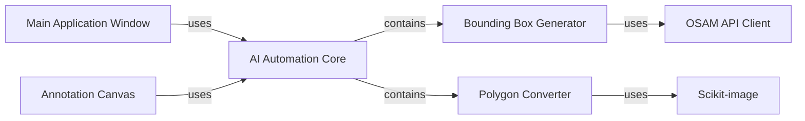

## Component Details

Analysis of the AI Automation subsystem within the labelme project, detailing its structure, purpose, and interactions with other key components.

### AI Automation Core
This is the overarching component that encapsulates all AI-assisted annotation functionalities. It serves as the primary interface for integrating AI models and image processing techniques into the `labelme` application. Its purpose is to abstract the complexities of AI model interaction and image manipulation, providing simplified methods for automated annotation.

**Related Classes/Methods**:

- `labelme._automation` (1:1)
- <a href="https://github.com/wkentaro/labelme/blob/master/labelme/_automation/bbox_from_text.py#L1-L1" target="_blank" rel="noopener noreferrer">`labelme._automation.bbox_from_text` (1:1)</a>
- <a href="https://github.com/wkentaro/labelme/blob/master/labelme/_automation/polygon_from_mask.py#L1-L1" target="_blank" rel="noopener noreferrer">`labelme._automation.polygon_from_mask` (1:1)</a>

### Bounding Box Generator
A specialized sub-component within the `AI Automation Core` responsible for generating bounding box annotations from textual descriptions. It handles the communication with external AI models (via the `OSAM API Client`) to interpret text prompts and return corresponding bounding box coordinates. It also includes logic for post-processing, such as Non-Maximum Suppression (NMS) and conversion of raw AI outputs into `labelme`'s internal shape format.

**Related Classes/Methods**:

- <a href="https://github.com/wkentaro/labelme/blob/master/labelme/_automation/bbox_from_text.py#L1-L1" target="_blank" rel="noopener noreferrer">`labelme._automation.bbox_from_text` (1:1)</a>

### Polygon Converter
Another specialized sub-component of the `AI Automation Core`, dedicated to converting segmentation masks (often generated by AI models) into polygonal annotations. It leverages image processing libraries (`Scikit-image`) to identify contours within masks and approximate them into simplified polygons, making them suitable for `labelme`'s annotation display and editing.

**Related Classes/Methods**:

- <a href="https://github.com/wkentaro/labelme/blob/master/labelme/_automation/polygon_from_mask.py#L1-L1" target="_blank" rel="noopener noreferrer">`labelme._automation.polygon_from_mask` (1:1)</a>

### Main Application Window
The central graphical user interface (GUI) of the `labelme` application. It provides the overall structure and controls for the user to interact with the application. It is responsible for orchestrating various functionalities, including loading images, managing the annotation canvas, and triggering AI automation features through user actions.

**Related Classes/Methods**:

- <a href="https://github.com/wkentaro/labelme/blob/master/labelme/app.py#L48-L2217" target="_blank" rel="noopener noreferrer">`labelme.app.MainWindow` (48:2217)</a>

### Annotation Canvas
The interactive drawing area within the `MainWindow` where images are displayed and annotations are created, viewed, and edited. It is responsible for rendering images and existing annotations, as well as providing tools for users to draw new shapes. It consumes the output from the `AI Automation Core` to display AI-generated annotations.

**Related Classes/Methods**:

- <a href="https://github.com/wkentaro/labelme/blob/master/labelme/widgets/canvas.py#L28-L968" target="_blank" rel="noopener noreferrer">`labelme.widgets.canvas.Canvas` (28:968)</a>

### OSAM API Client
An external library that serves as the communication layer with the Open-Set Annotation Model (OSAM) service. It provides the necessary functions to send image data and text prompts to the AI model and receive bounding box predictions. This component is crucial for the `Bounding Box Generator`'s functionality.

**Related Classes/Methods**:

- `osam.apis` (1:1)

### Scikit-image
An external Python library for image processing. It provides algorithms for tasks such as image segmentation, feature detection, and geometric transformations. Within the `AI Automation` subsystem, it is specifically used by the `Polygon Converter` for contour finding and polygon approximation from segmentation masks.

**Related Classes/Methods**:

- `skimage` (1:1)

### [FAQ](https://github.com/CodeBoarding/GeneratedOnBoardings/tree/main?tab=readme-ov-file#faq)