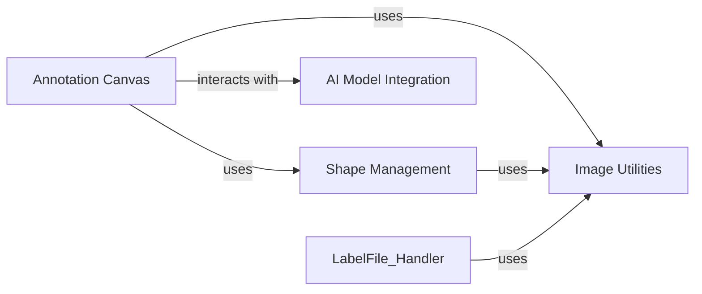

## Component Details

This subsystem focuses on the core functionality of displaying images and enabling users to draw, edit, and manage annotations. It is built around the Canvas widget, which serves as the primary interactive surface.

### Annotation Canvas
The Annotation Canvas is the central visual and interactive component where images are displayed, and annotations are drawn, edited, and rendered. It extends QtWidgets.QWidget and handles all low-low mouse and keyboard events for shape manipulation (creation, selection, movement, resizing of points and shapes). It manages the display scale, handles undo/redo states for shapes, and integrates with AI models for automated polygon generation.

**Related Classes/Methods**:

- <a href="https://github.com/wkentaro/labelme/blob/master/labelme/widgets/canvas.py#L0-L0" target="_blank" rel="noopener noreferrer">`labelme.widgets.canvas` (0:0)</a>

### Shape Management
This component defines the fundamental Shape object, which represents an individual annotation (e.g., polygon, rectangle, circle, line, point). It encapsulates the geometric properties of a shape (points, labels, colors, flags) and provides methods for manipulating these properties, such as adding/removing points, moving, and checking for point containment or proximity. It also handles the visual rendering of shapes on the canvas.

**Related Classes/Methods**:

- <a href="https://github.com/wkentaro/labelme/blob/master/labelme/shape.py#L0-L0" target="_blank" rel="noopener noreferrer">`labelme.shape` (0:0)</a>

### Image Utilities
This component provides essential helper functions for image-related tasks, particularly for converting image data between different formats (e.g., base64 encoded strings to NumPy arrays and vice-versa) and handling EXIF orientation to ensure images are displayed correctly. It also includes general utility functions like distance calculations, which are crucial for interactive elements on the canvas (e.g., closeEnough in Canvas).

**Related Classes/Methods**:

- <a href="https://github.com/wkentaro/labelme/blob/master/labelme/utils/image.py#L0-L0" target="_blank" rel="noopener noreferrer">`labelme.utils.image` (0:0)</a>
- `labelme.utils` (0:0)

### AI Model Integration
This component facilitates the integration of AI models, specifically for automated polygon or mask generation. It provides functions to retrieve and interact with AI models (e.g., SAM - Segment Anything Model) and update shape geometries based on the model's output. This allows for advanced annotation features like "AI Polygon" and "AI Mask" creation modes.

**Related Classes/Methods**:

- <a href="https://github.com/wkentaro/labelme/blob/master/labelme/_automation/polygon_from_mask.py#L0-L0" target="_blank" rel="noopener noreferrer">`labelme._automation.polygon_from_mask` (0:0)</a>

### [FAQ](https://github.com/CodeBoarding/GeneratedOnBoardings/tree/main?tab=readme-ov-file#faq)