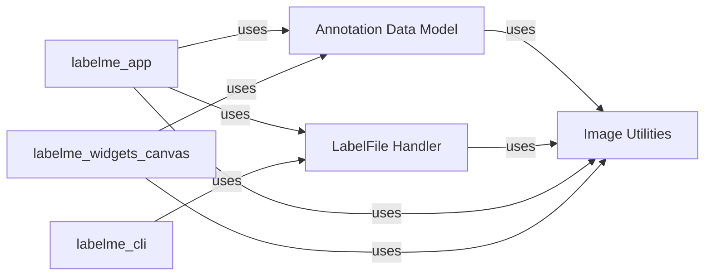

## Component Details

This section provides a detailed overview of the `Annotation Data Model` component, its structure, purpose, and interactions with other key components within the `labelme` project.

### Annotation Data Model
This component, primarily embodied by the `labelme.shape.Shape` class, defines the fundamental data structure for all types of annotations within LabelMe. It encapsulates the geometric properties (points, shape type), semantic attributes (label, flags, group ID, description), and rendering-related information (colors, point size). It provides a comprehensive set of methods for manipulating these properties, including adding/removing points, checking for point containment, calculating distances, and translating the shape. Crucially, it also contains the logic for self-rendering the annotation onto a Qt painter, handling different shape types (polygon, rectangle, circle, line, point, linestrip, mask) and their visual representation.

**Related Classes/Methods**:

- <a href="https://github.com/wkentaro/labelme/blob/master/labelme/shape.py#L14-L390" target="_blank" rel="noopener noreferrer">`labelme.shape.Shape` (14:390)</a>

### LabelFile Handler
This component is responsible for the lifecycle management of LabelMe annotation files. It handles reading and writing JSON-formatted annotation data, embedding image data (or referencing external images), and performing basic validation checks on image dimensions. It acts as the primary interface for interacting with LabelMe's project files, ensuring data persistence and integrity.

**Related Classes/Methods**:

- <a href="https://github.com/wkentaro/labelme/blob/master/labelme/label_file.py#L0-L0" target="_blank" rel="noopener noreferrer">`labelme.label_file` (0:0)</a>

### Image Utilities
This component provides essential helper functions for image processing and geometric calculations. It handles EXIF orientation adjustments, conversion of image data between base64 encoded strings and NumPy arrays, and general geometric utilities such as calculating distances between points and lines. It serves as a shared library of common functions used across various parts of the application, particularly for image display and annotation manipulation.

**Related Classes/Methods**:

- <a href="https://github.com/wkentaro/labelme/blob/master/labelme/utils/image.py#L0-L0" target="_blank" rel="noopener noreferrer">`labelme.utils.image` (0:0)</a>
- `labelme.utils` (0:0)

### [FAQ](https://github.com/CodeBoarding/GeneratedOnBoardings/tree/main?tab=readme-ov-file#faq)