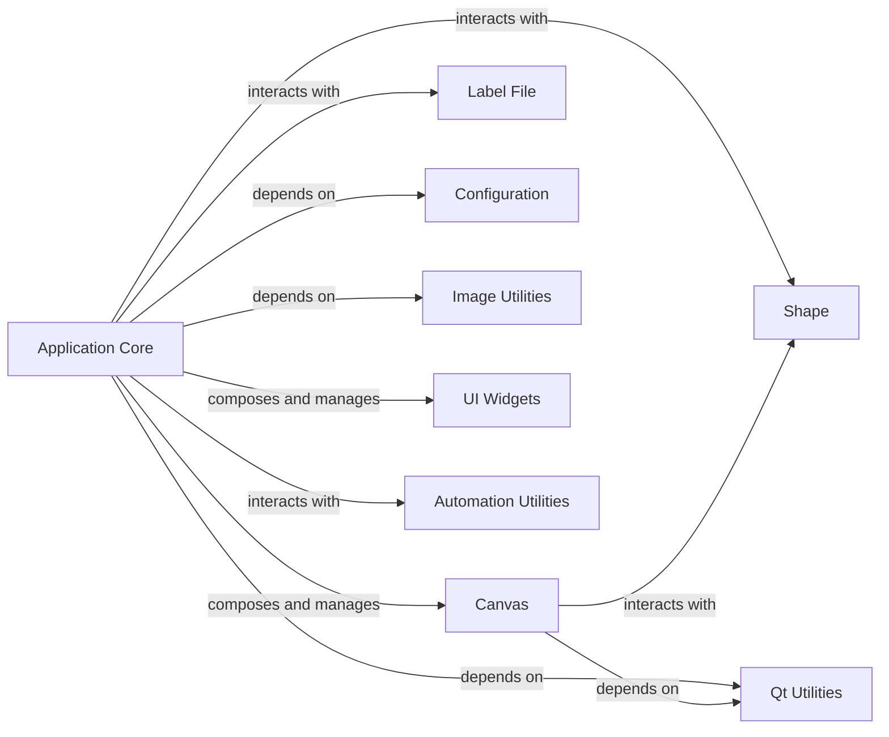

## Component Details

Abstract Components Overview of the labelme application's core components, focusing on their structure, flow, and purpose, with a detailed look at the Application Core and its interactions.

### Application Core
The `Application Core`, primarily embodied by `labelme.app.MainWindow`, serves as the central orchestrator of the `labelme` application. It manages the main user interface, handles high-level user interactions (e.g., file operations, menu actions, tool selections), and coordinates data flow and communication between all other major components. It acts as the primary controller for the entire annotation process, loading and saving annotation files, managing the display of images and shapes, and integrating various widgets and functionalities.

**Related Classes/Methods**:

- <a href="https://github.com/wkentaro/labelme/blob/master/labelme/app.py#L48-L2217" target="_blank" rel="noopener noreferrer">`labelme.app.MainWindow` (48:2217)</a>

### Canvas
This is the primary interactive area where users perform annotations. It's responsible for rendering images and shapes, and handling all drawing, selection, and manipulation of shapes directly on the image based on user input.

**Related Classes/Methods**:

- <a href="https://github.com/wkentaro/labelme/blob/master/labelme/widgets/canvas.py#L1-L1" target="_blank" rel="noopener noreferrer">`labelme.widgets.canvas` (1:1)</a>

### Shape
This component defines the data structure for annotations (e.g., polygons, rectangles, circles, lines, points). It encapsulates the geometric properties, label, flags, and other metadata for each annotated object.

**Related Classes/Methods**:

- <a href="https://github.com/wkentaro/labelme/blob/master/labelme/shape.py#L1-L1" target="_blank" rel="noopener noreferrer">`labelme.shape` (1:1)</a>

### Label File
This component is responsible for reading and writing the annotation data to and from disk, typically in JSON format. It handles the serialization and deserialization of annotation data, including image paths, image data (optional), shapes, and flags.

**Related Classes/Methods**:

- <a href="https://github.com/wkentaro/labelme/blob/master/labelme/label_file.py#L1-L1" target="_blank" rel="noopener noreferrer">`labelme.label_file` (1:1)</a>

### Configuration
This component manages application settings and user preferences, such as default colors, keybindings, display options, and AI model defaults. It provides a centralized way to access and modify application behavior.

**Related Classes/Methods**:

- `labelme.config` (1:1)

### Image Utilities
This module provides essential functionalities for image loading, manipulation (e.g., converting between different image formats like Qt's QImage and PIL images), and basic image processing.

**Related Classes/Methods**:

- <a href="https://github.com/wkentaro/labelme/blob/master/labelme/utils/image.py#L1-L1" target="_blank" rel="noopener noreferrer">`labelme.utils.image` (1:1)</a>

### Qt Utilities
This module offers various helper functions that simplify common Qt-related operations, such as creating QActions for menus and toolbars, adding actions to menus, and formatting shortcuts.

**Related Classes/Methods**:

- <a href="https://github.com/wkentaro/labelme/blob/master/labelme/utils/qt.py#L1-L1" target="_blank" rel="noopener noreferrer">`labelme.utils.qt` (1:1)</a>

### UI Widgets
This is a collection of various specialized UI components (e.g., `LabelListWidget`, `ZoomWidget`, `ToolBar`, `BrightnessContrastDialog`, `FileDialogPreview`, `AiPromptWidget`) that extend standard Qt widgets to provide specific functionalities within the `labelme` application.

**Related Classes/Methods**:

- `labelme.widgets` (1:1)

### Automation Utilities
This component provides advanced features for automated annotation, such as generating bounding boxes from text prompts or creating polygons from masks using AI models.

**Related Classes/Methods**:

- `labelme._automation` (1:1)

### [FAQ](https://github.com/CodeBoarding/GeneratedOnBoardings/tree/main?tab=readme-ov-file#faq)