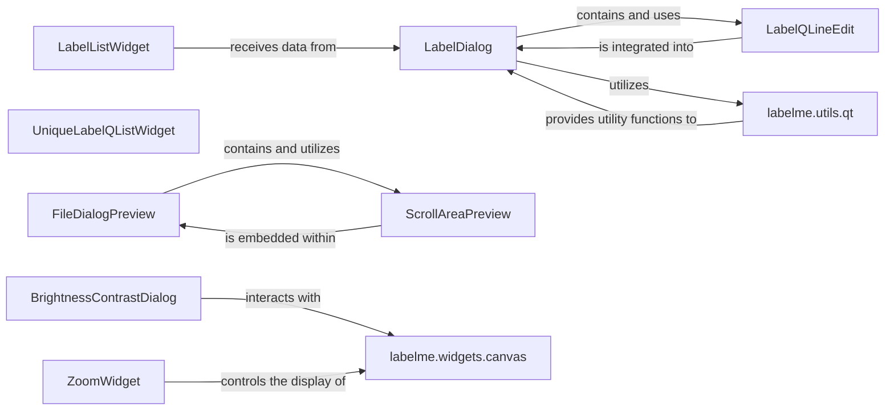

## Component Details

This subsystem comprises specialized PyQt widgets that extend the core UI functionalities of the `labelme` application, focusing on user interaction for labeling, file management, and image adjustments. These components are fundamental because they provide the necessary interfaces for users to define and manage annotations, preview files before loading, and manipulate image display properties, directly enhancing the user's ability to interact with and prepare data for annotation.

### LabelDialog
This is a crucial dialog window that enables users to create and modify labels for annotations. It integrates input fields for the label name, flags, and group ID, and includes validation to ensure data integrity. It also provides auto-completion for labels based on existing entries.

**Related Classes/Methods**:

- <a href="https://github.com/wkentaro/labelme/blob/master/labelme/widgets/label_dialog.py#L25-L250" target="_blank" rel="noopener noreferrer">`LabelDialog` (25:250)</a>
- <a href="https://github.com/wkentaro/labelme/blob/master/labelme/utils/qt.py#L68-L69" target="_blank" rel="noopener noreferrer">`labelme.utils.qt:labelValidator` (68:69)</a>
- <a href="https://github.com/wkentaro/labelme/blob/master/labelme/utils/qt.py#L11-L13" target="_blank" rel="noopener noreferrer">`labelme.utils.qt:newIcon` (11:13)</a>

### LabelQLineEdit
A specialized `QtWidgets.QLineEdit` designed for use within `LabelDialog`. Its primary function is to provide auto-completion suggestions based on a list of existing labels, significantly improving user efficiency and consistency during label entry.

**Related Classes/Methods**:

- `LabelQLineEdit` (1:1)

### LabelListWidget
This custom `QtWidgets.QListView` serves as the central interface for displaying and managing all annotated shapes (labels) within the project. It visually represents each label item and handles user interactions such as selection, editing, and reordering of items.

**Related Classes/Methods**:

- <a href="https://github.com/wkentaro/labelme/blob/master/labelme/widgets/label_list_widget.py#L105-L182" target="_blank" rel="noopener noreferrer">`LabelListWidget` (105:182)</a>

### UniqueLabelQListWidget
A `QtWidgets.QListWidget` that displays a unique, consolidated list of all labels used across the entire project. It provides functionalities to create new items from labels and efficiently find existing items, ensuring label consistency and preventing duplicates.

**Related Classes/Methods**:

- `UniqueLabelQListWidget` (1:1)
- <a href="https://github.com/wkentaro/labelme/blob/master/labelme/widgets/escapable_qlist_widget.py#L1-L1" target="_blank" rel="noopener noreferrer">`labelme.widgets.escapable_qlist_widget` (1:1)</a>

### FileDialogPreview
An extension of `QtWidgets.QFileDialog` that integrates a preview area. This allows users to visualize selected image or JSON files directly within the file dialog before opening them, streamlining the file selection process and preventing errors.

**Related Classes/Methods**:

- <a href="https://github.com/wkentaro/labelme/blob/master/labelme/widgets/file_dialog_preview.py#L34-L77" target="_blank" rel="noopener noreferrer">`FileDialogPreview` (34:77)</a>

### ScrollAreaPreview
A custom `QtWidgets.QScrollArea` specifically designed to display either an image (`QPixmap`) or formatted text content (e.g., JSON). It acts as a key sub-component of `FileDialogPreview`, responsible for rendering the visual representation of selected files.

**Related Classes/Methods**:

- `ScrollAreaPreview` (1:1)

### BrightnessContrastDialog
A dedicated dialog window that allows users to adjust the brightness and contrast of the currently displayed image. This component provides interactive controls (sliders) for real-time image manipulation, enhancing visibility and analysis.

**Related Classes/Methods**:

- <a href="https://github.com/wkentaro/labelme/blob/master/labelme/widgets/brightness_contrast_dialog.py#L7-L66" target="_blank" rel="noopener noreferrer">`BrightnessContrastDialog` (7:66)</a>
- <a href="https://github.com/wkentaro/labelme/blob/master/labelme/widgets/canvas.py#L1-L1" target="_blank" rel="noopener noreferrer">`labelme.widgets.canvas` (1:1)</a>

### ZoomWidget
A specialized widget that provides controls for zooming in and out of the main canvas. This typically includes a spin box for adjusting the magnification level of the displayed image, allowing users to inspect details or view the overall context.

**Related Classes/Methods**:

- <a href="https://github.com/wkentaro/labelme/blob/master/labelme/widgets/zoom_widget.py#L5-L20" target="_blank" rel="noopener noreferrer">`ZoomWidget` (5:20)</a>
- <a href="https://github.com/wkentaro/labelme/blob/master/labelme/widgets/canvas.py#L1-L1" target="_blank" rel="noopener noreferrer">`labelme.widgets.canvas` (1:1)</a>

### labelme.utils.qt
This is a utility module containing a collection of helper functions specifically related to Qt. These functions provide common functionalities such as creating icons (`newIcon`) and validating labels (`labelValidator`), which are reused across various UI components to maintain consistency and reduce code duplication.

**Related Classes/Methods**:

- <a href="https://github.com/wkentaro/labelme/blob/master/labelme/utils/qt.py#L1-L1" target="_blank" rel="noopener noreferrer">`labelme.utils.qt` (1:1)</a>
- <a href="https://github.com/wkentaro/labelme/blob/master/labelme/utils/qt.py#L11-L13" target="_blank" rel="noopener noreferrer">`labelme.utils.qt:newIcon` (11:13)</a>
- <a href="https://github.com/wkentaro/labelme/blob/master/labelme/utils/qt.py#L68-L69" target="_blank" rel="noopener noreferrer">`labelme.utils.qt:labelValidator` (68:69)</a>

### labelme.widgets.canvas
The main canvas component responsible for displaying images and handling image-related operations like zoom and brightness/contrast adjustments.

**Related Classes/Methods**:

- <a href="https://github.com/wkentaro/labelme/blob/master/labelme/widgets/canvas.py#L1-L1" target="_blank" rel="noopener noreferrer">`labelme.widgets.canvas` (1:1)</a>

### [FAQ](https://github.com/CodeBoarding/GeneratedOnBoardings/tree/main?tab=readme-ov-file#faq)