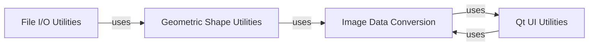

## Component Details

Overview of core utility components within the `labelme` project, including Image Data Conversion, Qt UI Utilities, File I/O Utilities, and Geometric Shape Utilities, and their interdependencies.

### Image Data Conversion
This component is the central hub for handling diverse image data transformations. It provides robust utilities for converting between various image representations, including base64 encoded strings, PIL (Pillow) image objects, NumPy arrays, and Qt Pixmaps. It also incorporates logic for applying EXIF orientation, ensuring images are displayed correctly regardless of their original capture orientation. This component is fundamental because it standardizes image handling, enabling seamless loading, processing, and display of visual data throughout the application.

**Related Classes/Methods**:

- <a href="https://github.com/wkentaro/labelme/blob/master/labelme/utils/image.py#L61-L65" target="_blank" rel="noopener noreferrer">`labelme.utils.image.img_qt_to_arr` (61:65)</a>

### Qt UI Utilities
This component offers a collection of helper functions specifically designed for creating, configuring, and managing common Qt GUI elements such as buttons, actions, and icons. It also includes utilities for performing geometric calculations pertinent to UI interactions, such as determining distances between points and lines. This component is fundamental as it centralizes and simplifies the development of the application's graphical user interface, promoting a consistent look and feel while reducing repetitive UI setup code.

**Related Classes/Methods**:

- <a href="https://github.com/wkentaro/labelme/blob/master/labelme/utils/qt.py#L0-L0" target="_blank" rel="noopener noreferrer">`labelme.utils.qt` (0:0)</a>

### File I/O Utilities
This component provides specialized functions for handling file input/output operations, primarily focused on saving pixel-wise label data. Specifically, the `lblsave` function converts NumPy arrays representing labels into PNG image files, incorporating a colormap for visualization. This component is fundamental for the persistence and retrieval of annotation data, which is a core requirement for any image labeling application.

**Related Classes/Methods**:

- <a href="https://github.com/wkentaro/labelme/blob/master/labelme/utils/_io.py#L9-L25" target="_blank" rel="noopener noreferrer">`labelme.utils._io.lblsave` (9:25)</a>

### Geometric Shape Utilities
This component provides a comprehensive suite of functions for the manipulation and analysis of geometric shapes. Its functionalities include converting polygons to masks, generating label images from defined shapes, and calculating bounding boxes. It supports various shape types such as circles, rectangles, lines, points, and polygons. This component is fundamental because it underpins the core annotation capabilities of the `labelme` application, enabling users to define, visualize, and process spatial data on images.

**Related Classes/Methods**:

- <a href="https://github.com/wkentaro/labelme/blob/master/labelme/utils/shape.py#L21-L54" target="_blank" rel="noopener noreferrer">`labelme.utils.shape.shape_to_mask` (21:54)</a>
- <a href="https://github.com/wkentaro/labelme/blob/master/labelme/utils/shape.py#L57-L90" target="_blank" rel="noopener noreferrer">`labelme.utils.shape.shapes_to_label` (57:90)</a>

### [FAQ](https://github.com/CodeBoarding/GeneratedOnBoardings/tree/main?tab=readme-ov-file#faq)