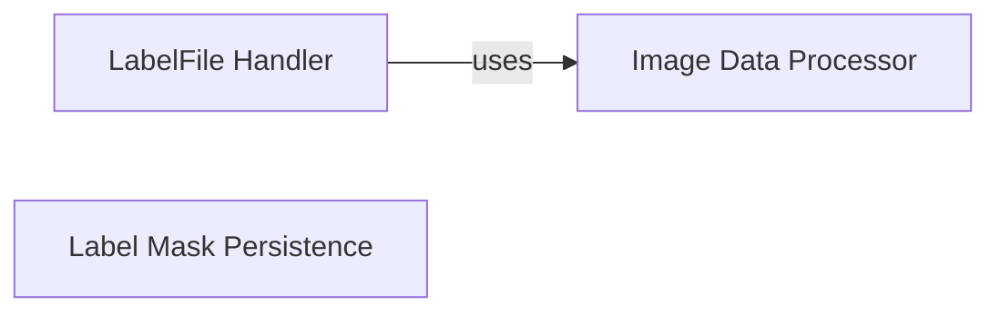

## Component Details

This subsystem is responsible for the core persistence and handling of annotation data within the labelme application. It manages the lifecycle of LabelMe project files, including the loading and saving of annotations and associated image data, and provides essential utilities for image processing and specialized data output.

### LabelFile Handler
This is the central component for managing LabelMe annotation files. It handles the complete process of reading and writing annotation data, including geometric shapes, image paths, and embedded image data, to and from JSON files. It ensures data integrity by validating image dimensions and integrates with image processing utilities for proper image handling and embedding.

**Related Classes/Methods**:

- <a href="https://github.com/wkentaro/labelme/blob/master/labelme/label_file.py#L0-L0" target="_blank" rel="noopener noreferrer">`labelme.label_file` (0:0)</a>

### Image Data Processor
This component provides a comprehensive set of utility functions for manipulating image data. Its key responsibilities include converting image data between various formats (e.g., raw bytes, base64 strings, PIL Image objects, NumPy arrays) and applying crucial transformations such as correcting image orientation based on EXIF metadata. These functionalities are vital for preparing image data for embedding within annotation files and for in-memory processing.

**Related Classes/Methods**:

- <a href="https://github.com/wkentaro/labelme/blob/master/labelme/utils/image.py#L0-L0" target="_blank" rel="noopener noreferrer">`labelme.utils.image` (0:0)</a>
- <a href="https://github.com/wkentaro/labelme/blob/master/labelme/utils/image.py#L68-L106" target="_blank" rel="noopener noreferrer">`labelme.utils.image:apply_exif_orientation` (68:106)</a>
- <a href="https://github.com/wkentaro/labelme/blob/master/labelme/utils/image.py#L25-L28" target="_blank" rel="noopener noreferrer">`labelme.utils.image:img_b64_to_arr` (25:28)</a>

### Label Mask Persistence
This specialized component is dedicated to the persistence of pixel-wise label masks. It offers functionality to save these segmented regions of an image as PNG files. While distinct from the primary JSON annotation file handling, it serves as a crucial utility for exporting a specific type of annotation data in an image format, often used for downstream tasks like model training.

**Related Classes/Methods**:

- <a href="https://github.com/wkentaro/labelme/blob/master/labelme/utils/_io.py#L0-L0" target="_blank" rel="noopener noreferrer">`labelme.utils._io` (0:0)</a>

### [FAQ](https://github.com/CodeBoarding/GeneratedOnBoardings/tree/main?tab=readme-ov-file#faq)