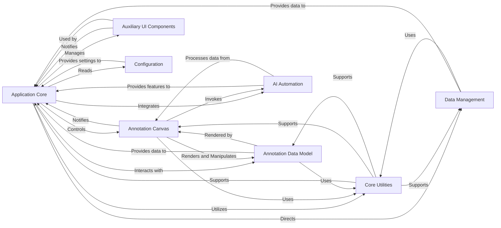

## Component Details

The `labelme` application's architecture is primarily driven by a Model-View-Controller (MVC) like pattern, with a strong emphasis on Qt-based UI components and a clear separation of concerns for data handling, utilities, and advanced features like AI automation. The analysis reveals that `labelme.app.MainWindow` is the undisputed central orchestrator. It initializes, controls, and reacts to events from the `Canvas` and various `UI Widgets`. Data flow is managed through `LabelFile` for persistence and `Shape` for in-memory representation. Utility modules (`utils.image`, `utils.qt`) provide foundational support across multiple components, while `_automation` modules represent a distinct, integrated feature set.

### Application Core
The central orchestrator of the `labelme` application. It manages the main user interface, handles high-level user interactions (e.g., file operations, menu actions, tool selections), and coordinates data flow and communication between all other major components. It acts as the primary controller for the entire annotation process.

**Related Classes/Methods**:

- <a href="https://github.com/wkentaro/labelme/blob/master/labelme/app.py#L48-L2217" target="_blank" rel="noopener noreferrer">`labelme.app.MainWindow` (48:2217)</a>

### Annotation Canvas
The primary visual and interactive component where images are displayed and annotations are drawn, edited, and rendered. It handles low-level mouse and keyboard events related to shape manipulation, providing the direct interface for user annotation.

**Related Classes/Methods**:

- <a href="https://github.com/wkentaro/labelme/blob/master/labelme/widgets/canvas.py#L28-L968" target="_blank" rel="noopener noreferrer">`labelme.widgets.canvas.Canvas` (28:968)</a>

### Annotation Data Model
Represents the fundamental data structure for all types of annotations (e.g., polygons, rectangles, points, lines). It encapsulates the geometric properties, labels, flags, and other attributes of an annotation, providing methods for self-rendering and geometric operations.

**Related Classes/Methods**:

- <a href="https://github.com/wkentaro/labelme/blob/master/labelme/shape.py#L14-L390" target="_blank" rel="noopener noreferrer">`labelme.shape.Shape` (14:390)</a>

### Data Management
Handles the persistence layer of the application. This component is responsible for loading annotation data from and saving it to JSON files, including the embedding and extraction of image data (e.g., base64 encoding) and handling EXIF orientation.

**Related Classes/Methods**:

- <a href="https://github.com/wkentaro/labelme/blob/master/labelme/label_file.py#L27-L184" target="_blank" rel="noopener noreferrer">`labelme.label_file.LabelFile` (27:184)</a>

### Auxiliary UI Components
A collection of specialized PyQt widgets that provide specific user interface functionalities beyond the core canvas. This includes dialogs for label input, lists for managing labels and files, zoom controls, and brightness/contrast adjustments. These components facilitate various user interactions.

**Related Classes/Methods**:

- <a href="https://github.com/wkentaro/labelme/blob/master/labelme/widgets/label_dialog.py#L25-L250" target="_blank" rel="noopener noreferrer">`labelme.widgets.label_dialog.LabelDialog` (25:250)</a>
- <a href="https://github.com/wkentaro/labelme/blob/master/labelme/widgets/label_list_widget.py#L105-L182" target="_blank" rel="noopener noreferrer">`labelme.widgets.label_list_widget.LabelListWidget` (105:182)</a>
- <a href="https://github.com/wkentaro/labelme/blob/master/labelme/widgets/unique_label_qlist_widget.py#L10-L44" target="_blank" rel="noopener noreferrer">`labelme.widgets.unique_label_qlist_widget.UniqueLabelQListWidget` (10:44)</a>
- <a href="https://github.com/wkentaro/labelme/blob/master/labelme/widgets/zoom_widget.py#L5-L20" target="_blank" rel="noopener noreferrer">`labelme.widgets.zoom_widget.ZoomWidget` (5:20)</a>
- <a href="https://github.com/wkentaro/labelme/blob/master/labelme/widgets/file_dialog_preview.py#L34-L77" target="_blank" rel="noopener noreferrer">`labelme.widgets.file_dialog_preview.FileDialogPreview` (34:77)</a>
- <a href="https://github.com/wkentaro/labelme/blob/master/labelme/widgets/brightness_contrast_dialog.py#L7-L66" target="_blank" rel="noopener noreferrer">`labelme.widgets.brightness_contrast_dialog.BrightnessContrastDialog` (7:66)</a>

### Core Utilities
A foundational layer providing common helper functions for image processing (e.g., format conversion between NumPy arrays, PIL images, Qt Pixmaps, EXIF handling) and PyQt-specific operations (e.g., creating UI elements, geometric calculations like distance). These utilities are widely used across other components to ensure consistency and reduce code duplication.

**Related Classes/Methods**:

- <a href="https://github.com/wkentaro/labelme/blob/master/labelme/utils/image.py#L1-L100" target="_blank" rel="noopener noreferrer">`labelme.utils.image` (1:100)</a>
- <a href="https://github.com/wkentaro/labelme/blob/master/labelme/utils/qt.py#L1-L100" target="_blank" rel="noopener noreferrer">`labelme.utils.qt` (1:100)</a>

### AI Automation
Encapsulates functionalities for AI-assisted annotation, such as generating bounding boxes from text prompts and converting segmentation masks into polygons. This component enhances the labeling workflow by automating parts of the annotation process.

**Related Classes/Methods**:

- <a href="https://github.com/wkentaro/labelme/blob/master/labelme/_automation/bbox_from_text.py#L1-L100" target="_blank" rel="noopener noreferrer">`labelme._automation.bbox_from_text` (1:100)</a>
- <a href="https://github.com/wkentaro/labelme/blob/master/labelme/_automation/polygon_from_mask.py#L1-L100" target="_blank" rel="noopener noreferrer">`labelme._automation.polygon_from_mask` (1:100)</a>

### Configuration
Manages the application's settings and preferences. It is responsible for loading default values and allowing for user-defined customizations, ensuring consistent application behavior and user experience.

**Related Classes/Methods**:

- <a href="https://github.com/wkentaro/labelme/blob/master/labelme/config/__init__.py#L1-L100" target="_blank" rel="noopener noreferrer">`labelme.config.__init__` (1:100)</a>
- `labelme.config.get_config` (1:100)
- `labelme.config.default_config.yaml` (1:100)

### [FAQ](https://github.com/CodeBoarding/GeneratedOnBoardings/tree/main?tab=readme-ov-file#faq)