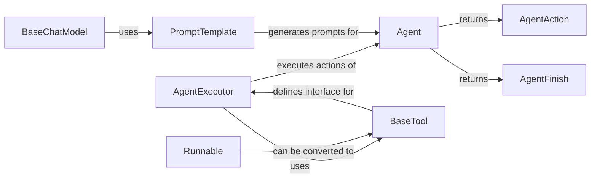

## Component Details

### Agent
The Agent class is responsible for determining the next action to take based on the current state and available tools. It uses a language model to generate the action and its input. The agent orchestrates the interaction between the language model and external tools, planning and executing actions to achieve a specific goal.
- **Related Classes/Methods**: `langchain.agents.agent.Agent`

### AgentExecutor
The AgentExecutor class is responsible for executing the actions determined by the Agent. It takes the Agent's output, executes the corresponding tool, and passes the result back to the Agent for the next iteration. It manages the overall execution loop of the agent, handling the interaction between the agent and the available tools.
- **Related Classes/Methods**: `langchain.agents.agent.AgentExecutor`

### BaseTool
The BaseTool class is an abstract class that defines the interface for all tools that can be used by an agent. It provides methods for running the tool and returning a result. Tools provide the agent with access to external resources and capabilities, enabling the agent to interact with the outside world.
- **Related Classes/Methods**: `langchain_core.tools.base.BaseTool`

### Runnable
The Runnable interface in Langchain Core represents a composable unit of execution. It can be a prompt, a model, a chain, or any other component that can be invoked with an input and produce an output. Runnables can be chained together to create complex workflows, allowing for the creation of modular and reusable components.
- **Related Classes/Methods**: `langchain_core.runnables.base.Runnable`

### BaseChatModel
Base class for Chat Models. Chat models take a series of messages as input and return a message as output. It provides a standard interface for interacting with different chat models, enabling the agent to leverage the power of language models for decision-making.
- **Related Classes/Methods**: `langchain_core.language_models.chat_models.BaseChatModel`

### AgentAction
Represents an action that an agent wants to take. It includes the tool to use and the input to the tool. This data structure is used to communicate the agent's decision to the AgentExecutor, providing a clear and structured way for the agent to signal its intentions.
- **Related Classes/Methods**: `langchain_core.agents.AgentAction`

### AgentFinish
Represents the final result of an agent's execution. It contains the final output of the agent. This signals the end of the agent's execution loop, indicating that the agent has successfully completed its task.
- **Related Classes/Methods**: `langchain_core.agents.AgentFinish`

### PromptTemplate
The PromptTemplate class is responsible for generating prompts for the language model. It takes a template string and a set of input variables and returns a formatted prompt. It allows for dynamic prompt generation based on the current context, enabling the agent to adapt its prompts to the specific situation.
- **Related Classes/Methods**: `langchain_core.prompts.prompt.PromptTemplate`
