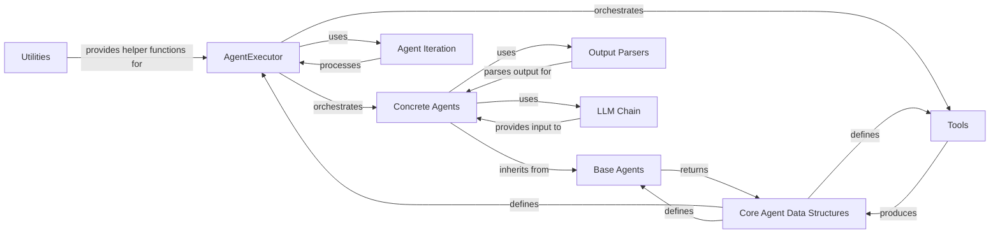

## Component Details

This graph represents the core components of the Agentic Systems subsystem, focusing on how intelligent agents reason, plan, and execute actions using tools. The central orchestrator is the AgentExecutor, which manages the overall flow, coordinating interactions between concrete agents (for planning) and various tools (for execution). Agents utilize LLM Chains for generating responses and Output Parsers to interpret these responses into structured actions. Data structures like AgentFinish, AgentAction, and AgentStep are fundamental for communication between these components. The system also includes abstract base classes for agents, an iteration mechanism for streaming, and utility functions to support the agent's operation.

### AgentExecutor
The central orchestrator of the agent's execution loop. It manages the overall flow, including deciding when to stop, handling parsing errors, and invoking tools. It coordinates interactions between the agent (for planning) and the tools (for execution).

**Related Classes/Methods**:

- <a href="https://github.com/langchain-ai/langchain/blob/master/libs/langchain/langchain/agents/agent.py#L1043-L1801" target="_blank" rel="noopener noreferrer">`langchain.agents.agent.AgentExecutor` (1043:1801)</a>
- <a href="https://github.com/langchain-ai/langchain/blob/master/libs/langchain/langchain/agents/agent.py#L1092-L1115" target="_blank" rel="noopener noreferrer">`langchain.agents.agent.AgentExecutor:from_agent_and_tools` (1092:1115)</a>
- <a href="https://github.com/langchain-ai/langchain/blob/master/libs/langchain/langchain/agents/agent.py#L1143-L1170" target="_blank" rel="noopener noreferrer">`langchain.agents.agent.AgentExecutor:validate_runnable_agent` (1143:1170)</a>
- <a href="https://github.com/langchain-ai/langchain/blob/master/libs/langchain/langchain/agents/agent.py#L1210-L1235" target="_blank" rel="noopener noreferrer">`langchain.agents.agent.AgentExecutor:iter` (1210:1235)</a>
- <a href="https://github.com/langchain-ai/langchain/blob/master/libs/langchain/langchain/agents/agent.py#L1317-L1336" target="_blank" rel="noopener noreferrer">`langchain.agents.agent.AgentExecutor:_take_next_step` (1317:1336)</a>
- <a href="https://github.com/langchain-ai/langchain/blob/master/libs/langchain/langchain/agents/agent.py#L1338-L1413" target="_blank" rel="noopener noreferrer">`langchain.agents.agent.AgentExecutor:_iter_next_step` (1338:1413)</a>
- <a href="https://github.com/langchain-ai/langchain/blob/master/libs/langchain/langchain/agents/agent.py#L1415-L1452" target="_blank" rel="noopener noreferrer">`langchain.agents.agent.AgentExecutor:_perform_agent_action` (1415:1452)</a>
- <a href="https://github.com/langchain-ai/langchain/blob/master/libs/langchain/langchain/agents/agent.py#L1454-L1473" target="_blank" rel="noopener noreferrer">`langchain.agents.agent.AgentExecutor:_atake_next_step` (1454:1473)</a>
- <a href="https://github.com/langchain-ai/langchain/blob/master/libs/langchain/langchain/agents/agent.py#L1475-L1558" target="_blank" rel="noopener noreferrer">`langchain.agents.agent.AgentExecutor:_aiter_next_step` (1475:1558)</a>
- <a href="https://github.com/langchain-ai/langchain/blob/master/libs/langchain/langchain/agents/agent.py#L1560-L1599" target="_blank" rel="noopener noreferrer">`langchain.agents.agent.AgentExecutor:_aperform_agent_action` (1560:1599)</a>
- <a href="https://github.com/langchain-ai/langchain/blob/master/libs/langchain/langchain/agents/agent.py#L1601-L1646" target="_blank" rel="noopener noreferrer">`langchain.agents.agent.AgentExecutor:_call` (1601:1646)</a>
- <a href="https://github.com/langchain-ai/langchain/blob/master/libs/langchain/langchain/agents/agent.py#L1648-L1708" target="_blank" rel="noopener noreferrer">`langchain.agents.agent.AgentExecutor:_acall` (1648:1708)</a>
- <a href="https://github.com/langchain-ai/langchain/blob/master/libs/langchain/langchain/agents/agent.py#L1710-L1726" target="_blank" rel="noopener noreferrer">`langchain.agents.agent.AgentExecutor:_get_tool_return` (1710:1726)</a>
- <a href="https://github.com/langchain-ai/langchain/blob/master/libs/langchain/langchain/agents/agent.py#L1741-L1769" target="_blank" rel="noopener noreferrer">`langchain.agents.agent.AgentExecutor:stream` (1741:1769)</a>
- <a href="https://github.com/langchain-ai/langchain/blob/master/libs/langchain/langchain/agents/agent.py#L1771-L1801" target="_blank" rel="noopener noreferrer">`langchain.agents.agent.AgentExecutor:astream` (1771:1801)</a>
- <a href="https://github.com/langchain-ai/langchain/blob/master/libs/langchain/langchain/agents/agent.py#L1267-L1276" target="_blank" rel="noopener noreferrer">`langchain.agents.agent.AgentExecutor:_should_continue` (1267:1276)</a>
- <a href="https://github.com/langchain-ai/langchain/blob/master/libs/langchain/langchain/agents/agent.py#L1278-L1289" target="_blank" rel="noopener noreferrer">`langchain.agents.agent.AgentExecutor:_return` (1278:1289)</a>
- <a href="https://github.com/langchain-ai/langchain/blob/master/libs/langchain/langchain/agents/agent.py#L1291-L1304" target="_blank" rel="noopener noreferrer">`langchain.agents.agent.AgentExecutor:_areturn` (1291:1304)</a>
- <a href="https://github.com/langchain-ai/langchain/blob/master/libs/langchain/langchain/agents/agent.py#L1306-L1315" target="_blank" rel="noopener noreferrer">`langchain.agents.agent.AgentExecutor:_consume_next_step` (1306:1315)</a>
- <a href="https://github.com/langchain-ai/langchain/blob/master/libs/langchain/langchain/agents/agent.py#L1728-L1739" target="_blank" rel="noopener noreferrer">`langchain.agents.agent.AgentExecutor:_prepare_intermediate_steps` (1728:1739)</a>

### Base Agents
Abstract base classes defining the fundamental interface for agents, specifying how they plan actions (synchronously and asynchronously) and handle responses when execution is stopped.

**Related Classes/Methods**:

- <a href="https://github.com/langchain-ai/langchain/blob/master/libs/langchain/langchain/agents/agent.py#L57-L224" target="_blank" rel="noopener noreferrer">`langchain.agents.agent.BaseSingleActionAgent` (57:224)</a>
- <a href="https://github.com/langchain-ai/langchain/blob/master/libs/langchain/langchain/agents/agent.py#L114-L142" target="_blank" rel="noopener noreferrer">`langchain.agents.agent.BaseSingleActionAgent:return_stopped_response` (114:142)</a>
- <a href="https://github.com/langchain-ai/langchain/blob/master/libs/langchain/langchain/agents/agent.py#L187-L220" target="_blank" rel="noopener noreferrer">`langchain.agents.agent.BaseSingleActionAgent:save` (187:220)</a>
- <a href="https://github.com/langchain-ai/langchain/blob/master/libs/langchain/langchain/agents/agent.py#L227-L373" target="_blank" rel="noopener noreferrer">`langchain.agents.agent.BaseMultiActionAgent` (227:373)</a>
- <a href="https://github.com/langchain-ai/langchain/blob/master/libs/langchain/langchain/agents/agent.py#L289-L315" target="_blank" rel="noopener noreferrer">`langchain.agents.agent.BaseMultiActionAgent:return_stopped_response` (289:315)</a>
- <a href="https://github.com/langchain-ai/langchain/blob/master/libs/langchain/langchain/agents/agent.py#L331-L368" target="_blank" rel="noopener noreferrer">`langchain.agents.agent.BaseMultiActionAgent:save` (331:368)</a>

### Concrete Agents
Specific implementations of agents that decide the next action based on inputs and intermediate steps. These agents often wrap an LLMChain and an output parser or a Runnable.

**Related Classes/Methods**:

- <a href="https://github.com/langchain-ai/langchain/blob/master/libs/langchain/langchain/agents/agent.py#L636-L716" target="_blank" rel="noopener noreferrer">`langchain.agents.agent.LLMSingleActionAgent` (636:716)</a>
- <a href="https://github.com/langchain-ai/langchain/blob/master/libs/langchain/langchain/agents/agent.py#L655-L659" target="_blank" rel="noopener noreferrer">`langchain.agents.agent.LLMSingleActionAgent:dict` (655:659)</a>
- <a href="https://github.com/langchain-ai/langchain/blob/master/libs/langchain/langchain/agents/agent.py#L724-L1013" target="_blank" rel="noopener noreferrer">`langchain.agents.agent.Agent` (724:1013)</a>
- <a href="https://github.com/langchain-ai/langchain/blob/master/libs/langchain/langchain/agents/agent.py#L739-L743" target="_blank" rel="noopener noreferrer">`langchain.agents.agent.Agent:dict` (739:743)</a>
- <a href="https://github.com/langchain-ai/langchain/blob/master/libs/langchain/langchain/agents/agent.py#L782-L801" target="_blank" rel="noopener noreferrer">`langchain.agents.agent.Agent:plan` (782:801)</a>
- <a href="https://github.com/langchain-ai/langchain/blob/master/libs/langchain/langchain/agents/agent.py#L803-L823" target="_blank" rel="noopener noreferrer">`langchain.agents.agent.Agent:aplan` (803:823)</a>
- <a href="https://github.com/langchain-ai/langchain/blob/master/libs/langchain/langchain/agents/agent.py#L825-L841" target="_blank" rel="noopener noreferrer">`langchain.agents.agent.Agent:get_full_inputs` (825:841)</a>
- <a href="https://github.com/langchain-ai/langchain/blob/master/libs/langchain/langchain/agents/agent.py#L918-L951" target="_blank" rel="noopener noreferrer">`langchain.agents.agent.Agent:from_llm_and_tools` (918:951)</a>
- <a href="https://github.com/langchain-ai/langchain/blob/master/libs/langchain/langchain/agents/agent.py#L953-L1006" target="_blank" rel="noopener noreferrer">`langchain.agents.agent.Agent:return_stopped_response` (953:1006)</a>
- <a href="https://github.com/langchain-ai/langchain/blob/master/libs/langchain/langchain/agents/agent.py#L903-L910" target="_blank" rel="noopener noreferrer">`langchain.agents.agent.Agent._validate_tools` (903:910)</a>
- <a href="https://github.com/langchain-ai/langchain/blob/master/libs/langchain/langchain/agents/agent.py#L892-L900" target="_blank" rel="noopener noreferrer">`langchain.agents.agent.Agent.create_prompt` (892:900)</a>
- <a href="https://github.com/langchain-ai/langchain/blob/master/libs/langchain/langchain/agents/agent.py#L914-L915" target="_blank" rel="noopener noreferrer">`langchain.agents.agent.Agent._get_default_output_parser` (914:915)</a>
- <a href="https://github.com/langchain-ai/langchain/blob/master/libs/langchain/langchain/agents/agent.py#L772-L780" target="_blank" rel="noopener noreferrer">`langchain.agents.agent.Agent._construct_scratchpad` (772:780)</a>
- <a href="https://github.com/langchain-ai/langchain/blob/master/libs/langchain/langchain/agents/agent.py#L405-L511" target="_blank" rel="noopener noreferrer">`langchain.agents.agent.RunnableAgent` (405:511)</a>
- <a href="https://github.com/langchain-ai/langchain/blob/master/libs/langchain/langchain/agents/agent.py#L514-L628" target="_blank" rel="noopener noreferrer">`langchain.agents.agent.RunnableMultiActionAgent` (514:628)</a>

### Output Parsers
Components responsible for transforming the raw text output from a language model into structured agent actions or a final agent finish object, enabling the agent to understand and act upon the LLM's response.

**Related Classes/Methods**:

- <a href="https://github.com/langchain-ai/langchain/blob/master/libs/langchain/langchain/agents/agent.py#L376-L381" target="_blank" rel="noopener noreferrer">`langchain.agents.agent.AgentOutputParser` (376:381)</a>
- <a href="https://github.com/langchain-ai/langchain/blob/master/libs/langchain/langchain/agents/agent.py#L384-L402" target="_blank" rel="noopener noreferrer">`langchain.agents.agent.MultiActionAgentOutputParser` (384:402)</a>

### Tools
External functionalities or capabilities that an agent can invoke to perform specific tasks, such as searching the web, running code, or interacting with APIs. Includes special tools for handling exceptions or invalid tool calls.

**Related Classes/Methods**:

- <a href="https://github.com/langchain-ai/langchain/blob/master/libs/core/langchain_core/tools/base.py#L667-L777" target="_blank" rel="noopener noreferrer">`langchain_core.tools.base.BaseTool.run` (667:777)</a>
- <a href="https://github.com/langchain-ai/langchain/blob/master/libs/core/langchain_core/tools/base.py#L779-L891" target="_blank" rel="noopener noreferrer">`langchain_core.tools.base.BaseTool.arun` (779:891)</a>
- <a href="https://github.com/langchain-ai/langchain/blob/master/libs/langchain/langchain/agents/agent.py#L1016-L1036" target="_blank" rel="noopener noreferrer">`langchain.agents.agent.ExceptionTool` (1016:1036)</a>
- <a href="https://github.com/langchain-ai/langchain/blob/master/libs/langchain/langchain/agents/tools.py#L12-L44" target="_blank" rel="noopener noreferrer">`langchain.agents.tools.InvalidTool` (12:44)</a>

### Agent Iteration
A component that provides an iterable interface for stepping through the agent's execution, allowing for streaming of intermediate steps and final outputs.

**Related Classes/Methods**:

- <a href="https://github.com/langchain-ai/langchain/blob/master/libs/langchain/langchain/agents/agent_iterator.py#L42-L414" target="_blank" rel="noopener noreferrer">`langchain.agents.agent_iterator.AgentExecutorIterator` (42:414)</a>

### Core Agent Data Structures
Fundamental data models used throughout the agent system to represent the agent's actions, intermediate steps, and final outputs, facilitating structured communication between components.

**Related Classes/Methods**:

- <a href="https://github.com/langchain-ai/langchain/blob/master/libs/core/langchain_core/agents.py#L133-L170" target="_blank" rel="noopener noreferrer">`langchain_core.agents.AgentFinish` (133:170)</a>
- <a href="https://github.com/langchain-ai/langchain/blob/master/libs/core/langchain_core/agents.py#L40-L94" target="_blank" rel="noopener noreferrer">`langchain_core.agents.AgentAction` (40:94)</a>
- <a href="https://github.com/langchain-ai/langchain/blob/master/libs/core/langchain_core/agents.py#L119-L130" target="_blank" rel="noopener noreferrer">`langchain_core.agents.AgentStep` (119:130)</a>

### LLM Chain
A component that wraps a language model and a prompt, used by agents to generate responses and plans by interacting with the underlying large language model.

**Related Classes/Methods**:

- <a href="https://github.com/langchain-ai/langchain/blob/master/libs/langchain/langchain/chains/llm.py#L44-L410" target="_blank" rel="noopener noreferrer">`langchain.chains.llm.LLMChain` (44:410)</a>

### Utilities
Helper functions and configurations used across the agent module for various purposes, such as managing callbacks, ensuring runnable configurations, and mapping colors for logging.

**Related Classes/Methods**:

- <a href="https://github.com/langchain-ai/langchain/blob/master/libs/core/langchain_core/utils/input.py#L14-L29" target="_blank" rel="noopener noreferrer">`langchain_core.utils.input.get_color_mapping` (14:29)</a>
- <a href="https://github.com/langchain-ai/langchain/blob/master/libs/core/langchain_core/runnables/config.py#L185-L235" target="_blank" rel="noopener noreferrer">`langchain_core.runnables.config.ensure_config` (185:235)</a>

### [FAQ](https://github.com/CodeBoarding/GeneratedOnBoardings/tree/main?tab=readme-ov-file#faq)