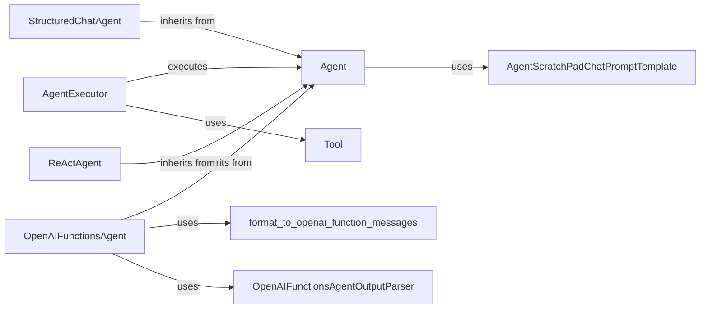

## Component Details

The Agents and Tooling component provides a framework for building autonomous agents that can interact with their environment to achieve specific goals. The core flow involves the Agent receiving input, planning a sequence of actions using available Tools, executing those actions, and returning a final response. The AgentExecutor orchestrates this process, managing the interaction between the Agent and the Tools. Different types of Agents, such as OpenAIFunctionsAgent, StructuredChatAgent, and ReActAgent, implement different planning strategies and output parsing techniques. The format_scratchpad modules are used to format the agent's scratchpad and actions into a list of messages suitable for the LLM.

### Agent
The base class for all agents. It defines the core methods for planning and running an agent, including `plan` and `aplan` for generating actions, `get_full_inputs` for preparing inputs, and `from_llm_and_tools` for creating an agent from an LLM and a set of tools.
- **Related Classes/Methods**: `langchain.libs.langchain.agents.agent.Agent`

### AgentExecutor
The class responsible for executing an agent and its tools. It takes an agent and a list of tools as input and orchestrates the execution of the agent's plan. Key methods include `_take_next_step`, `_perform_agent_action`, `_call`, `stream`, and `astream`.
- **Related Classes/Methods**: `langchain.libs.langchain.agents.agent.AgentExecutor`

### OpenAIFunctionsAgent
An agent that uses OpenAI functions to define the tools it can use. It inherits from the base Agent class and implements the `plan` and `aplan` methods to generate actions using OpenAI functions. It uses `create_prompt` to create the prompt for the LLM.
- **Related Classes/Methods**: `langchain.libs.langchain.agents.openai_functions_agent.base.OpenAIFunctionsAgent`

### StructuredChatAgent
An agent designed for structured conversations. It uses a specific output parser and prompt format to handle multi-turn conversations. It inherits from the base Agent class and implements methods for constructing the scratchpad and creating the prompt.
- **Related Classes/Methods**: `langchain.libs.langchain.agents.structured_chat.base.StructuredChatAgent`

### ReActAgent
An agent that uses the ReAct (Reasoning and Acting) framework. It generates actions based on reasoning steps and tool execution. It uses a specific output parser and prompt format to handle the ReAct framework.
- **Related Classes/Methods**: `langchain.libs.langchain.agents.react.agent`

### AgentScratchPadChatPromptTemplate
A prompt template specifically designed for agents, incorporating a scratchpad for storing intermediate steps and observations. It merges partial and user variables to create the final prompt.
- **Related Classes/Methods**: `langchain.libs.langchain.agents.schema.AgentScratchPadChatPromptTemplate`

### OpenAIFunctionsAgentOutputParser
An output parser specifically designed for OpenAIFunctionsAgent. It parses the AI message and extracts the tool name and tool input.
- **Related Classes/Methods**: `langchain.libs.langchain.agents.output_parsers.openai_functions.OpenAIFunctionsAgentOutputParser`

### Tool
A base class for tools that an agent can use. It defines the interface for running a tool and provides a description of the tool's purpose and usage.
- **Related Classes/Methods**: `langchain.libs.langchain.tools.base.BaseTool`, `langchain.libs.core.langchain_core.tools.base.BaseTool`

### format_to_openai_function_messages
A function that formats the agent's scratchpad and actions into a list of messages suitable for the OpenAI function calling API.
- **Related Classes/Methods**: `langchain.libs.langchain.agents.format_scratchpad.openai_functions.format_to_openai_function_messages`
