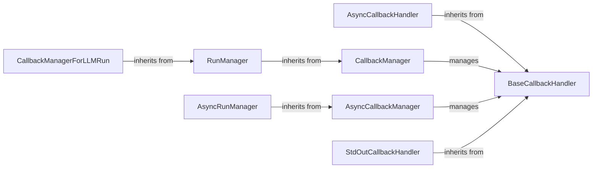

## Component Details

### BaseCallbackHandler
The abstract base class for all callback handlers in LangChain. It defines the interface for handling various events during the execution of LangChain components like LLMs, chains, and tools. Subclasses should override the `on_*` methods to implement custom logic for handling specific events, such as the start or end of an LLM run, the generation of a new token, or the occurrence of an error. It provides a flexible way to monitor and interact with the execution of LangChain components.
- **Related Classes/Methods**: `langchain_core.callbacks.base`

### CallbackManager
The CallbackManager class is responsible for managing and executing callbacks during the execution of Langchain components. It holds a list of callback handlers and provides methods to trigger specific events on these handlers. It allows to add, remove, and set handlers, as well as add tags and metadata to the callback manager. It is the central component for managing callbacks.
- **Related Classes/Methods**: `langchain_core.callbacks.manager`

### RunManager
The RunManager class is responsible for managing the execution of a single run of a LangChain component. It is a context-specific callback manager that is passed to the component during its execution. It inherits the handlers from a parent CallbackManager and provides methods to trigger events on those handlers. It is used to track the execution of a single run and to provide a way to interact with the execution.
- **Related Classes/Methods**: `langchain_core.callbacks.manager`

### StdOutCallbackHandler
A concrete callback handler that prints the output to stdout. It's a simple way to log the intermediate steps and final results of a chain or agent execution. It inherits from BaseCallbackHandler and overrides its methods to print the output to stdout.
- **Related Classes/Methods**: `langchain_core.callbacks.stdout`

### AsyncCallbackHandler
Asynchronous version of the BaseCallbackHandler. It provides the same functionality as BaseCallbackHandler but with asynchronous methods, allowing it to be used in asynchronous LangChain applications. It inherits from BaseCallbackHandler and overrides its methods to be asynchronous.
- **Related Classes/Methods**: `langchain_core.callbacks.base`

### AsyncCallbackManager
Asynchronous version of the CallbackManager. It provides the same functionality as CallbackManager but with asynchronous methods, allowing it to be used in asynchronous LangChain applications. It manages a list of asynchronous callback handlers and triggers events on them asynchronously.
- **Related Classes/Methods**: `langchain_core.callbacks.manager`

### AsyncRunManager
Asynchronous version of the RunManager. It provides the same functionality as RunManager but with asynchronous methods, allowing it to be used in asynchronous LangChain applications. It manages the execution of a single run of a LangChain component asynchronously.
- **Related Classes/Methods**: `langchain_core.callbacks.manager`

### CallbackManagerForLLMRun
Callback manager specific for LLM runs. It inherits from RunManager and adds methods specific to LLM runs, such as on_llm_new_token, on_llm_end, and on_llm_error. It is used to track the execution of a single LLM run and to provide a way to interact with the execution.
- **Related Classes/Methods**: `langchain_core.callbacks.manager`
