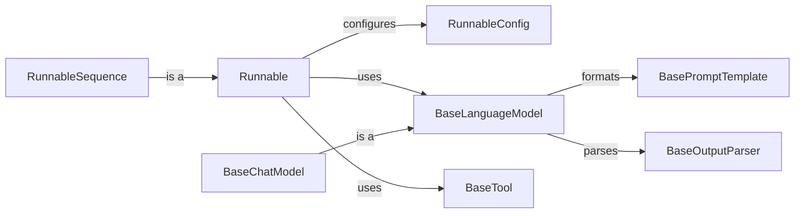

## Component Details

### Runnable
The `Runnable` class is the foundation for creating composable units in Langchain. It serves as the base class for chains, models, and tools, providing a unified interface for invoking, streaming, and transforming these components. It defines methods for composing runnables together, configuring their execution, and handling errors, enabling the creation of complex workflows.
- **Related Classes/Methods**: `langchain_core.runnables.base.Runnable`

### RunnableSequence
The `RunnableSequence` class enables the construction of sequential pipelines by combining multiple `Runnable` instances. It executes each runnable in the order they are defined, passing the output of one as the input to the next. This provides a convenient and structured way to define complex workflows where the output of one step feeds into the next.
- **Related Classes/Methods**: `langchain_core.runnables.base.RunnableSequence`

### RunnableConfig
The `RunnableConfig` class provides a mechanism to configure the execution of a `Runnable`. It allows specifying callbacks, tags, metadata, and other settings that control how the runnable is invoked and traced. This enables fine-grained control over the execution environment and allows for customization of the runnable's behavior.
- **Related Classes/Methods**: `langchain_core.runnables.config.RunnableConfig`

### BaseLanguageModel
The `BaseLanguageModel` class is an abstract base class that serves as the foundation for language models within Langchain. It defines the interface for generating text, predicting messages, and retrieving token counts. Both LLMs and chat models inherit from this class, ensuring a consistent interface for interacting with different types of language models.
- **Related Classes/Methods**: `langchain_core.language_models.base.BaseLanguageModel`

### BaseChatModel
The `BaseChatModel` class is an abstract base class specifically designed for chat models. It extends `BaseLanguageModel` and provides methods tailored for conversational language models, such as generating chat messages and handling tools. This class provides the structure for building conversational AI agents.
- **Related Classes/Methods**: `langchain_core.language_models.chat_models.BaseChatModel`

### BaseTool
The `BaseTool` class is an abstract base class for defining tools that can be used within Langchain. It defines the interface for invoking a tool with a given input and provides metadata about the tool, such as its name and description. Tools can be integrated into chains and agents to perform specific tasks, extending the capabilities of the system.
- **Related Classes/Methods**: `langchain_core.tools.base.BaseTool`

### BasePromptTemplate
The `BasePromptTemplate` class is an abstract base class for prompt templates. It defines the interface for formatting prompts with input variables and partial values. It allows creating dynamic prompts that can be used with language models, enabling flexible and customizable interactions.
- **Related Classes/Methods**: `langchain_core.prompts.base.BasePromptTemplate`

### BaseOutputParser
The `BaseOutputParser` class is an abstract base class for output parsers. It defines the interface for parsing the output of a language model and converting it into a structured format. It allows extracting specific information from the generated text, making it easier to work with the results of language model calls.
- **Related Classes/Methods**: `langchain_core.output_parsers.base.BaseOutputParser`
