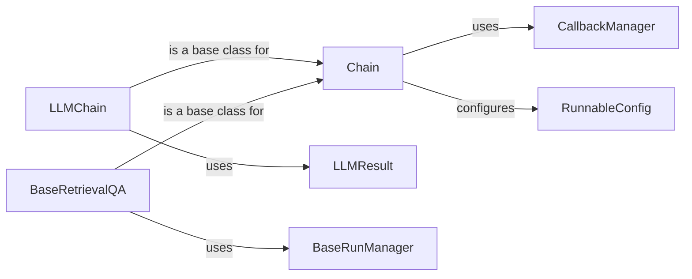

## Component Details

### Chain
The Chain component serves as the foundational building block for creating sequences of operations, defining the structure for executing a series of calls to language models or other utilities. It manages the flow of data through these operations, handles input and output, and provides a mechanism for incorporating callbacks to monitor and customize the chain's behavior. It defines the base interface for all chains.
- **Related Classes/Methods**: `langchain.chains.base.Chain`, `langchain.chains.base.Chain:invoke`, `langchain.chains.base.Chain:ainvoke`

### LLMChain
The LLMChain component is a specific type of chain designed to generate text using a Language Model (LLM) based on a prompt. It combines a prompt template with an LLM to create a structured process for generating text from input data. The LLMChain orchestrates the interaction with the LLM, passing in the formatted prompt and handling the LLM's output.
- **Related Classes/Methods**: `langchain.chains.llm.LLMChain`, `langchain.chains.llm.LLMChain:_call`, `langchain.chains.llm.LLMChain:_acall`, `langchain.chains.llm.LLMChain:generate`

### BaseRetrievalQA
The BaseRetrievalQA component is a chain specifically designed for question answering tasks. It retrieves relevant documents from a knowledge base and then uses a language model to answer a question based on the retrieved context. It encapsulates the retrieval and generation steps, providing a streamlined interface for question answering applications.
- **Related Classes/Methods**: `langchain.chains.retrieval_qa.base.BaseRetrievalQA`, `langchain.chains.retrieval_qa.base.BaseRetrievalQA:_call`, `langchain.chains.retrieval_qa.base.BaseRetrievalQA:_acall`

### CallbackManager
The CallbackManager component manages callbacks for different stages of chain execution, enabling logging, monitoring, and other side effects during the chain's operation. It provides a centralized mechanism for registering and invoking callbacks, allowing developers to customize and extend the behavior of chains without modifying their core logic.
- **Related Classes/Methods**: `langchain_core.callbacks.manager.CallbackManager`, `langchain_core.callbacks.manager.CallbackManager.configure`, `langchain_core.callbacks.manager.AsyncCallbackManager.configure`, `langchain_core.callbacks.manager.CallbackManager.on_chain_start`, `langchain_core.callbacks.manager.AsyncCallbackManager.on_chain_start`, `langchain_core.callbacks.manager.CallbackManagerForChainRun.on_chain_error`, `langchain_core.callbacks.manager.CallbackManagerForChainRun.on_chain_end`

### LLMResult
The LLMResult component represents the output of a language model, including the generated text, token usage, and other metadata. It encapsulates the raw response from the LLM, providing a structured format for accessing the generated content and associated information.
- **Related Classes/Methods**: `langchain_core.outputs.llm_result.LLMResult`

### RunnableConfig
The RunnableConfig component ensures that the configuration is properly set up for the runnable, preparing the environment for execution. It manages settings such as callbacks and tags, providing a consistent and reliable configuration context for running chains and other runnables.
- **Related Classes/Methods**: `langchain_core.runnables.config.ensure_config`, `langchain_core.runnables.config.run_in_executor`

### BaseRunManager
The BaseRunManager component provides a base class for managing the execution of a runnable, including handling callbacks and managing the context. It offers methods for creating child run managers and obtaining no-op managers, enabling hierarchical management of callbacks and efficient handling of scenarios where callbacks are not needed.
- **Related Classes/Methods**: `langchain_core.callbacks.manager.BaseRunManager.get_noop_manager`, `langchain_core.callbacks.manager.ParentRunManager.get_child`, `langchain_core.callbacks.manager.AsyncParentRunManager.get_child`
