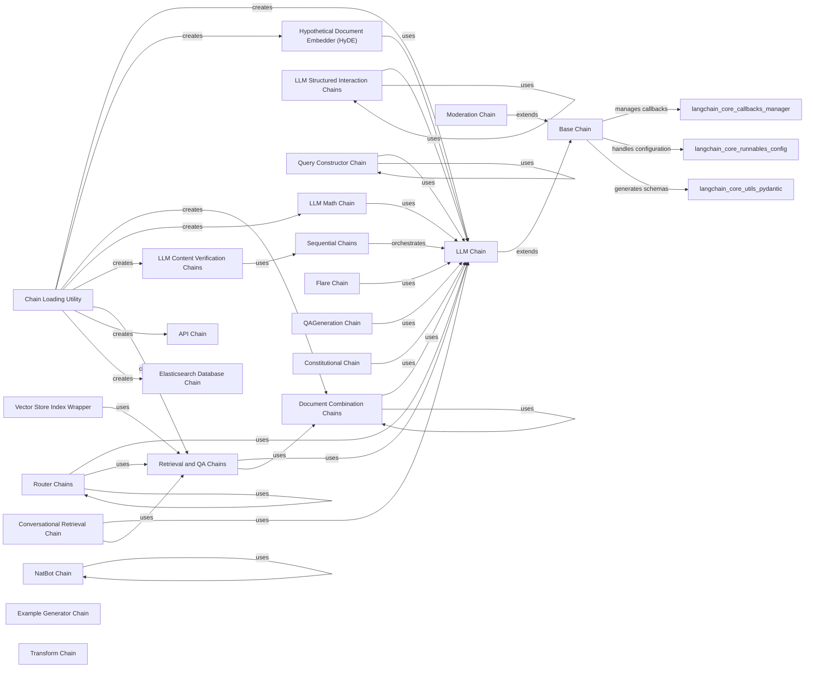

## Component Details

The 'Chains & Workflows' subsystem in LangChain provides a modular and extensible framework for building complex applications by orchestrating various components, primarily Language Models (LLMs). It defines a hierarchical structure where a 'Base Chain' serves as the fundamental abstract class, offering core functionalities like input/output handling, callback management, and execution methods. Specialized chains extend this base, enabling diverse functionalities such as direct LLM interaction ('LLM Chain'), document processing ('Document Combination Chains'), information retrieval and question answering ('Retrieval and QA Chains'), and dynamic routing of queries ('Router Chains'). The subsystem also includes utilities for loading and managing chain configurations, facilitating the creation of sophisticated multi-step workflows that can incorporate memory, handle structured interactions, perform mathematical operations, verify content, and interact with external systems like APIs and databases.

### Base Chain
The foundational abstract class for all chains in LangChain. It provides core functionalities such as input/output handling, callback management, and methods for synchronous and asynchronous execution (`invoke`, `ainvoke`). It defines the basic structure and lifecycle for any chain.

**Related Classes/Methods**:

- <a href="https://github.com/langchain-ai/langchain/blob/master/libs/langchain/langchain/chains/base.py#L50-L766" target="_blank" rel="noopener noreferrer">`langchain.libs.langchain.langchain.chains.base.Chain` (50:766)</a>
- <a href="https://github.com/langchain-ai/langchain/blob/master/libs/langchain/langchain/chains/base.py#L44-L47" target="_blank" rel="noopener noreferrer">`langchain.libs.langchain.langchain.chains.base._get_verbosity` (44:47)</a>

### LLM Chain
A fundamental chain designed for direct interaction with Language Models. It is responsible for preparing prompts, sending them to an LLM, and processing the generated responses. It forms the backbone for many higher-level chains.

**Related Classes/Methods**:

- <a href="https://github.com/langchain-ai/langchain/blob/master/libs/langchain/langchain/chains/llm.py#L44-L410" target="_blank" rel="noopener noreferrer">`langchain.libs.langchain.langchain.chains.llm.LLMChain` (44:410)</a>
- <a href="https://github.com/langchain-ai/langchain/blob/master/libs/langchain/langchain/chains/llm.py#L413-L426" target="_blank" rel="noopener noreferrer">`langchain.libs.langchain.langchain.chains.llm._get_language_model` (413:426)</a>

### Chain Loading Utility
This component provides utilities for deserializing and loading various chain configurations from different sources, such as files. It acts as a factory for creating chain instances based on predefined configurations.

**Related Classes/Methods**:

- <a href="https://github.com/langchain-ai/langchain/blob/master/libs/langchain/langchain/chains/loading.py#L659-L669" target="_blank" rel="noopener noreferrer">`langchain.libs.langchain.langchain.chains.loading.load_chain_from_config` (659:669)</a>
- <a href="https://github.com/langchain-ai/langchain/blob/master/libs/langchain/langchain/chains/loading.py#L680-L688" target="_blank" rel="noopener noreferrer">`langchain.libs.langchain.langchain.chains.loading.load_chain` (680:688)</a>
- <a href="https://github.com/langchain-ai/langchain/blob/master/libs/langchain/langchain/chains/loading.py#L691-L715" target="_blank" rel="noopener noreferrer">`langchain.libs.langchain.langchain.chains.loading._load_chain_from_file` (691:715)</a>
- <a href="https://github.com/langchain-ai/langchain/blob/master/libs/langchain/langchain/chains/loading.py#L60-L79" target="_blank" rel="noopener noreferrer">`langchain.libs.langchain.langchain.chains.loading._load_llm_chain` (60:79)</a>
- <a href="https://github.com/langchain-ai/langchain/blob/master/libs/langchain/langchain/chains/loading.py#L82-L99" target="_blank" rel="noopener noreferrer">`langchain.libs.langchain.langchain.chains.loading._load_hyde_chain` (82:99)</a>
- <a href="https://github.com/langchain-ai/langchain/blob/master/libs/langchain/langchain/chains/loading.py#L102-L126" target="_blank" rel="noopener noreferrer">`langchain.libs.langchain.langchain.chains.loading._load_stuff_documents_chain` (102:126)</a>
- <a href="https://github.com/langchain-ai/langchain/blob/master/libs/langchain/langchain/chains/loading.py#L129-L158" target="_blank" rel="noopener noreferrer">`langchain.libs.langchain.langchain.chains.loading._load_map_reduce_documents_chain` (129:158)</a>
- <a href="https://github.com/langchain-ai/langchain/blob/master/libs/langchain/langchain/chains/loading.py#L161-L218" target="_blank" rel="noopener noreferrer">`langchain.libs.langchain.langchain.chains.loading._load_reduce_documents_chain` (161:218)</a>
- <a href="https://github.com/langchain-ai/langchain/blob/master/libs/langchain/langchain/chains/loading.py#L221-L248" target="_blank" rel="noopener noreferrer">`langchain.libs.langchain.langchain.chains.loading._load_llm_bash_chain` (221:248)</a>
- <a href="https://github.com/langchain-ai/langchain/blob/master/libs/langchain/langchain/chains/loading.py#L251-L294" target="_blank" rel="noopener noreferrer">`langchain.libs.langchain.langchain.chains.loading._load_llm_checker_chain` (251:294)</a>
- <a href="https://github.com/langchain-ai/langchain/blob/master/libs/langchain/langchain/chains/loading.py#L297-L322" target="_blank" rel="noopener noreferrer">`langchain.libs.langchain.langchain.chains.loading._load_llm_math_chain` (297:322)</a>
- <a href="https://github.com/langchain-ai/langchain/blob/master/libs/langchain/langchain/chains/loading.py#L325-L335" target="_blank" rel="noopener noreferrer">`langchain.libs.langchain.langchain.chains.loading._load_map_rerank_documents_chain` (325:335)</a>
- <a href="https://github.com/langchain-ai/langchain/blob/master/libs/langchain/langchain/chains/loading.py#L338-L348" target="_blank" rel="noopener noreferrer">`langchain.libs.langchain.langchain.chains.loading._load_pal_chain` (338:348)</a>
- <a href="https://github.com/langchain-ai/langchain/blob/master/libs/langchain/langchain/chains/loading.py#L351-L380" target="_blank" rel="noopener noreferrer">`langchain.libs.langchain.langchain.chains.loading._load_refine_documents_chain` (351:380)</a>
- <a href="https://github.com/langchain-ai/langchain/blob/master/libs/langchain/langchain/chains/loading.py#L383-L398" target="_blank" rel="noopener noreferrer">`langchain.libs.langchain.langchain.chains.loading._load_qa_with_sources_chain` (383:398)</a>
- <a href="https://github.com/langchain-ai/langchain/blob/master/libs/langchain/langchain/chains/loading.py#L401-L425" target="_blank" rel="noopener noreferrer">`langchain.libs.langchain.langchain.chains.loading._load_sql_database_chain` (401:425)</a>
- <a href="https://github.com/langchain-ai/langchain/blob/master/libs/langchain/langchain/chains/loading.py#L428-L453" target="_blank" rel="noopener noreferrer">`langchain.libs.langchain.langchain.chains.loading._load_vector_db_qa_with_sources_chain` (428:453)</a>
- <a href="https://github.com/langchain-ai/langchain/blob/master/libs/langchain/langchain/chains/loading.py#L456-L479" target="_blank" rel="noopener noreferrer">`langchain.libs.langchain.langchain.chains.loading._load_retrieval_qa` (456:479)</a>
- <a href="https://github.com/langchain-ai/langchain/blob/master/libs/langchain/langchain/chains/loading.py#L482-L507" target="_blank" rel="noopener noreferrer">`langchain.libs.langchain.langchain.chains.loading._load_retrieval_qa_with_sources_chain` (482:507)</a>
- <a href="https://github.com/langchain-ai/langchain/blob/master/libs/langchain/langchain/chains/loading.py#L510-L533" target="_blank" rel="noopener noreferrer">`langchain.libs.langchain.langchain.chains.loading._load_vector_db_qa` (510:533)</a>
- <a href="https://github.com/langchain-ai/langchain/blob/master/libs/langchain/langchain/chains/loading.py#L536-L567" target="_blank" rel="noopener noreferrer">`langchain.libs.langchain.langchain.chains.loading._load_graph_cypher_chain` (536:567)</a>
- <a href="https://github.com/langchain-ai/langchain/blob/master/libs/langchain/langchain/chains/loading.py#L570-L598" target="_blank" rel="noopener noreferrer">`langchain.libs.langchain.langchain.chains.loading._load_api_chain` (570:598)</a>
- <a href="https://github.com/langchain-ai/langchain/blob/master/libs/langchain/langchain/chains/loading.py#L601-L624" target="_blank" rel="noopener noreferrer">`langchain.libs.langchain.langchain.chains.loading._load_llm_requests_chain` (601:624)</a>

### Retrieval and QA Chains
This component encompasses chains specialized in question-answering by retrieving relevant documents and generating answers based on the retrieved context. It includes functionalities for both standard QA and QA with explicit source citation.

**Related Classes/Methods**:

- <a href="https://github.com/langchain-ai/langchain/blob/master/libs/langchain/langchain/chains/retrieval_qa/base.py#L40-L204" target="_blank" rel="noopener noreferrer">`langchain.chains.retrieval_qa.base.BaseRetrievalQA` (40:204)</a>
- <a href="https://github.com/langchain-ai/langchain/blob/master/libs/langchain/langchain/chains/retrieval_qa/base.py#L216-L289" target="_blank" rel="noopener noreferrer">`langchain.chains.retrieval_qa.base.RetrievalQA` (216:289)</a>
- <a href="https://github.com/langchain-ai/langchain/blob/master/libs/langchain/langchain/chains/retrieval_qa/base.py#L301-L363" target="_blank" rel="noopener noreferrer">`langchain.chains.retrieval_qa.base.VectorDBQA` (301:363)</a>
- <a href="https://github.com/langchain-ai/langchain/blob/master/libs/langchain/langchain/chains/qa_with_sources/base.py#L43-L210" target="_blank" rel="noopener noreferrer">`langchain.chains.qa_with_sources.base.BaseQAWithSourcesChain` (43:210)</a>
- <a href="https://github.com/langchain-ai/langchain/blob/master/libs/langchain/langchain/chains/qa_with_sources/retrieval.py#L17-L66" target="_blank" rel="noopener noreferrer">`langchain.chains.qa_with_sources.retrieval.RetrievalQAWithSourcesChain` (17:66)</a>
- <a href="https://github.com/langchain-ai/langchain/blob/master/libs/langchain/langchain/chains/qa_with_sources/vector_db.py#L18-L75" target="_blank" rel="noopener noreferrer">`langchain.chains.qa_with_sources.vector_db.VectorDBQAWithSourcesChain` (18:75)</a>
- <a href="https://github.com/langchain-ai/langchain/blob/master/libs/langchain/langchain/chains/qa_with_sources/loading.py#L38-L54" target="_blank" rel="noopener noreferrer">`langchain.libs.langchain.langchain.chains.qa_with_sources.loading._load_map_rerank_chain` (38:54)</a>
- <a href="https://github.com/langchain-ai/langchain/blob/master/libs/langchain/langchain/chains/qa_with_sources/loading.py#L57-L72" target="_blank" rel="noopener noreferrer">`langchain.libs.langchain.langchain.chains.qa_with_sources.loading._load_stuff_chain` (57:72)</a>
- <a href="https://github.com/langchain-ai/langchain/blob/master/libs/langchain/langchain/chains/qa_with_sources/loading.py#L75-L128" target="_blank" rel="noopener noreferrer">`langchain.libs.langchain.langchain.chains.qa_with_sources.loading._load_map_reduce_chain` (75:128)</a>
- <a href="https://github.com/langchain-ai/langchain/blob/master/libs/langchain/langchain/chains/qa_with_sources/loading.py#L131-L153" target="_blank" rel="noopener noreferrer">`langchain.libs.langchain.langchain.chains.qa_with_sources.loading._load_refine_chain` (131:153)</a>
- <a href="https://github.com/langchain-ai/langchain/blob/master/libs/langchain/langchain/chains/qa_with_sources/loading.py#L171-L201" target="_blank" rel="noopener noreferrer">`langchain.libs.langchain.langchain.chains.qa_with_sources.loading.load_qa_with_sources_chain` (171:201)</a>
- <a href="https://github.com/langchain-ai/langchain/blob/master/libs/langchain/langchain/chains/question_answering/chain.py#L235-L268" target="_blank" rel="noopener noreferrer">`langchain.libs.langchain.langchain.chains.question_answering.chain.load_qa_chain` (235:268)</a>
- <a href="https://github.com/langchain-ai/langchain/blob/master/libs/langchain/langchain/chains/question_answering/chain.py#L37-L63" target="_blank" rel="noopener noreferrer">`langchain.libs.langchain.langchain.chains.question_answering.chain._load_map_rerank_chain` (37:63)</a>
- <a href="https://github.com/langchain-ai/langchain/blob/master/libs/langchain/langchain/chains/question_answering/chain.py#L66-L91" target="_blank" rel="noopener noreferrer">`langchain.libs.langchain.langchain.chains.question_answering.chain._load_stuff_chain` (66:91)</a>
- <a href="https://github.com/langchain-ai/langchain/blob/master/libs/langchain/langchain/chains/question_answering/chain.py#L94-L173" target="_blank" rel="noopener noreferrer">`langchain.libs.langchain.langchain.chains.question_answering.chain._load_map_reduce_chain` (94:173)</a>
- <a href="https://github.com/langchain-ai/langchain/blob/master/libs/langchain/langchain/chains/question_answering/chain.py#L176-L218" target="_blank" rel="noopener noreferrer">`langchain.libs.langchain.langchain.chains.question_answering.chain._load_refine_chain` (176:218)</a>

### Document Combination Chains
A family of chains designed to process and combine multiple documents into a format suitable for Language Models. This includes strategies like 'stuffing' (concatenating documents), 'map-reduce' (summarizing parts and then combining summaries), 'refine' (iteratively refining an answer with new documents), and 'map-rerank' (scoring documents and selecting the best ones).

**Related Classes/Methods**:

- <a href="https://github.com/langchain-ai/langchain/blob/master/libs/langchain/langchain/chains/combine_documents/stuff.py#L108-L281" target="_blank" rel="noopener noreferrer">`langchain.libs.langchain.langchain.chains.combine_documents.stuff.StuffDocumentsChain` (108:281)</a>
- <a href="https://github.com/langchain-ai/langchain/blob/master/libs/langchain/langchain/chains/combine_documents/map_reduce.py#L28-L292" target="_blank" rel="noopener noreferrer">`langchain.libs.langchain.langchain.chains.combine_documents.map_reduce.MapReduceDocumentsChain` (28:292)</a>
- <a href="https://github.com/langchain-ai/langchain/blob/master/libs/langchain/langchain/chains/combine_documents/refine.py#L33-L227" target="_blank" rel="noopener noreferrer">`langchain.libs.langchain.langchain.chains.combine_documents.refine.RefineDocumentsChain` (33:227)</a>
- <a href="https://github.com/langchain-ai/langchain/blob/master/libs/langchain/langchain/chains/combine_documents/map_rerank.py#L30-L234" target="_blank" rel="noopener noreferrer">`langchain.libs.langchain.langchain.chains.combine_documents.map_rerank.MapRerankDocumentsChain` (30:234)</a>
- <a href="https://github.com/langchain-ai/langchain/blob/master/libs/langchain/langchain/chains/combine_documents/reduce.py#L134-L360" target="_blank" rel="noopener noreferrer">`langchain.libs.langchain.langchain.chains.combine_documents.reduce.ReduceDocumentsChain` (134:360)</a>
- <a href="https://github.com/langchain-ai/langchain/blob/master/libs/langchain/langchain/chains/combine_documents/base.py#L33-L158" target="_blank" rel="noopener noreferrer">`langchain.libs.langchain.langchain.chains.combine_documents.base.BaseCombineDocumentsChain` (33:158)</a>
- <a href="https://github.com/langchain-ai/langchain/blob/master/libs/langchain/langchain/chains/combine_documents/base.py#L169-L274" target="_blank" rel="noopener noreferrer">`langchain.libs.langchain.langchain.chains.combine_documents.base.AnalyzeDocumentChain` (169:274)</a>
- <a href="https://github.com/langchain-ai/langchain/blob/master/libs/langchain/langchain/chains/combine_documents/refine.py#L20-L21" target="_blank" rel="noopener noreferrer">`langchain.libs.langchain.langchain.chains.combine_documents.refine._get_default_document_prompt` (20:21)</a>
- <a href="https://github.com/langchain-ai/langchain/blob/master/libs/langchain/langchain/chains/combine_documents/reduce.py#L61-L90" target="_blank" rel="noopener noreferrer">`langchain.libs.langchain.langchain.chains.combine_documents.reduce.collapse_docs` (61:90)</a>
- <a href="https://github.com/langchain-ai/langchain/blob/master/libs/langchain/langchain/chains/combine_documents/reduce.py#L93-L122" target="_blank" rel="noopener noreferrer">`langchain.libs.langchain.langchain.chains.combine_documents.reduce.acollapse_docs` (93:122)</a>
- <a href="https://github.com/langchain-ai/langchain/blob/master/libs/langchain/langchain/chains/combine_documents/reduce.py#L29-L58" target="_blank" rel="noopener noreferrer">`langchain.libs.langchain.langchain.chains.combine_documents.reduce.split_list_of_docs` (29:58)</a>
- <a href="https://github.com/langchain-ai/langchain/blob/master/libs/langchain/langchain/chains/combine_documents/stuff.py#L24-L96" target="_blank" rel="noopener noreferrer">`langchain.libs.langchain.langchain.chains.combine_documents.stuff.create_stuff_documents_chain` (24:96)</a>

### Sequential Chains
These chains are used to orchestrate a series of other chains or components, executing them in a predefined sequence. The output of one step typically becomes the input for the next, allowing for complex multi-step workflows.

**Related Classes/Methods**:

- <a href="https://github.com/langchain-ai/langchain/blob/master/libs/langchain/langchain/chains/sequential.py#L16-L124" target="_blank" rel="noopener noreferrer">`langchain.libs.langchain.langchain.chains.sequential.SequentialChain` (16:124)</a>
- <a href="https://github.com/langchain-ai/langchain/blob/master/libs/langchain/langchain/chains/sequential.py#L127-L208" target="_blank" rel="noopener noreferrer">`langchain.libs.langchain.langchain.chains.sequential.SimpleSequentialChain` (127:208)</a>

### Router Chains
Router chains are responsible for dynamically directing an input query to one of several sub-chains based on a routing logic, often determined by an LLM or embedding similarity. This allows for building flexible applications that can handle diverse user intents by selecting the most appropriate specialized chain.

**Related Classes/Methods**:

- <a href="https://github.com/langchain-ai/langchain/blob/master/libs/langchain/langchain/chains/router/llm_router.py#L33-L163" target="_blank" rel="noopener noreferrer">`langchain.libs.langchain.langchain.chains.router.llm_router.LLMRouterChain` (33:163)</a>
- <a href="https://github.com/langchain-ai/langchain/blob/master/libs/langchain/langchain/chains/router/llm_router.py#L166-L195" target="_blank" rel="noopener noreferrer">`langchain.libs.langchain.langchain.chains.router.llm_router.RouterOutputParser` (166:195)</a>
- <a href="https://github.com/langchain-ai/langchain/blob/master/libs/langchain/langchain/chains/router/base.py#L24-L49" target="_blank" rel="noopener noreferrer">`langchain.libs.langchain.langchain.chains.router.base.RouterChain` (24:49)</a>
- <a href="https://github.com/langchain-ai/langchain/blob/master/libs/langchain/langchain/chains/router/base.py#L52-L138" target="_blank" rel="noopener noreferrer">`langchain.libs.langchain.langchain.chains.router.base.MultiRouteChain` (52:138)</a>
- <a href="https://github.com/langchain-ai/langchain/blob/master/libs/langchain/langchain/chains/router/multi_prompt.py#L27-L181" target="_blank" rel="noopener noreferrer">`langchain.libs.langchain.langchain.chains.router.multi_prompt.MultiPromptChain` (27:181)</a>
- <a href="https://github.com/langchain-ai/langchain/blob/master/libs/langchain/langchain/chains/router/multi_retrieval_qa.py#L23-L104" target="_blank" rel="noopener noreferrer">`langchain.libs.langchain.langchain.chains.router.multi_retrieval_qa.MultiRetrievalQAChain` (23:104)</a>
- <a href="https://github.com/langchain-ai/langchain/blob/master/libs/langchain/langchain/chains/router/embedding_router.py#L18-L89" target="_blank" rel="noopener noreferrer">`langchain.libs.langchain.langchain.chains.router.embedding_router.EmbeddingRouterChain` (18:89)</a>

### LLM Structured Interaction Chains
A collection of chains designed to facilitate structured interactions with Language Models, including leveraging OpenAI's function calling for data extraction, structured output, and tagging, as well as general structured output enforcement.

**Related Classes/Methods**:

- <a href="https://github.com/langchain-ai/langchain/blob/master/libs/langchain/langchain/chains/openai_functions/extraction.py#L82-L114" target="_blank" rel="noopener noreferrer">`langchain.libs.langchain.langchain.chains.openai_functions.extraction.create_extraction_chain` (82:114)</a>
- <a href="https://github.com/langchain-ai/langchain/blob/master/libs/langchain/langchain/chains/openai_functions/extraction.py#L152-L197" target="_blank" rel="noopener noreferrer">`langchain.libs.langchain.langchain.chains.openai_functions.extraction.create_extraction_chain_pydantic` (152:197)</a>
- <a href="https://github.com/langchain-ai/langchain/blob/master/libs/langchain/langchain/chains/openai_functions/extraction.py#L21-L32" target="_blank" rel="noopener noreferrer">`langchain.libs.langchain.langchain.chains.openai_functions.extraction._get_extraction_function` (21:32)</a>
- <a href="https://github.com/langchain-ai/langchain/blob/master/libs/langchain/langchain/chains/openai_functions/base.py#L45-L142" target="_blank" rel="noopener noreferrer">`langchain.libs.langchain.langchain.chains.openai_functions.base.create_openai_fn_chain` (45:142)</a>
- <a href="https://github.com/langchain-ai/langchain/blob/master/libs/langchain/langchain/chains/openai_functions/base.py#L148-L232" target="_blank" rel="noopener noreferrer">`langchain.libs.langchain.langchain.chains.openai_functions.base.create_structured_output_chain` (148:232)</a>
- <a href="https://github.com/langchain-ai/langchain/blob/master/libs/langchain/langchain/chains/openai_functions/qa_with_structure.py#L38-L108" target="_blank" rel="noopener noreferrer">`langchain.libs.langchain.langchain.chains.openai_functions.qa_with_structure.create_qa_with_structure_chain` (38:108)</a>
- <a href="https://github.com/langchain-ai/langchain/blob/master/libs/langchain/langchain/chains/openai_functions/qa_with_structure.py#L120-L135" target="_blank" rel="noopener noreferrer">`langchain.libs.langchain.langchain.chains.openai_functions.qa_with_structure.create_qa_with_sources_chain` (120:135)</a>
- <a href="https://github.com/langchain-ai/langchain/blob/master/libs/langchain/langchain/chains/openai_functions/citation_fuzzy_match.py#L15-L49" target="_blank" rel="noopener noreferrer">`langchain.libs.langchain.langchain.chains.openai_functions.citation_fuzzy_match.FactWithEvidence` (15:49)</a>
- <a href="https://github.com/langchain-ai/langchain/blob/master/libs/langchain/langchain/chains/openai_functions/citation_fuzzy_match.py#L66-L109" target="_blank" rel="noopener noreferrer">`langchain.libs.langchain.langchain.chains.openai_functions.citation_fuzzy_match.create_citation_fuzzy_match_runnable` (66:109)</a>
- <a href="https://github.com/langchain-ai/langchain/blob/master/libs/langchain/langchain/chains/openai_functions/citation_fuzzy_match.py#L117-L159" target="_blank" rel="noopener noreferrer">`langchain.libs.langchain.langchain.chains.openai_functions.citation_fuzzy_match.create_citation_fuzzy_match_chain` (117:159)</a>
- <a href="https://github.com/langchain-ai/langchain/blob/master/libs/langchain/langchain/chains/openai_functions/openapi.py#L90-L197" target="_blank" rel="noopener noreferrer">`langchain.libs.langchain.langchain.chains.openai_functions.openapi.openapi_spec_to_openai_fn` (90:197)</a>
- <a href="https://github.com/langchain-ai/langchain/blob/master/libs/langchain/langchain/chains/openai_functions/openapi.py#L200-L243" target="_blank" rel="noopener noreferrer">`langchain.libs.langchain.langchain.chains.openai_functions.openapi.SimpleRequestChain` (200:243)</a>
- <a href="https://github.com/langchain-ai/langchain/blob/master/libs/langchain/langchain/chains/openai_functions/openapi.py#L255-L405" target="_blank" rel="noopener noreferrer">`langchain.libs.langchain.langchain.chains.openai_functions.openapi.get_openapi_chain` (255:405)</a>
- <a href="https://github.com/langchain-ai/langchain/blob/master/libs/langchain/langchain/chains/openai_functions/tagging.py#L16-L21" target="_blank" rel="noopener noreferrer">`langchain.libs.langchain.langchain.chains.openai_functions.tagging._get_tagging_function` (16:21)</a>
- <a href="https://github.com/langchain-ai/langchain/blob/master/libs/langchain/langchain/chains/openai_functions/tagging.py#L48-L101" target="_blank" rel="noopener noreferrer">`langchain.libs.langchain.langchain.chains.openai_functions.tagging.create_tagging_chain` (48:101)</a>
- <a href="https://github.com/langchain-ai/langchain/blob/master/libs/langchain/langchain/chains/openai_functions/tagging.py#L119-L174" target="_blank" rel="noopener noreferrer">`langchain.libs.langchain.langchain.chains.openai_functions.tagging.create_tagging_chain_pydantic` (119:174)</a>
- <a href="https://github.com/langchain-ai/langchain/blob/master/libs/langchain/langchain/chains/structured_output/base.py#L66-L146" target="_blank" rel="noopener noreferrer">`langchain.libs.langchain.langchain.chains.structured_output.base.create_openai_fn_runnable` (66:146)</a>
- <a href="https://github.com/langchain-ai/langchain/blob/master/libs/langchain/langchain/chains/structured_output/base.py#L184-L437" target="_blank" rel="noopener noreferrer">`langchain.libs.langchain.langchain.chains.structured_output.base.create_structured_output_runnable` (184:437)</a>
- <a href="https://github.com/langchain-ai/langchain/blob/master/libs/langchain/langchain/chains/structured_output/base.py#L440-L462" target="_blank" rel="noopener noreferrer">`langchain.libs.langchain.langchain.chains.structured_output.base._create_openai_tools_runnable` (440:462)</a>
- <a href="https://github.com/langchain-ai/langchain/blob/master/libs/langchain/langchain/chains/structured_output/base.py#L465-L479" target="_blank" rel="noopener noreferrer">`langchain.libs.langchain.langchain.chains.structured_output.base._get_openai_tool_output_parser` (465:479)</a>
- <a href="https://github.com/langchain-ai/langchain/blob/master/libs/langchain/langchain/chains/structured_output/base.py#L482-L510" target="_blank" rel="noopener noreferrer">`langchain.libs.langchain.langchain.chains.structured_output.base.get_openai_output_parser` (482:510)</a>
- <a href="https://github.com/langchain-ai/langchain/blob/master/libs/langchain/langchain/chains/structured_output/base.py#L513-L537" target="_blank" rel="noopener noreferrer">`langchain.libs.langchain.langchain.chains.structured_output.base._create_openai_json_runnable` (513:537)</a>
- <a href="https://github.com/langchain-ai/langchain/blob/master/libs/langchain/langchain/chains/structured_output/base.py#L540-L574" target="_blank" rel="noopener noreferrer">`langchain.libs.langchain.langchain.chains.structured_output.base._create_openai_functions_structured_output_runnable` (540:574)</a>

### Query Constructor Chain
This chain is responsible for transforming natural language queries into structured queries, which can then be used to interact with databases or other structured data sources. It involves parsing and reformatting user input into a query language.

**Related Classes/Methods**:

- <a href="https://github.com/langchain-ai/langchain/blob/master/libs/langchain/langchain/chains/query_constructor/parser.py#L75-L178" target="_blank" rel="noopener noreferrer">`langchain.libs.langchain.langchain.chains.query_constructor.parser.QueryTransformer` (75:178)</a>
- <a href="https://github.com/langchain-ai/langchain/blob/master/libs/langchain/langchain/chains/query_constructor/parser.py#L181-L205" target="_blank" rel="noopener noreferrer">`langchain.libs.langchain.langchain.chains.query_constructor.parser.get_parser` (181:205)</a>
- <a href="https://github.com/langchain-ai/langchain/blob/master/libs/langchain/langchain/chains/query_constructor/base.py#L43-L107" target="_blank" rel="noopener noreferrer">`langchain.libs.langchain.langchain.chains.query_constructor.base.StructuredQueryOutputParser` (43:107)</a>
- <a href="https://github.com/langchain-ai/langchain/blob/master/libs/langchain/langchain/chains/query_constructor/base.py#L110-L165" target="_blank" rel="noopener noreferrer">`langchain.libs.langchain.langchain.chains.query_constructor.base.fix_filter_directive` (110:165)</a>
- <a href="https://github.com/langchain-ai/langchain/blob/master/libs/langchain/langchain/chains/query_constructor/base.py#L199-L259" target="_blank" rel="noopener noreferrer">`langchain.libs.langchain.langchain.chains.query_constructor.base.get_query_constructor_prompt` (199:259)</a>
- <a href="https://github.com/langchain-ai/langchain/blob/master/libs/langchain/langchain/chains/query_constructor/base.py#L267-L317" target="_blank" rel="noopener noreferrer">`langchain.libs.langchain.langchain.chains.query_constructor.base.load_query_constructor_chain` (267:317)</a>
- <a href="https://github.com/langchain-ai/langchain/blob/master/libs/langchain/langchain/chains/query_constructor/base.py#L320-L375" target="_blank" rel="noopener noreferrer">`langchain.libs.langchain.langchain.chains.query_constructor.base.load_query_constructor_runnable` (320:375)</a>

### Conversational Retrieval Chain
This chain integrates conversational memory with document retrieval, enabling a chatbot-like experience where the system can answer questions based on a knowledge base while maintaining context from previous turns in the conversation.

**Related Classes/Methods**:

- <a href="https://github.com/langchain-ai/langchain/blob/master/libs/langchain/langchain/chains/conversational_retrieval/base.py#L71-L237" target="_blank" rel="noopener noreferrer">`langchain.libs.langchain.langchain.chains.conversational_retrieval.base.BaseConversationalRetrievalChain` (71:237)</a>
- <a href="https://github.com/langchain-ai/langchain/blob/master/libs/langchain/langchain/chains/conversational_retrieval/base.py#L248-L472" target="_blank" rel="noopener noreferrer">`langchain.libs.langchain.langchain.chains.conversational_retrieval.base.ConversationalRetrievalChain` (248:472)</a>
- <a href="https://github.com/langchain-ai/langchain/blob/master/libs/langchain/langchain/chains/conversational_retrieval/base.py#L475-L547" target="_blank" rel="noopener noreferrer">`langchain.libs.langchain.langchain.chains.conversational_retrieval.base.ChatVectorDBChain` (475:547)</a>

### LLM Math Chain
A specialized chain that takes a natural language input, extracts mathematical expressions, and then evaluates them. It allows Language Models to perform calculations and return numerical results.

**Related Classes/Methods**:

- <a href="https://github.com/langchain-ai/langchain/blob/master/libs/langchain/langchain/chains/llm_math/base.py#L33-L304" target="_blank" rel="noopener noreferrer">`langchain.libs.langchain.langchain.chains.llm_math.base.LLMMathChain` (33:304)</a>

### LLM Content Verification Chains
This component encompasses chains designed to verify the factual accuracy, adherence to rules, or quality of content generated by Language Models. This includes checking general LLM outputs and specifically evaluating summaries.

**Related Classes/Methods**:

- <a href="https://github.com/langchain-ai/langchain/blob/master/libs/langchain/langchain/chains/llm_checker/base.py#L76-L192" target="_blank" rel="noopener noreferrer">`langchain.libs.langchain.langchain.chains.llm_checker.base.LLMCheckerChain` (76:192)</a>
- <a href="https://github.com/langchain-ai/langchain/blob/master/libs/langchain/langchain/chains/llm_checker/base.py#L25-L64" target="_blank" rel="noopener noreferrer">`langchain.libs.langchain.langchain.chains.llm_checker.base._load_question_to_checked_assertions_chain` (25:64)</a>
- <a href="https://github.com/langchain-ai/langchain/blob/master/libs/langchain/langchain/chains/llm_summarization_checker/base.py#L78-L202" target="_blank" rel="noopener noreferrer">`langchain.libs.langchain.langchain.chains.llm_summarization_checker.base.LLMSummarizationCheckerChain` (78:202)</a>
- <a href="https://github.com/langchain-ai/langchain/blob/master/libs/langchain/langchain/chains/llm_summarization_checker/base.py#L27-L66" target="_blank" rel="noopener noreferrer">`langchain.libs.langchain.langchain.chains.llm_summarization_checker.base._load_sequential_chain` (27:66)</a>

### Hypothetical Document Embedder (HyDE)
This component improves retrieval by first generating a hypothetical document that answers a given query, and then embedding this hypothetical document to find similar real documents in a vector store. This helps bridge the lexical gap between queries and documents.

**Related Classes/Methods**:

- <a href="https://github.com/langchain-ai/langchain/blob/master/libs/langchain/langchain/chains/hyde/base.py#L26-L123" target="_blank" rel="noopener noreferrer">`langchain.libs.langchain.langchain.chains.hyde.base.HypotheticalDocumentEmbedder` (26:123)</a>

### Flare Chain
An advanced chain that iteratively refines answers. It generates an initial response, identifies low-confidence spans within it, and then performs targeted retrieval based on these spans to gather more information, leading to a more accurate final answer.

**Related Classes/Methods**:

- <a href="https://github.com/langchain-ai/langchain/blob/master/libs/langchain/langchain/chains/flare/base.py#L94-L268" target="_blank" rel="noopener noreferrer">`langchain.libs.langchain.langchain.chains.flare.base.FlareChain` (94:268)</a>

### NatBot Chain
This chain enables Language Models to interact with web pages by simulating user actions like typing into fields and clicking elements. It's designed for automating web-based tasks and information gathering.

**Related Classes/Methods**:

- <a href="https://github.com/langchain-ai/langchain/blob/master/libs/langchain/langchain/chains/natbot/base.py#L31-L160" target="_blank" rel="noopener noreferrer">`langchain.libs.langchain.langchain.chains.natbot.base.NatBotChain` (31:160)</a>
- <a href="https://github.com/langchain-ai/langchain/blob/master/libs/langchain/langchain/chains/natbot/crawler.py#L51-L446" target="_blank" rel="noopener noreferrer">`langchain.libs.langchain.langchain.chains.natbot.crawler.Crawler` (51:446)</a>

### Elasticsearch Database Chain
A chain specifically designed to interact with Elasticsearch databases. It can formulate queries, execute them against Elasticsearch, and process the results, enabling LLMs to retrieve and utilize information stored in Elasticsearch indices.

**Related Classes/Methods**:

- <a href="https://github.com/langchain-ai/langchain/blob/master/libs/langchain/langchain/chains/elasticsearch_database/base.py#L25-L212" target="_blank" rel="noopener noreferrer">`langchain.libs.langchain.langchain.chains.elasticsearch_database.base.ElasticsearchDatabaseChain` (25:212)</a>

### Vector Store Index Wrapper
This component provides a high-level, simplified interface for querying vector stores. It abstracts away the complexities of direct vector store interaction, often by internally leveraging Retrieval QA or QA with Sources chains to process queries.

**Related Classes/Methods**:

- <a href="https://github.com/langchain-ai/langchain/blob/master/libs/langchain/langchain/indexes/vectorstore.py#L22-L158" target="_blank" rel="noopener noreferrer">`langchain.libs.langchain.langchain.indexes.vectorstore.VectorStoreIndexWrapper` (22:158)</a>

### Moderation Chain
This chain is responsible for moderating text, typically by checking for harmful or inappropriate content using a moderation model (e.g., OpenAI's moderation API). It ensures that generated or processed text adheres to safety guidelines.

**Related Classes/Methods**:

- <a href="https://github.com/langchain-ai/langchain/blob/master/libs/langchain/langchain/chains/moderation.py#L15-L133" target="_blank" rel="noopener noreferrer">`langchain.libs.langchain.langchain.chains.moderation.OpenAIModerationChain` (15:133)</a>

### API Chain
This chain is designed to interact with APIs, often by generating API calls based on natural language input and processing the API responses. It includes logic for validating API domains.

**Related Classes/Methods**:

- `langchain.libs.langchain.langchain.chains.api.base.APIChain` (full file reference)
- <a href="https://github.com/langchain-ai/langchain/blob/master/libs/langchain/langchain/chains/api/base.py#L37-L53" target="_blank" rel="noopener noreferrer">`langchain.libs.langchain.langchain.chains.api.base._check_in_allowed_domain` (37:53)</a>
- <a href="https://github.com/langchain-ai/langchain/blob/master/libs/langchain/langchain/chains/api/base.py#L24-L34" target="_blank" rel="noopener noreferrer">`langchain.libs.langchain.langchain.chains.api.base._extract_scheme_and_domain` (24:34)</a>

### QAGeneration Chain
This chain focuses on generating question-answer pairs from a given text. It can be used for creating datasets for training or for augmenting existing knowledge bases.

**Related Classes/Methods**:

- <a href="https://github.com/langchain-ai/langchain/blob/master/libs/langchain/langchain/chains/qa_generation/base.py#L26-L123" target="_blank" rel="noopener noreferrer">`langchain.libs.langchain.langchain.chains.qa_generation.base.QAGenerationChain` (26:123)</a>

### Constitutional Chain
This chain enforces ethical and safety guidelines by allowing an LLM to critique and revise its own output based on a set of constitutional principles, ensuring responses align with desired values.

**Related Classes/Methods**:

- <a href="https://github.com/langchain-ai/langchain/blob/master/libs/langchain/langchain/chains/constitutional_ai/base.py#L26-L321" target="_blank" rel="noopener noreferrer">`langchain.libs.langchain.langchain.chains.constitutional_ai.base.ConstitutionalChain` (26:321)</a>

### Example Generator Chain
This chain is designed to generate examples, often used in few-shot prompting to provide the LLM with demonstrations of desired input-output formats or behaviors.

**Related Classes/Methods**:

- <a href="https://github.com/langchain-ai/langchain/blob/master/libs/langchain/langchain/chains/example_generator.py#L9-L20" target="_blank" rel="noopener noreferrer">`langchain.libs.langchain.langchain.chains.example_generator:generate_example` (9:20)</a>

### Transform Chain
A simple chain that applies a transformation function to its input. It's useful for pre-processing or post-processing data within a chain sequence.

**Related Classes/Methods**:

- <a href="https://github.com/langchain-ai/langchain/blob/master/libs/langchain/langchain/chains/transform.py#L19-L85" target="_blank" rel="noopener noreferrer">`langchain.libs.langchain.langchain.chains.transform.TransformChain` (19:85)</a>

### [FAQ](https://github.com/CodeBoarding/GeneratedOnBoardings/tree/main?tab=readme-ov-file#faq)