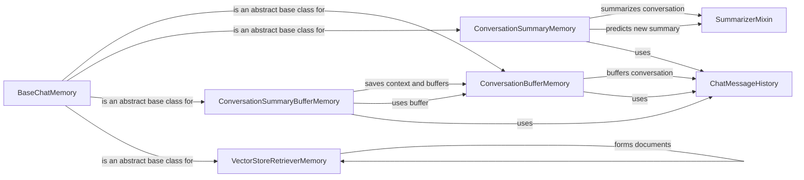

## Component Details

The Contextual Memory component in Langchain provides stateful information storage and retrieval across multiple interactions with a language model. It enables conversational agents to remember past interactions, maintaining context for more natural and engaging conversations. The core components include abstract base classes for defining memory interfaces, concrete implementations for buffering, summarizing, and vector-based retrieval of conversation history, and utility classes for managing chat message history.

### BaseChatMemory
Abstract base class defining the interface for chat memory classes. It specifies methods for saving and loading messages, managing key prefixes, and clearing memory. Subclasses implement specific memory storage and retrieval strategies.
- **Related Classes/Methods**: `langchain.libs.langchain.memory.chat_memory.BaseChatMemory`

### ConversationBufferMemory
Stores the entire conversation history in a buffer (list of messages). It retrieves the entire buffer when loading memory variables. Simple and straightforward, but can become inefficient for long conversations.
- **Related Classes/Methods**: `langchain.libs.langchain.memory.buffer.ConversationBufferMemory`

### ConversationSummaryMemory
Stores a summarized version of the conversation. It uses a language model to predict a new summary when saving context, which helps to keep the memory size bounded. Relies on a language model for summarization.
- **Related Classes/Methods**: `langchain.libs.langchain.memory.summary.ConversationSummaryMemory`, `langchain.libs.langchain.memory.summary.SummarizerMixin`

### ConversationSummaryBufferMemory
Combines buffering and summarization. It stores a buffer of recent interactions and summarizes older interactions to keep the memory size bounded. Offers a balance between retaining detailed recent history and managing long-term memory size.
- **Related Classes/Methods**: `langchain.libs.langchain.memory.summary_buffer.ConversationSummaryBufferMemory`

### VectorStoreRetrieverMemory
Uses a vector store to retrieve relevant parts of the conversation history. It converts the input and output to documents and stores them in the vector store, enabling semantic search for relevant context. Requires a vector store for storing and retrieving embeddings.
- **Related Classes/Methods**: `langchain.libs.langchain.memory.vectorstore.VectorStoreRetrieverMemory`

### ChatMessageHistory
A utility class for storing and retrieving chat messages. It provides methods for adding user and AI messages to the history, and for retrieving the messages as lists of strings or messages.
- **Related Classes/Methods**: `langchain.libs.langchain.memory.chat_message_history.ChatMessageHistory`

### SummarizerMixin
A mixin class that provides summarization functionality to memory classes. It uses a language model to generate summaries of the conversation history.
- **Related Classes/Methods**: `langchain.libs.langchain.memory.summary.SummarizerMixin`
