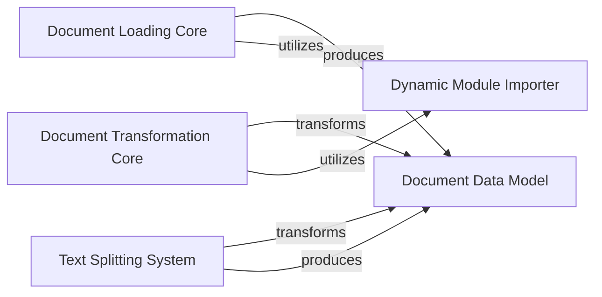

## Component Details

The Data Ingestion & Transformation subsystem is responsible for acquiring raw data from various sources, converting it into a standardized `Document` format, and then processing these documents through various transformations, including splitting large texts into smaller, manageable chunks. This preparation is essential for efficient and effective utilization of unstructured data by Large Language Models.

### Document Loading Core
Defines the foundational interfaces for loading data from diverse sources into the standardized `Document` format.

**Related Classes/Methods**:

- <a href="https://github.com/langchain-ai/langchain/blob/master/libs/core/langchain_core/document_loaders/base.py#L19-L86" target="_blank" rel="noopener noreferrer">`langchain_core.document_loaders.base.BaseLoader` (19:86)</a>
- <a href="https://github.com/langchain-ai/langchain/blob/master/libs/core/langchain_core/document_loaders/base.py#L89-L127" target="_blank" rel="noopener noreferrer">`langchain_core.document_loaders.base.BaseBlobParser` (89:127)</a>

### Document Transformation Core
Provides the base interface for applying various transformations to `Document` objects, such as converting formats or extracting specific content.

**Related Classes/Methods**:

- <a href="https://github.com/langchain-ai/langchain/blob/master/libs/core/langchain_core/documents/base.py#L102-L110" target="_blank" rel="noopener noreferrer">`langchain_core.documents.base.BaseDocumentTransformer` (102:110)</a>
- <a href="https://github.com/langchain-ai/langchain/blob/master/libs/langchain/langchain/document_transformers/html2text.py#L18-L20" target="_blank" rel="noopener noreferrer">`langchain.document_transformers.html2text:__getattr__` (18:20)</a>

### Text Splitting System
Manages the process of breaking down large text content within `Document` objects into smaller, overlapping chunks, optimized for processing by language models. It includes token-based splitting capabilities.

**Related Classes/Methods**:

- <a href="https://github.com/langchain-ai/langchain/blob/master/libs/text-splitters/langchain_text_splitters/base.py#L30-L218" target="_blank" rel="noopener noreferrer">`langchain_text_splitters.base.TextSplitter` (30:218)</a>
- <a href="https://github.com/langchain-ai/langchain/blob/master/libs/text-splitters/langchain_text_splitters/base.py#L221-L281" target="_blank" rel="noopener noreferrer">`langchain_text_splitters.base.TokenTextSplitter` (221:281)</a>
- <a href="https://github.com/langchain-ai/langchain/blob/master/libs/text-splitters/langchain_text_splitters/base.py#L316-L326" target="_blank" rel="noopener noreferrer">`langchain_text_splitters.base.Tokenizer` (316:326)</a>
- <a href="https://github.com/langchain-ai/langchain/blob/master/libs/text-splitters/langchain_text_splitters/base.py#L329-L343" target="_blank" rel="noopener noreferrer">`langchain_text_splitters.base.split_text_on_tokens` (329:343)</a>

### Document Data Model
Defines the fundamental data structure for representing loaded and processed text content, including page content and associated metadata, throughout the LangChain ecosystem.

**Related Classes/Methods**:

- <a href="https://github.com/langchain-ai/langchain/blob/master/libs/core/langchain_core/documents/base.py#L255-L305" target="_blank" rel="noopener noreferrer">`langchain_core.documents.base.Document` (255:305)</a>

### Dynamic Module Importer
A utility for dynamically loading modules and attributes, often used for lazy loading or managing optional dependencies, particularly for specific document loaders and transformers.

**Related Classes/Methods**:

- <a href="https://github.com/langchain-ai/langchain/blob/master/libs/langchain/langchain/_api/module_import.py#L15-L148" target="_blank" rel="noopener noreferrer">`langchain._api.module_import.create_importer` (15:148)</a>

### [FAQ](https://github.com/CodeBoarding/GeneratedOnBoardings/tree/main?tab=readme-ov-file#faq)