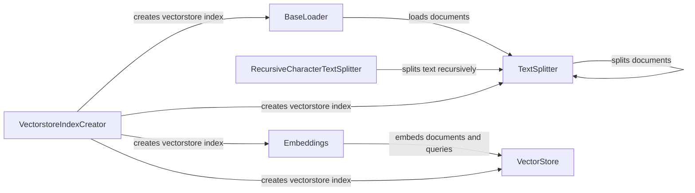

## Component Details

The Data Management component in Langchain is responsible for preparing data for use in language models and vector stores. It handles loading data from various sources, splitting it into manageable chunks, and generating vector embeddings. The main flow involves using a BaseLoader to load documents, a TextSplitter to split the documents into chunks, and Embeddings to create vector representations of the text. This process enables efficient storage and retrieval of information for downstream tasks.

### BaseLoader
Abstract base class for loading documents from various sources. It defines the interface for loading documents and provides methods for loading and splitting documents. Concrete implementations handle the specifics of fetching data from different sources like files, web pages, or databases.
- **Related Classes/Methods**: `langchain.libs.core.langchain_core.document_loaders.base.BaseLoader`

### TextSplitter
Abstract base class for splitting text into smaller, more manageable chunks. It defines the interface for splitting text and provides methods for splitting documents based on different strategies. Different implementations provide various splitting strategies, such as splitting by character, separator, or recursively.
- **Related Classes/Methods**: `langchain.libs.text_splitters.langchain_text_splitters.base.TextSplitter`

### RecursiveCharacterTextSplitter
Implementation of TextSplitter that splits text recursively based on a set of characters. It tries to split on different characters until the chunks are small enough. This is useful for preserving semantic meaning while ensuring chunks fit within size constraints.
- **Related Classes/Methods**: `langchain.libs.text_splitters.langchain_text_splitters.character.RecursiveCharacterTextSplitter`

### Embeddings
Abstract base class for embedding documents and queries. It defines the interface for embedding text and provides methods for generating embeddings for documents and queries. Concrete implementations use different models to generate vector representations of text.
- **Related Classes/Methods**: `langchain.libs.core.langchain_core.embeddings.embeddings.Embeddings`

### VectorStore
Abstract base class for storing and retrieving vectors. It defines the interface for adding documents, searching for similar vectors, and performing other vector-related operations. Different implementations provide various storage and retrieval mechanisms, such as in-memory storage or specialized vector databases.
- **Related Classes/Methods**: `langchain.libs.core.langchain_core.vectorstores.base.VectorStore`

### VectorstoreIndexCreator
Responsible for creating a vectorstore index from documents or loaders. It encapsulates the process of loading, splitting, embedding, and storing documents in a vectorstore. This component simplifies the creation of vectorstore indexes by orchestrating the other components.
- **Related Classes/Methods**: `langchain.libs.langchain.indexes.vectorstore.VectorstoreIndexCreator`
