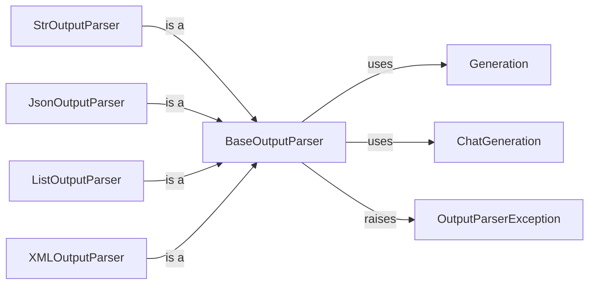

## Component Details

### BaseOutputParser
The `BaseOutputParser` is an abstract base class that serves as the foundation for all output parsers in the Langchain framework. Its primary responsibility is to define a standard interface for converting raw text output from language models (LLMs) into structured data formats, making it easier for applications to consume and utilize the LLM's responses. It defines the `parse` and `parse_result` methods, which are the core parsing functions.
- **Related Classes/Methods**: `langchain_core.output_parsers.base.BaseOutputParser`

### StrOutputParser
The `StrOutputParser` is a concrete implementation of the `BaseOutputParser` that converts the output of a language model into a simple string. It's a straightforward parser suitable for cases where minimal processing is required and the LLM's output is already in a usable string format. It inherits from `BaseOutputParser` and overrides the `parse` method to simply return the input string.
- **Related Classes/Methods**: `langchain_core.output_parsers.string.StrOutputParser`

### JsonOutputParser
The `JsonOutputParser` is a specialized output parser designed to interpret the output of a language model as JSON data. It takes the raw text output from an LLM, attempts to parse it as a JSON string, and returns a Python dictionary or other suitable JSON representation. It inherits from `BaseOutputParser` and overrides the `parse` method to include JSON parsing logic.
- **Related Classes/Methods**: `langchain_core.output_parsers.json.JsonOutputParser`

### ListOutputParser
The `ListOutputParser` is designed to parse the output of a language model into a list of items. It provides a base class for parsing LLM output into a list. It inherits from `BaseOutputParser` and provides a foundation for more specific list parsing implementations.
- **Related Classes/Methods**: `langchain_core.output_parsers.list.ListOutputParser`

### XMLOutputParser
The `XMLOutputParser` is designed to parse the output of a language model into XML format. It takes the raw text output from an LLM, attempts to parse it as an XML string, and returns a Python ElementTree or other suitable XML representation. It inherits from `BaseOutputParser` and overrides the `parse` method to include XML parsing logic.
- **Related Classes/Methods**: `langchain_core.output_parsers.xml.XMLOutputParser`

### Generation
The `Generation` class represents a single generation (i.e., output) from a language model. It encapsulates the text generated by the LLM, along with any associated metadata. It is used as input for the `parse_result` method in `BaseOutputParser`.
- **Related Classes/Methods**: `langchain_core.outputs.generation.Generation`

### ChatGeneration
The `ChatGeneration` class represents a single chat generation from a language model. It encapsulates the message generated by the LLM, along with any associated metadata. It is used as input for the `parse_result` method in `BaseOutputParser` when the input is a `BaseMessage`.
- **Related Classes/Methods**: `langchain_core.outputs.chat_generation.ChatGeneration`

### OutputParserException
The `OutputParserException` is a custom exception class that is raised when the output from the LLM does not conform to the expected format or cannot be parsed correctly by an output parser. It provides a mechanism for handling parsing errors and signaling to the application that the LLM's output is invalid.
- **Related Classes/Methods**: `langchain_core.exceptions.OutputParserException`
