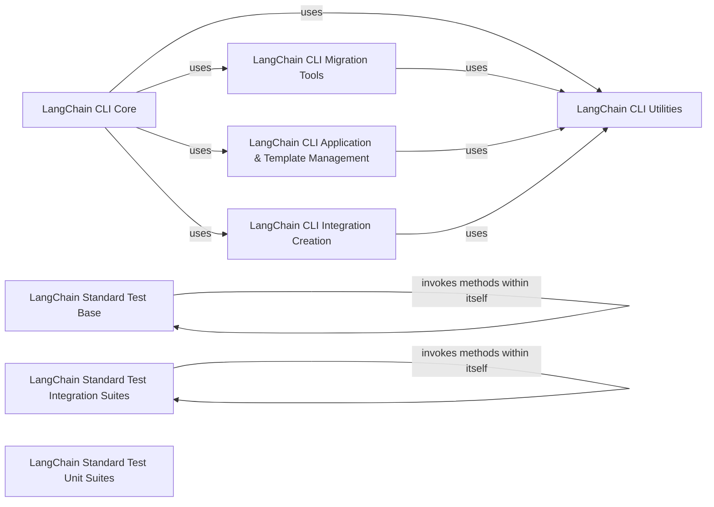

## Component Details

The Development & CLI Utilities component provides a command-line interface (CLI) for various LangChain-related tasks, including generating migrations, serving applications, and managing templates and integrations. It also supports the development and quality assurance of the LangChain library by including modules for generating API reference documentation and standardized test suites. The main flow involves users interacting with the `langchain_cli.cli` entry point to execute commands, which then delegate to specific namespaces for application management, template handling, integration creation, and migration generation. The purpose of this component is to streamline development workflows, facilitate code maintenance, and ensure the quality and consistency of the LangChain ecosystem.

### LangChain CLI Core
Serves as the main entry point for the LangChain Command Line Interface, providing commands for serving applications and managing development-related tasks.

**Related Classes/Methods**:

- <a href="https://github.com/langchain-ai/langchain/blob/master/libs/cli/langchain_cli/cli.py#L1-L67" target="_blank" rel="noopener noreferrer">`langchain_cli.cli` (1:67)</a>
- <a href="https://github.com/langchain-ai/langchain/blob/master/libs/cli/langchain_cli/cli.py#L57-L80" target="_blank" rel="noopener noreferrer">`langchain_cli.cli:serve` (57:80)</a>

### LangChain CLI Migration Tools
Provides tools within the CLI for generating and managing code migrations, including generic and partner-specific migration generation, and dumping migrations in Grit format.

**Related Classes/Methods**:

- <a href="https://github.com/langchain-ai/langchain/blob/master/libs/cli/langchain_cli/namespaces/migrate/main.py#L17-L74" target="_blank" rel="noopener noreferrer">`langchain_cli.namespaces.migrate.main:migrate` (17:74)</a>
- <a href="https://github.com/langchain-ai/langchain/blob/master/libs/cli/langchain_cli/namespaces/migrate/generate/generic.py#L122-L147" target="_blank" rel="noopener noreferrer">`langchain_cli.namespaces.migrate.generate.generic.generate_simplified_migrations` (122:147)</a>
- <a href="https://github.com/langchain-ai/langchain/blob/master/libs/cli/langchain_cli/namespaces/migrate/generate/grit.py#L10-L40" target="_blank" rel="noopener noreferrer">`langchain_cli.namespaces.migrate.generate.grit.dump_migrations_as_grit` (10:40)</a>
- <a href="https://github.com/langchain-ai/langchain/blob/master/libs/cli/langchain_cli/namespaces/migrate/generate/partner.py#L22-L55" target="_blank" rel="noopener noreferrer">`langchain_cli.namespaces.migrate.generate.partner.get_migrations_for_partner_package` (22:55)</a>
- <a href="https://github.com/langchain-ai/langchain/blob/master/libs/cli/langchain_cli/namespaces/migrate/generate/utils.py#L32-L49" target="_blank" rel="noopener noreferrer">`langchain_cli.namespaces.migrate.generate.utils._get_class_names` (32:49)</a>
- <a href="https://github.com/langchain-ai/langchain/blob/master/libs/cli/langchain_cli/namespaces/migrate/generate/utils.py#L61-L68" target="_blank" rel="noopener noreferrer">`langchain_cli.namespaces.migrate.generate.utils.find_subclasses_in_module` (61:68)</a>
- <a href="https://github.com/langchain-ai/langchain/blob/master/libs/cli/langchain_cli/namespaces/migrate/generate/utils.py#L71-L78" target="_blank" rel="noopener noreferrer">`langchain_cli.namespaces.migrate.generate.utils._get_all_classnames_from_file` (71:78)</a>
- <a href="https://github.com/langchain-ai/langchain/blob/master/libs/cli/langchain_cli/namespaces/migrate/generate/utils.py#L81-L87" target="_blank" rel="noopener noreferrer">`langchain_cli.namespaces.migrate.generate.utils.identify_all_imports_in_file` (81:87)</a>
- <a href="https://github.com/langchain-ai/langchain/blob/master/libs/cli/langchain_cli/namespaces/migrate/generate/utils.py#L106-L117" target="_blank" rel="noopener noreferrer">`langchain_cli.namespaces.migrate.generate.utils.list_classes_by_package` (106:117)</a>
- <a href="https://github.com/langchain-ai/langchain/blob/master/libs/cli/langchain_cli/namespaces/migrate/generate/utils.py#L120-L133" target="_blank" rel="noopener noreferrer">`langchain_cli.namespaces.migrate.generate.utils.list_init_imports_by_package` (120:133)</a>
- <a href="https://github.com/langchain-ai/langchain/blob/master/libs/cli/langchain_cli/namespaces/migrate/generate/utils.py#L136-L145" target="_blank" rel="noopener noreferrer">`langchain_cli.namespaces.migrate.generate.utils.find_imports_from_package` (136:145)</a>
- <a href="https://github.com/langchain-ai/langchain/blob/master/libs/cli/langchain_cli/namespaces/migrate/generate/utils.py#L17-L29" target="_blank" rel="noopener noreferrer">`langchain_cli.namespaces.migrate.generate.utils.ImportExtractor` (17:29)</a>
- <a href="https://github.com/langchain-ai/langchain/blob/master/libs/cli/langchain_cli/namespaces/migrate/generate/utils.py#L52-L58" target="_blank" rel="noopener noreferrer">`langchain_cli.namespaces.migrate.generate.utils.is_subclass` (52:58)</a>
- <a href="https://github.com/langchain-ai/langchain/blob/master/libs/cli/langchain_cli/namespaces/migrate/generate/utils.py#L148-L158" target="_blank" rel="noopener noreferrer">`langchain_cli.namespaces.migrate.generate.utils._get_current_module` (148:158)</a>

### LangChain CLI Application & Template Management
Manages the lifecycle of LangChain applications and templates, including creation, addition, removal, and listing of templates.

**Related Classes/Methods**:

- <a href="https://github.com/langchain-ai/langchain/blob/master/libs/cli/langchain_cli/namespaces/template.py#L89-L142" target="_blank" rel="noopener noreferrer">`langchain_cli.namespaces.template:serve` (89:142)</a>
- <a href="https://github.com/langchain-ai/langchain/blob/master/libs/cli/langchain_cli/namespaces/template.py#L146-L154" target="_blank" rel="noopener noreferrer">`langchain_cli.namespaces.template:list` (146:154)</a>
- <a href="https://github.com/langchain-ai/langchain/blob/master/libs/cli/langchain_cli/namespaces/app.py#L38-L129" target="_blank" rel="noopener noreferrer">`langchain_cli.namespaces.app:new` (38:129)</a>
- <a href="https://github.com/langchain-ai/langchain/blob/master/libs/cli/langchain_cli/namespaces/app.py#L133-L293" target="_blank" rel="noopener noreferrer">`langchain_cli.namespaces.app:add` (133:293)</a>
- <a href="https://github.com/langchain-ai/langchain/blob/master/libs/cli/langchain_cli/namespaces/app.py#L297-L335" target="_blank" rel="noopener noreferrer">`langchain_cli.namespaces.app:remove` (297:335)</a>

### LangChain CLI Integration Creation
Facilitates the creation of new LangChain integrations by providing utilities for processing names, replacing content in files, and generating documentation.

**Related Classes/Methods**:

- <a href="https://github.com/langchain-ai/langchain/blob/master/libs/cli/langchain_cli/namespaces/integration.py#L57-L170" target="_blank" rel="noopener noreferrer">`langchain_cli.namespaces.integration:new` (57:170)</a>
- <a href="https://github.com/langchain-ai/langchain/blob/master/libs/cli/langchain_cli/namespaces/integration.py#L190-L244" target="_blank" rel="noopener noreferrer">`langchain_cli.namespaces.integration:create_doc` (190:244)</a>
- <a href="https://github.com/langchain-ai/langchain/blob/master/libs/cli/langchain_cli/namespaces/integration.py#L28-L53" target="_blank" rel="noopener noreferrer">`langchain_cli.namespaces.integration._process_name` (28:53)</a>

### LangChain CLI Utilities
A collection of general utility functions supporting various CLI operations, including package management, Git interactions, event creation, and pyproject.toml manipulation. It also includes the structure of the integration template.

**Related Classes/Methods**:

- <a href="https://github.com/langchain-ai/langchain/blob/master/libs/cli/langchain_cli/utils/packages.py#L7-L18" target="_blank" rel="noopener noreferrer">`langchain_cli.utils.packages.get_package_root` (7:18)</a>
- <a href="https://github.com/langchain-ai/langchain/blob/master/libs/cli/langchain_cli/utils/packages.py#L36-L45" target="_blank" rel="noopener noreferrer">`langchain_cli.utils.packages.get_langserve_export` (36:45)</a>
- <a href="https://github.com/langchain-ai/langchain/blob/master/libs/cli/langchain_cli/utils/packages.py#L21-L33" target="_blank" rel="noopener noreferrer">`langchain_cli.utils.packages.LangServeExport` (21:33)</a>
- <a href="https://github.com/langchain-ai/langchain/blob/master/libs/cli/langchain_cli/utils/github.py#L6-L29" target="_blank" rel="noopener noreferrer">`langchain_cli.utils.github.list_packages` (6:29)</a>
- <a href="https://github.com/langchain-ai/langchain/blob/master/libs/cli/langchain_cli/utils/git.py#L118-L147" target="_blank" rel="noopener noreferrer">`langchain_cli.utils.git.parse_dependencies` (118:147)</a>
- <a href="https://github.com/langchain-ai/langchain/blob/master/libs/cli/langchain_cli/utils/git.py#L25-L104" target="_blank" rel="noopener noreferrer">`langchain_cli.utils.git.parse_dependency_string` (25:104)</a>
- <a href="https://github.com/langchain-ai/langchain/blob/master/libs/cli/langchain_cli/utils/git.py#L107-L115" target="_blank" rel="noopener noreferrer">`langchain_cli.utils.git._list_arg_to_length` (107:115)</a>
- <a href="https://github.com/langchain-ai/langchain/blob/master/libs/cli/langchain_cli/utils/git.py#L164-L181" target="_blank" rel="noopener noreferrer">`langchain_cli.utils.git.update_repo` (164:181)</a>
- <a href="https://github.com/langchain-ai/langchain/blob/master/libs/cli/langchain_cli/utils/git.py#L150-L161" target="_blank" rel="noopener noreferrer">`langchain_cli.utils.git._get_repo_path` (150:161)</a>
- <a href="https://github.com/langchain-ai/langchain/blob/master/libs/cli/langchain_cli/utils/git.py#L184-L197" target="_blank" rel="noopener noreferrer">`langchain_cli.utils.git.copy_repo` (184:197)</a>
- <a href="https://github.com/langchain-ai/langchain/blob/master/libs/cli/langchain_cli/utils/events.py#L13-L41" target="_blank" rel="noopener noreferrer">`langchain_cli.utils.events.create_events` (13:41)</a>
- <a href="https://github.com/langchain-ai/langchain/blob/master/libs/cli/langchain_cli/utils/pyproject.py#L14-L28" target="_blank" rel="noopener noreferrer">`langchain_cli.utils.pyproject.add_dependencies_to_pyproject_toml` (14:28)</a>
- <a href="https://github.com/langchain-ai/langchain/blob/master/libs/cli/langchain_cli/utils/pyproject.py#L31-L45" target="_blank" rel="noopener noreferrer">`langchain_cli.utils.pyproject.remove_dependencies_from_pyproject_toml` (31:45)</a>
- <a href="https://github.com/langchain-ai/langchain/blob/master/libs/cli/langchain_cli/utils/pyproject.py#L8-L11" target="_blank" rel="noopener noreferrer">`langchain_cli.utils.pyproject._get_dep_inline_table` (8:11)</a>
- <a href="https://github.com/langchain-ai/langchain/blob/master/libs/cli/langchain_cli/utils/find_replace.py#L27-L31" target="_blank" rel="noopener noreferrer">`langchain_cli.utils.find_replace.replace_glob` (27:31)</a>
- <a href="https://github.com/langchain-ai/langchain/blob/master/libs/cli/langchain_cli/utils/find_replace.py#L16-L24" target="_blank" rel="noopener noreferrer">`langchain_cli.utils.find_replace.replace_file` (16:24)</a>
- <a href="https://github.com/langchain-ai/langchain/blob/master/libs/cli/langchain_cli/utils/find_replace.py#L5-L13" target="_blank" rel="noopener noreferrer">`langchain_cli.utils.find_replace.find_and_replace` (5:13)</a>
- <a href="https://github.com/langchain-ai/langchain/blob/master/libs/cli/langchain_cli/integration_template/integration_template/vectorstores.py#L26-L359" target="_blank" rel="noopener noreferrer">`libs.cli.langchain_cli.integration_template.integration_template.vectorstores.__ModuleName__VectorStore` (26:359)</a>
- <a href="https://github.com/langchain-ai/langchain/blob/master/libs/cli/langchain_cli/integration_template/integration_template/retrievers.py#L10-L98" target="_blank" rel="noopener noreferrer">`libs.cli.langchain_cli.integration_template.integration_template.retrievers.__ModuleName__Retriever` (10:98)</a>
- <a href="https://github.com/langchain-ai/langchain/blob/master/libs/cli/langchain_cli/integration_template/integration_template/embeddings.py#L6-L83" target="_blank" rel="noopener noreferrer">`libs.cli.langchain_cli.integration_template.integration_template.embeddings.__ModuleName__Embeddings` (6:83)</a>
- <a href="https://github.com/langchain-ai/langchain/blob/master/libs/cli/langchain_cli/integration_template/integration_template/chat_models.py#L19-L404" target="_blank" rel="noopener noreferrer">`libs.cli.langchain_cli.integration_template.integration_template.chat_models.Chat__ModuleName__` (19:404)</a>

### LangChain Standard Test Base
Provides the base classes and common utilities for implementing standard tests across various LangChain components, ensuring consistent testing practices.

**Related Classes/Methods**:

- <a href="https://github.com/langchain-ai/langchain/blob/master/libs/standard-tests/langchain_tests/base.py#L5-L70" target="_blank" rel="noopener noreferrer">`langchain.libs.standard-tests.langchain_tests.base.BaseStandardTests` (5:70)</a>

### LangChain Standard Test Integration Suites
Contains comprehensive integration test suites for key LangChain functionalities, including vector stores, tools, caching mechanisms, document indexers, and chat models, validating their end-to-end behavior.

**Related Classes/Methods**:

- <a href="https://github.com/langchain-ai/langchain/blob/master/libs/standard-tests/langchain_tests/integration_tests/vectorstores.py#L17-L779" target="_blank" rel="noopener noreferrer">`langchain.libs.standard-tests.langchain_tests.integration_tests.vectorstores.VectorStoreIntegrationTests` (17:779)</a>
- <a href="https://github.com/langchain-ai/langchain/blob/master/libs/standard-tests/langchain_tests/integration_tests/tools.py#L7-L88" target="_blank" rel="noopener noreferrer">`langchain.libs.standard-tests.langchain_tests.integration_tests.tools.ToolsIntegrationTests` (7:88)</a>
- <a href="https://github.com/langchain-ai/langchain/blob/master/libs/standard-tests/langchain_tests/integration_tests/cache.py#L18-L105" target="_blank" rel="noopener noreferrer">`langchain.libs.standard-tests.langchain_tests.integration_tests.cache.SyncCacheTestSuite` (18:105)</a>
- <a href="https://github.com/langchain-ai/langchain/blob/master/libs/standard-tests/langchain_tests/integration_tests/cache.py#L108-L202" target="_blank" rel="noopener noreferrer">`langchain.libs.standard-tests.langchain_tests.integration_tests.cache.AsyncCacheTestSuite` (108:202)</a>
- <a href="https://github.com/langchain-ai/langchain/blob/master/libs/standard-tests/langchain_tests/integration_tests/indexer.py#L21-L208" target="_blank" rel="noopener noreferrer">`langchain.libs.standard-tests.langchain_tests.integration_tests.indexer.DocumentIndexerTestSuite` (21:208)</a>
- <a href="https://github.com/langchain-ai/langchain/blob/master/libs/standard-tests/langchain_tests/integration_tests/indexer.py#L211-L400" target="_blank" rel="noopener noreferrer">`langchain.libs.standard-tests.langchain_tests.integration_tests.indexer.AsyncDocumentIndexTestSuite` (211:400)</a>
- <a href="https://github.com/langchain-ai/langchain/blob/master/libs/standard-tests/langchain_tests/integration_tests/chat_models.py#L132-L2883" target="_blank" rel="noopener noreferrer">`langchain.libs.standard-tests.langchain_tests.integration_tests.chat_models.ChatModelIntegrationTests` (132:2883)</a>
- <a href="https://github.com/langchain-ai/langchain/blob/master/libs/standard-tests/langchain_tests/integration_tests/chat_models.py#L112-L119" target="_blank" rel="noopener noreferrer">`langchain.libs.standard-tests.langchain_tests.integration_tests.chat_models._validate_tool_call_message` (112:119)</a>
- <a href="https://github.com/langchain-ai/langchain/blob/master/libs/standard-tests/langchain_tests/integration_tests/chat_models.py#L122-L129" target="_blank" rel="noopener noreferrer">`langchain.libs.standard-tests.langchain_tests.integration_tests.chat_models._validate_tool_call_message_no_args` (122:129)</a>
- <a href="https://github.com/langchain-ai/langchain/blob/master/libs/standard-tests/langchain_tests/integration_tests/chat_models.py#L41-L75" target="_blank" rel="noopener noreferrer">`langchain.libs.standard-tests.langchain_tests.integration_tests.chat_models._get_joke_class` (41:75)</a>
- <a href="https://github.com/langchain-ai/langchain/blob/master/libs/standard-tests/langchain_tests/integration_tests/chat_models.py#L78-L93" target="_blank" rel="noopener noreferrer">`langchain.libs.standard-tests.langchain_tests.integration_tests.chat_models._TestCallbackHandler` (78:93)</a>

### LangChain Standard Test Unit Suites
Houses unit test suites for individual LangChain components, such as chat models, focusing on isolated functionality validation.

**Related Classes/Methods**:

- <a href="https://github.com/langchain-ai/langchain/blob/master/libs/standard-tests/langchain_tests/unit_tests/chat_models.py#L234-L1015" target="_blank" rel="noopener noreferrer">`langchain.libs.standard-tests.langchain_tests.unit_tests.chat_models.ChatModelUnitTests` (234:1015)</a>

### [FAQ](https://github.com/CodeBoarding/GeneratedOnBoardings/tree/main?tab=readme-ov-file#faq)