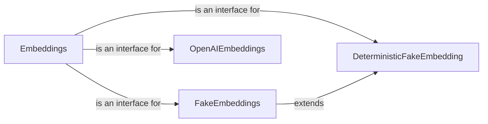

## Component Details

### Embeddings
This abstract base class defines the interface for all embedding models within the Langchain framework. It specifies the methods for embedding documents and queries, ensuring that all concrete embedding classes adhere to a consistent API. This abstraction allows for easy swapping of different embedding providers without modifying the core logic that uses them.
- **Related Classes/Methods**: `langchain_core.embeddings.embeddings`

### FakeEmbeddings
This class provides a mock implementation of the Embeddings interface, primarily used for testing purposes. It generates embeddings by sampling from a normal distribution, allowing developers to simulate embedding behavior without relying on external services or incurring costs. It's useful for unit tests and integration tests where real embeddings are not required.
- **Related Classes/Methods**: `langchain_core.embeddings.fake`

### DeterministicFakeEmbedding
This class extends the FakeEmbeddings class by providing a deterministic implementation. It generates embeddings by sampling from a normal distribution with a seed based on the hash of the input text. This ensures that the same input text always produces the same embedding, making it suitable for tests that require reproducible results.
- **Related Classes/Methods**: `langchain_core.embeddings.fake`

### OpenAIEmbeddings
This class provides an integration with OpenAI's embedding models. It handles the process of tokenizing, chunking, and calling the OpenAI API to generate embeddings for documents and queries. It also manages API authentication and error handling, providing a convenient way to use OpenAI's embedding services within Langchain.
- **Related Classes/Methods**: `langchain_openai.embeddings.base.OpenAIEmbeddings`
