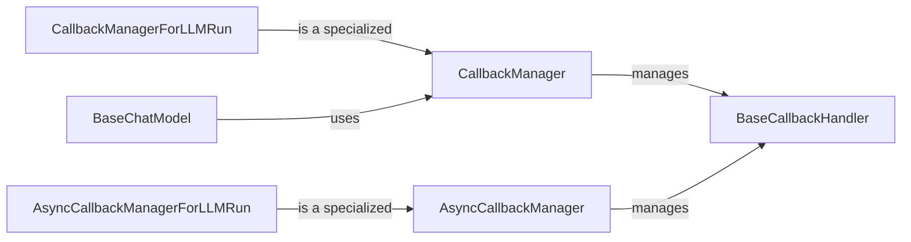

## Component Details

### CallbackManager
The `CallbackManager` class is responsible for managing and executing callbacks during the execution of LangChain components. It maintains a list of callback handlers and invokes them at various stages of the process, such as when an LLM starts or ends, when a chain starts or ends, or when a tool is used. This allows for monitoring, logging, tracing, and custom logic implementation.
- **Related Classes/Methods**: `langchain_core.callbacks.manager:CallbackManager`

### AsyncCallbackManager
The `AsyncCallbackManager` class provides asynchronous capabilities to the CallbackManager. It allows you to manage and execute callbacks in an asynchronous manner, enabling non-blocking operations and improved performance in asynchronous environments.
- **Related Classes/Methods**: `langchain_core.callbacks.manager:AsyncCallbackManager`

### CallbackManagerForLLMRun
The `CallbackManagerForLLMRun` class is a specialized callback manager designed for managing callbacks during the execution of a language model (LLM). It inherits from the `CallbackManager` class and includes additional methods for handling LLM-specific events, such as when a new token is generated, when the LLM ends running, or when an error occurs. It provides a context-specific way to manage callbacks within an LLM run.
- **Related Classes/Methods**: `langchain_core.callbacks.manager:CallbackManagerForLLMRun`

### AsyncCallbackManagerForLLMRun
The `AsyncCallbackManagerForLLMRun` class provides asynchronous capabilities to the CallbackManagerForLLMRun. It allows you to manage and execute callbacks in an asynchronous manner, enabling non-blocking operations and improved performance in asynchronous environments for LLM runs.
- **Related Classes/Methods**: `langchain_core.callbacks.manager:AsyncCallbackManagerForLLMRun`

### BaseCallbackHandler
The `BaseCallbackHandler` class serves as an abstract base class for callback handlers. It defines the core interface for handling events during the execution of LangChain components. Subclasses of `BaseCallbackHandler` implement specific logic to be executed when certain events occur, such as the start or end of an LLM, chain, or tool.
- **Related Classes/Methods**: `langchain_core.callbacks.base:BaseCallbackHandler`

### BaseChatModel
The `BaseChatModel` class is an abstract base class for chat models, defining the core interface for interacting with conversational AI models. It handles input conversion, output parsing, streaming, batch processing, and integration with LangSmith for tracing. It also provides declarative methods for creating specialized runnables. It uses the CallbackManager to handle callbacks during the execution of the chat model.
- **Related Classes/Methods**: `langchain_core.language_models.chat_models:BaseChatModel`
