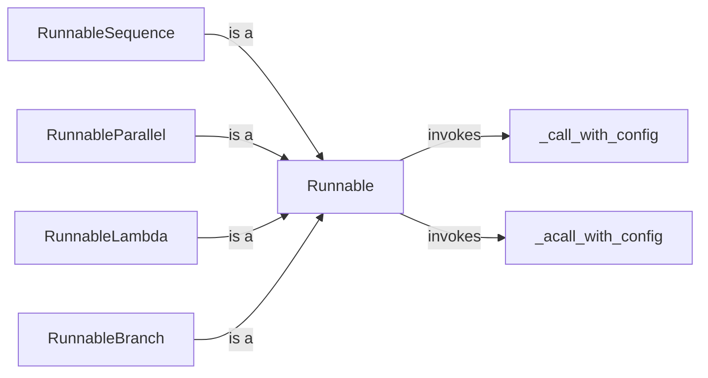

## Component Details

The Execution Core in Langchain, powered by Runnables and Chains, orchestrates the execution flow of applications. Runnables are composable units of work, enabling the creation of complex workflows through Chains, which are sequences of Runnables. This system manages interactions between various components like Language Models, Data Handling, and Memory, to achieve the desired application logic. It provides a flexible and modular approach to building and executing Langchain applications.

### Runnable
The `Runnable` class serves as the foundational building block for creating composable units of execution in Langchain. It defines a standard interface for invoking, batching, and streaming operations, providing default implementations that can be customized by subclasses. This abstraction enables the creation of flexible and reusable components that can be easily chained together to form complex workflows.
- **Related Classes/Methods**: `langchain.libs.core.langchain_core.runnables.base.Runnable`

### RunnableSequence
The `RunnableSequence` class extends the `Runnable` interface to execute a sequence of runnables in a defined order. It implements the `invoke`, `ainvoke`, `transform`, and `atransform` methods to chain the execution of its constituent runnables, where the output of one runnable becomes the input of the next. This enables the creation of linear workflows where operations are performed sequentially.
- **Related Classes/Methods**: `langchain.libs.core.langchain_core.runnables.base.RunnableSequence`

### RunnableParallel
The `RunnableParallel` class extends the `Runnable` interface to execute multiple runnables concurrently. It implements the `invoke`, `ainvoke`, `transform`, and `atransform` methods to execute its constituent runnables in parallel, allowing for speeding up workflows by executing independent operations simultaneously. This is particularly useful when dealing with tasks that can be performed independently without relying on the output of other tasks.
- **Related Classes/Methods**: `langchain.libs.core.langchain_core.runnables.base.RunnableParallel`

### RunnableLambda
The `RunnableLambda` class extends the `Runnable` interface to execute a lambda function. It implements the `invoke`, `ainvoke`, `transform`, and `atransform` methods to apply the lambda function to the input data. This provides a simple and concise way to integrate custom logic into a runnable workflow without the need for defining separate classes or functions.
- **Related Classes/Methods**: `langchain.libs.core.langchain_core.runnables.base.RunnableLambda`

### RunnableBranch
The `RunnableBranch` class extends the `Runnable` interface to conditionally execute one of several other runnables based on a condition. It implements the `invoke` and `ainvoke` methods to select and execute the appropriate runnable based on the input data. This enables the creation of branching workflows where the execution path depends on the input data, allowing for more complex and adaptive logic.
- **Related Classes/Methods**: `langchain.libs.core.langchain_core.runnables.branch.RunnableBranch`

### _call_with_config
The `_call_with_config` method of the `Runnable` class is responsible for calling the runnable with configuration options. It allows passing configuration parameters to the runnable during invocation, enabling customization of the execution behavior. This method is used internally by the `invoke` method to handle configuration.
- **Related Classes/Methods**: `langchain.libs.core.langchain_core.runnables.base.Runnable`

### _acall_with_config
The `_acall_with_config` method of the `Runnable` class is the asynchronous counterpart of `_call_with_config`. It is responsible for calling the runnable with configuration options in an asynchronous manner. This method is used internally by the `ainvoke` method to handle configuration during asynchronous invocation.
- **Related Classes/Methods**: `langchain.libs.core.langchain_core.runnables.base.Runnable`
