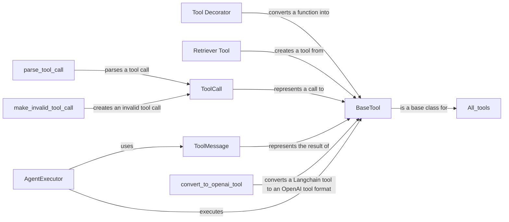

## Component Details

### BaseTool
Abstract base class for all tools. It defines the interface that all tools must implement, including methods for running the tool, handling input and output, and managing tool state. It provides a common way to interact with different tools within the Langchain ecosystem.
- **Related Classes/Methods**: `langchain_core.tools.base`

### Tool Decorator
A decorator that converts a Python function into a Langchain tool. This allows developers to easily integrate existing functions into Langchain agents and workflows without modifying the original function's code. The decorator handles the conversion of the function's signature and docstring into a format that Langchain can understand.
- **Related Classes/Methods**: `langchain_core.tools.convert`

### Retriever Tool
A function that creates a tool from a retriever object. This allows Langchain agents to use retrievers to access and retrieve information from external sources, such as databases or knowledge bases. The retriever tool provides a way to integrate information retrieval into Langchain workflows.
- **Related Classes/Methods**: `langchain_core.tools.retriever`

### ToolCall
Represents a call to a tool, including the tool's name and arguments. This is used to represent the agent's intention to use a tool. It encapsulates the information needed to execute a tool.
- **Related Classes/Methods**: `langchain_core.messages.tool`

### ToolMessage
Represents the result of a tool call, including the tool's output. This is used to provide the agent with the results of using a tool. It encapsulates the output of a tool after it has been executed.
- **Related Classes/Methods**: `langchain_core.messages.tool`

### parse_tool_call
A function that parses a tool call from a string. This is used to extract the tool's name and arguments from the agent's output. It is used to interpret the agent's instructions and determine which tool to use and how to use it.
- **Related Classes/Methods**: `langchain_core.output_parsers.openai_tools`

### make_invalid_tool_call
A function that creates an invalid tool call. This is used to handle cases where the agent's output does not conform to the expected format. It is used to generate error messages when the agent's instructions are not valid.
- **Related Classes/Methods**: `langchain_core.output_parsers.openai_tools`

### convert_to_openai_tool
A function that converts a Langchain tool to an OpenAI tool format. This is used to integrate Langchain tools with OpenAI models. It allows Langchain tools to be used with OpenAI's function calling API.
- **Related Classes/Methods**: `langchain_core.utils.function_calling`

### AgentExecutor
The AgentExecutor is responsible for running an agent and executing tools. It orchestrates the interaction between the agent, tools, and environment. It takes the agent's instructions, selects the appropriate tool, executes the tool, and returns the results to the agent.
- **Related Classes/Methods**: `repos.langchain.libs.langchain.langchain.agents.agent.AgentExecutor`
