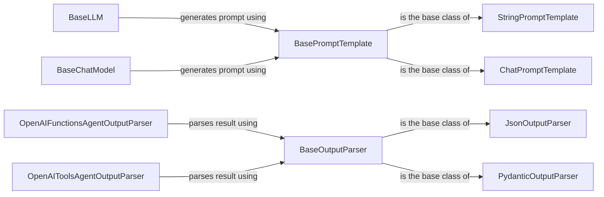

## Component Details

The Interaction Shaping component focuses on structuring prompts for Language Models (LLMs) and parsing their outputs into usable formats. It encompasses prompt engineering, which involves designing effective prompts to guide LLM behavior, and output parsing, which transforms raw LLM output into structured data suitable for downstream tasks. This component acts as the interface between the system and LLMs, ensuring effective communication and data exchange.

### BasePromptTemplate
The abstract base class for all prompt templates. It defines the interface for formatting prompts, validating input variables, and constructing prompts for different types of language models. It serves as a foundation for creating specialized prompt templates.
- **Related Classes/Methods**: `langchain.libs.core.langchain_core.prompts.base.BasePromptTemplate`

### StringPromptTemplate
A concrete implementation of a prompt template that uses a string-based template for formatting prompts. It supports various template languages like Jinja2, allowing for dynamic prompt generation based on input variables. It's suitable for simple text-based prompts.
- **Related Classes/Methods**: `langchain.libs.core.langchain_core.prompts.string.StringPromptTemplate`

### ChatPromptTemplate
A specialized prompt template designed for chat models. It allows defining prompts as a sequence of messages with different roles (e.g., system, user, assistant), enabling more complex and nuanced interactions with chat-based LLMs. It facilitates multi-turn conversations and role-playing scenarios.
- **Related Classes/Methods**: `langchain.libs.core.langchain_core.prompts.chat.ChatPromptTemplate`

### BaseOutputParser
The abstract base class for all output parsers. It defines the interface for parsing the output of a language model, handling potential errors, and providing instructions on how to format the output. It serves as a foundation for creating specialized output parsers.
- **Related Classes/Methods**: `langchain.libs.core.langchain_core.output_parsers.base.BaseOutputParser`

### JsonOutputParser
A concrete implementation of an output parser that parses the output of a language model as JSON. It extracts structured data from the LLM's output, making it easy to consume by downstream components. It's suitable for tasks that require structured data extraction.
- **Related Classes/Methods**: `langchain.libs.core.langchain_core.output_parsers.json.JsonOutputParser`

### PydanticOutputParser
An output parser that parses the output of a language model into a Pydantic object. It leverages Pydantic's data validation capabilities to ensure the output conforms to a predefined schema. It's suitable for tasks that require strong data typing and validation.
- **Related Classes/Methods**: `langchain.libs.core.langchain_core.output_parsers.pydantic.PydanticOutputParser`

### BaseLLM
Abstract base class for Language Models. It defines the interface for interacting with different types of language models.
- **Related Classes/Methods**: `langchain.libs.core.langchain_core.language_models.llms.BaseLLM`

### BaseChatModel
Abstract base class for Chat Models. It defines the interface for interacting with different types of chat models.
- **Related Classes/Methods**: `langchain.libs.core.langchain_core.language_models.chat_models.BaseChatModel`

### OpenAIFunctionsAgentOutputParser
Output parser for agents using OpenAI functions. It parses the output of the language model, extracting the function call and arguments, enabling agents to interact with external tools and APIs.
- **Related Classes/Methods**: `langchain.libs.langchain.langchain.agents.output_parsers.openai_functions.OpenAIFunctionsAgentOutputParser`

### OpenAIToolsAgentOutputParser
Output parser for agents using OpenAI tools. It parses the output of the language model, extracting the tool call and arguments, enabling agents to interact with external tools and APIs.
- **Related Classes/Methods**: `langchain.libs.langchain.langchain.agents.output_parsers.openai_tools.OpenAIToolsAgentOutputParser`
