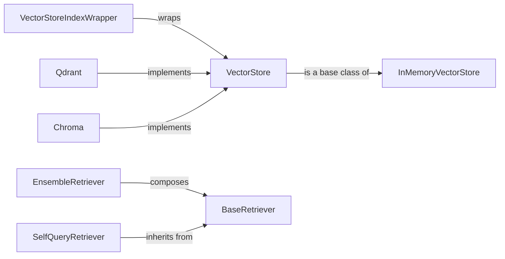

## Component Details

The Knowledge Management component in Langchain provides the ability to store, index, and retrieve knowledge for use in language model applications. It revolves around the concept of vector embeddings, where data is transformed into numerical representations that capture semantic meaning. These embeddings are stored in Vector Stores, which allow for efficient similarity searches. Retrievers then use these vector stores to fetch relevant information based on user queries, providing context and knowledge to the language model. The core flow involves creating embeddings, storing them in a vector store, and then using a retriever to query the vector store and retrieve relevant documents.

### VectorStore
The VectorStore interface defines the base methods for interacting with vector databases. It provides methods for adding, deleting, and searching vectors, enabling the storage and retrieval of knowledge representations.
- **Related Classes/Methods**: `langchain.libs.core.langchain_core.vectorstores.base.VectorStore`

### BaseRetriever
The BaseRetriever interface defines the base methods for retrieving relevant documents from a data source. It provides a standard way to fetch information based on a query, abstracting away the underlying data storage and retrieval mechanisms.
- **Related Classes/Methods**: `langchain.libs.core.langchain_core.retrievers.BaseRetriever`

### InMemoryVectorStore
InMemoryVectorStore is a simple implementation of VectorStore that stores vectors in memory. It is useful for testing and development purposes, providing a lightweight and easily accessible vector storage solution.
- **Related Classes/Methods**: `langchain.libs.core.langchain_core.vectorstores.in_memory.InMemoryVectorStore`

### VectorStoreIndexWrapper
VectorStoreIndexWrapper simplifies querying a VectorStore by providing a high-level interface. It encapsulates the vector store and provides methods for querying and retrieving documents, making it easier to integrate vector stores into Langchain applications.
- **Related Classes/Methods**: `langchain.libs.langchain.indexes.vectorstore.VectorStoreIndexWrapper`

### EnsembleRetriever
EnsembleRetriever combines multiple retrievers to improve retrieval performance. It leverages the strengths of different retrieval methods to provide more accurate and comprehensive results.
- **Related Classes/Methods**: `langchain.libs.langchain.retrievers.ensemble.EnsembleRetriever`

### SelfQueryRetriever
SelfQueryRetriever uses a language model to generate queries from natural language. This allows users to query the knowledge base using natural language, making it more accessible and intuitive.
- **Related Classes/Methods**: `langchain.libs.langchain.retrievers.self_query.base.SelfQueryRetriever`

### Qdrant
Qdrant is a VectorStore implementation that uses the Qdrant vector database. It provides efficient storage and retrieval of vector embeddings, enabling fast and accurate similarity searches.
- **Related Classes/Methods**: `langchain.libs.partners.qdrant.langchain_qdrant.vectorstores.Qdrant`, `langchain.libs.partners.qdrant.langchain_qdrant.qdrant.QdrantVectorStore`

### Chroma
Chroma is a VectorStore implementation that uses the Chroma vector database. It offers a simple and efficient way to store and retrieve vector embeddings, making it easy to integrate vector search into Langchain applications.
- **Related Classes/Methods**: `langchain.libs.partners.chroma.langchain_chroma.vectorstores.Chroma`
