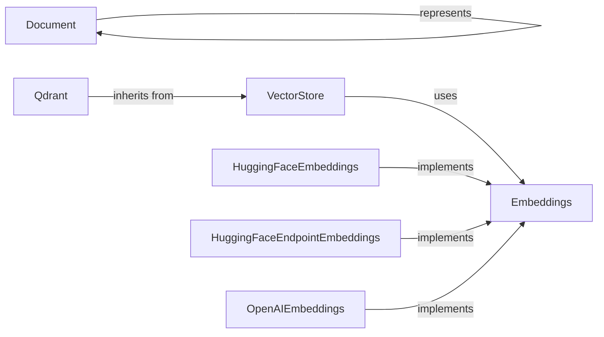

## Component Details

### Document
Represents a document with content (page_content) and metadata. It's a fundamental data structure for holding text and associated information within the Langchain framework. It serves as the basic unit for text processing and knowledge representation.
- **Related Classes/Methods**: `langchain_core.documents.base.Document`

### VectorStore
An abstract base class defining the interface for vector stores. It provides methods for adding documents, deleting documents, searching for similar documents, and managing embeddings. Vector stores are used to store and retrieve embeddings of documents, enabling efficient similarity search and retrieval of documents based on their semantic content.
- **Related Classes/Methods**: `langchain_core.vectorstores.base.VectorStore`

### Embeddings
An abstract base class defining the interface for embedding models. It provides methods for embedding documents and queries into vector representations. Embedding models are used to transform text into numerical vectors that capture the semantic meaning of the text, enabling similarity comparisons and other downstream tasks.
- **Related Classes/Methods**: `langchain_core.embeddings.embeddings.Embeddings`

### Qdrant
A concrete implementation of a VectorStore that uses Qdrant as the underlying vector database. It provides methods for interacting with Qdrant, such as creating collections, adding documents, and searching for similar documents. Qdrant is a vector search engine that allows for efficient storage and retrieval of embeddings.
- **Related Classes/Methods**: `repos.langchain.libs.partners.qdrant.langchain_qdrant.vectorstores.Qdrant`

### HuggingFaceEmbeddings
A concrete implementation of an Embeddings model that uses Hugging Face models to generate embeddings. It provides methods for loading Hugging Face models and embedding documents and queries. Hugging Face provides a wide range of pre-trained language models that can be used for generating embeddings.
- **Related Classes/Methods**: `repos.langchain.libs.partners.huggingface.langchain_huggingface.embeddings.huggingface.HuggingFaceEmbeddings`

### HuggingFaceEndpointEmbeddings
A concrete implementation of an Embeddings model that uses Hugging Face Inference Endpoints to generate embeddings. It provides methods for interacting with Hugging Face Inference Endpoints and embedding documents and queries. Hugging Face Inference Endpoints provide a scalable and reliable way to deploy and use Hugging Face models.
- **Related Classes/Methods**: `repos.langchain.libs.partners.huggingface.langchain_huggingface.embeddings.huggingface_endpoint.HuggingFaceEndpointEmbeddings`

### OpenAIEmbeddings
A concrete implementation of an Embeddings model that uses OpenAI models to generate embeddings. It provides methods for interacting with OpenAI's API and embedding documents and queries. OpenAI provides powerful language models that can be used for generating high-quality embeddings.
- **Related Classes/Methods**: `repos.langchain.libs.partners.openai.langchain_openai.embeddings.base.OpenAIEmbeddings`
