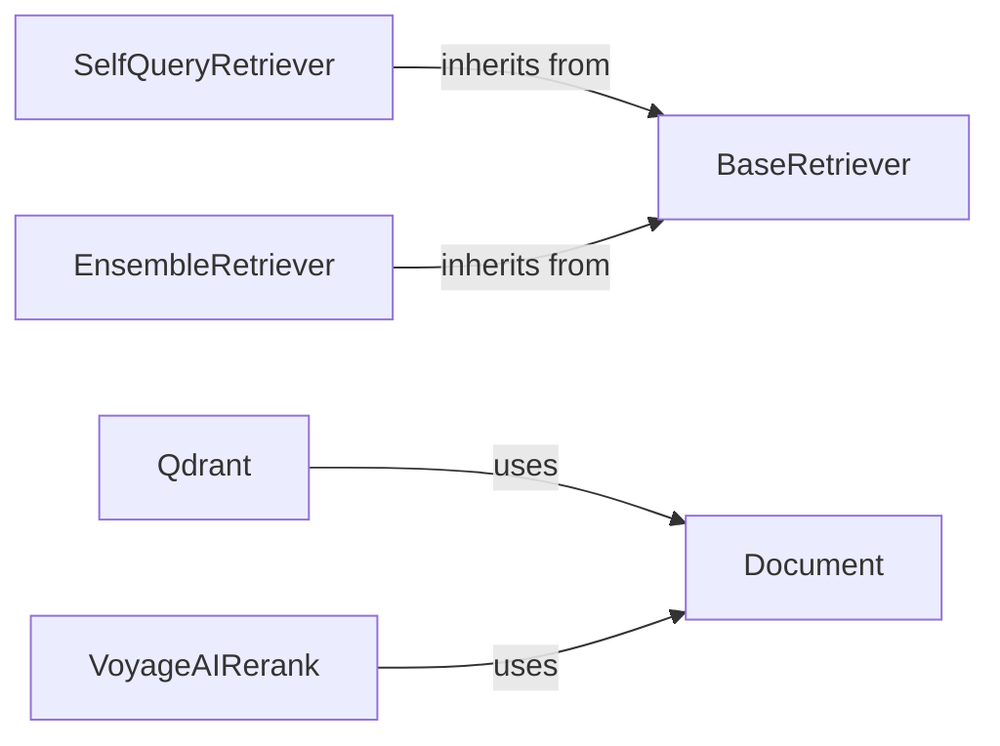

## Component Details

### BaseRetriever
The BaseRetriever class serves as an abstract base class for all retrievers in Langchain. It defines the core interface for fetching relevant documents based on a query. Subclasses must implement the `get_relevant_documents` method to provide specific retrieval logic. It's the foundation upon which all other retrievers are built, ensuring a consistent interface for interacting with different knowledge sources.
- **Related Classes/Methods**: `langchain_core.retrievers.BaseRetriever`

### SelfQueryRetriever
The SelfQueryRetriever is a powerful retriever that leverages a language model to generate self-queries for structured data. It enables querying based on both the content and metadata of documents. This allows for more precise and flexible retrieval, as the language model can understand the semantic meaning of the query and translate it into a structured query that can be executed against the document metadata.
- **Related Classes/Methods**: `langchain.retrievers.self_query.base`

### EnsembleRetriever
The EnsembleRetriever combines multiple retrievers to enhance retrieval performance. It aggregates results from different sources and re-ranks them to provide a more comprehensive and relevant set of documents. This approach leverages the strengths of individual retrievers and mitigates their weaknesses, leading to improved overall retrieval accuracy and recall.
- **Related Classes/Methods**: `langchain.retrievers.ensemble.EnsembleRetriever`

### Qdrant
Qdrant is a vector store implementation that utilizes Qdrant as its storage backend. It provides functionalities for adding, deleting, and searching documents within a Qdrant vector database. This allows for efficient storage and retrieval of documents based on their vector embeddings, enabling semantic search and similarity matching.
- **Related Classes/Methods**: `repos.langchain.libs.partners.qdrant.langchain_qdrant.vectorstores.Qdrant`

### VoyageAIRerank
VoyageAIRerank is a document compressor that uses the VoyageAI API to re-rank documents based on their relevance to a given query. It refines the initial retrieval results by prioritizing documents that are most semantically similar to the query, improving the precision of the retrieved documents.
- **Related Classes/Methods**: `repos.langchain.libs.partners.voyageai.langchain_voyageai.rerank.VoyageAIRerank`

### Document
The Document class represents a single document with content and associated metadata. It serves as a fundamental data structure for handling text and related information within Langchain. Documents are the basic units of information that are retrieved and processed by the system.
- **Related Classes/Methods**: `langchain_core.documents.base.Document`
