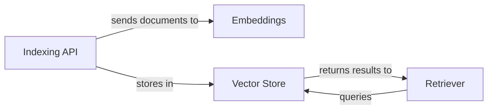

## Details

The `Knowledge Base` subsystem is designed around a pluggable architecture, enabling flexible integration with various external services. The `Indexing API` serves as the primary entry point for populating the knowledge base, responsible for processing raw documents. It leverages the `Embeddings` component to transform these documents into numerical vector representations, which are then stored and managed by the `Vector Store`. The `Vector Store` itself utilizes the `Embeddings` component for efficient similarity searches. For retrieving information, the `Retriever` component queries the `Vector Store`, abstracting the underlying embedding and storage mechanisms to fetch relevant documents based on user queries. This clear separation of concerns ensures modularity and allows for independent evolution of each component.

### Embeddings
This component abstracts the process of converting raw text or documents into numerical vector representations (embeddings). It serves as a pluggable interface, allowing different embedding models (e.g., OpenAI, HuggingFace) to be used interchangeably without affecting the downstream components. This aligns with the "Pluggable Architecture" pattern.

**Related Classes/Methods**:

- <a href="https://github.com/langchain-ai/langchain/blob/master/libs/langchain_v1/langchain/embeddings/base.py" target="_blank" rel="noopener noreferrer">`langchain.embeddings.base.Embeddings`</a>

### Vector Store
Manages the storage, indexing, and retrieval of vector embeddings and their associated metadata. This component embodies the "Pluggable Architecture" by providing a standardized interface for interacting with various vector databases (e.g., Qdrant, Pinecone, Chroma), allowing for flexible backend choices. It utilizes the `Embeddings` component internally for similarity searches.

**Related Classes/Methods**:

- <a href="https://github.com/langchain-ai/langchain/blob/master/libs/partners/qdrant/langchain_qdrant/vectorstores.py" target="_blank" rel="noopener noreferrer">`langchain_qdrant.vectorstores.Qdrant`</a>

### Retriever
Responsible for fetching relevant documents or information from the `Vector Store` based on a given query. This component can implement various retrieval strategies (e.g., simple similarity search, multi-query generation, contextual compression) and often forms part of a "Pipeline/Chain Pattern" to refine search results before they are passed to an LLM. It interacts with the `Vector Store` to retrieve documents, abstracting away the underlying embedding process.

**Related Classes/Methods**:

- <a href="https://github.com/langchain-ai/langchain/blob/master/libs/langchain/langchain/retrievers/multi_query.py#L50-L233" target="_blank" rel="noopener noreferrer">`langchain.retrievers.multi_query.MultiQueryRetriever`:50-233</a>

### Indexing API
Provides a high-level interface for ingesting, updating, and managing documents within the `Knowledge Base`. It orchestrates the flow of documents through the `Embeddings` component and into the `Vector Store`, handling concerns like document hashing, deduplication, and batch processing. This component streamlines the data pipeline for knowledge base population.

**Related Classes/Methods**:

- <a href="https://github.com/langchain-ai/langchain/blob/master/libs/core/langchain_core/indexing/api.py#L270-L579" target="_blank" rel="noopener noreferrer">`langchain_core.indexing.api.index`:270-579</a>

### [FAQ](https://github.com/CodeBoarding/GeneratedOnBoardings/tree/main?tab=readme-ov-file#faq)