```mermaid
graph LR
    langchain_core_language_models_chat_models_BaseChatModel["langchain_core.language_models.chat_models.BaseChatModel"]
    langchain_chat_models_base_BaseChatModel["langchain.chat_models.base.BaseChatModel"]
    langchain_core_prompts_chat_ChatPromptTemplate["langchain_core.prompts.chat.ChatPromptTemplate"]
    langchain_chat_models_base_BaseChatModel -- "extends" --> langchain_core_language_models_chat_models_BaseChatModel
    langchain_chat_models_base_BaseChatModel -- "delegates core generation logic to" --> langchain_core_language_models_chat_models_BaseChatModel
    langchain_core_prompts_chat_ChatPromptTemplate -- "formats prompts for" --> langchain_chat_models_base_BaseChatModel
```

## Details

The Chat Model subsystem in LangChain is designed with a clear separation of concerns, leveraging abstract base classes for core functionalities and specialized components for user-facing interactions and prompt management. `langchain_core.language_models.chat_models.BaseChatModel` establishes the foundational contract for all chat models, defining their core behavior. Building upon this, `langchain.chat_models.base.BaseChatModel` provides a richer, user-friendly interface, extending the core capabilities with advanced invocation patterns and features, while delegating the underlying generation logic to its `langchain_core` counterpart. Complementing these models, `langchain_core.prompts.chat.ChatPromptTemplate` is responsible for meticulously crafting and formatting chat-specific prompts, ensuring they are correctly structured and readily consumable by the `langchain.chat_models.base.BaseChatModel` for subsequent processing and interaction with language models.

### langchain_core.language_models.chat_models.BaseChatModel
This component serves as the fundamental abstract base class for all chat models. It defines the core interface and common functionalities such as input/output handling, caching, and error management. It ensures a consistent contract for all concrete chat model implementations and orchestrates the underlying generation processes. This aligns with the 'Core Abstractions' pattern.

**Related Classes/Methods**:

- <a href="https://github.com/langchain-ai/langchain/blob/master/libs/core/langchain_core/language_models/chat_models.py#L214-L1553" target="_blank" rel="noopener noreferrer">`langchain_core.language_models.chat_models.BaseChatModel`:214-1553</a>

### langchain.chat_models.base.BaseChatModel
This component provides the primary user-facing interface for interacting with chat models. It extends `langchain_core.language_models.chat_models.BaseChatModel` by adding higher-level invocation methods (e.g., `invoke`, `stream`, `batch`), output transformations, and advanced features like tool binding and structured output. It acts as an adapter, abstracting away provider-specific details by delegating core operations to the underlying `langchain_core` base model. This aligns with the 'Integrations' and 'Pluggable Architecture' patterns.

**Related Classes/Methods**: _None_

### langchain_core.prompts.chat.ChatPromptTemplate
This component is responsible for the creation, formatting, and manipulation of chat-specific prompts. It defines the structure of messages (e.g., system, human, AI messages), handles input variables, and generates structured messages suitable for consumption by chat models. This component is crucial for the 'Prompting' aspect of the subsystem.

**Related Classes/Methods**:

- <a href="https://github.com/langchain-ai/langchain/blob/master/libs/core/langchain_core/prompts/chat.py#L783-L1324" target="_blank" rel="noopener noreferrer">`langchain_core.prompts.chat.ChatPromptTemplate`:783-1324</a>

### [FAQ](https://github.com/CodeBoarding/GeneratedOnBoardings/tree/main?tab=readme-ov-file#faq)