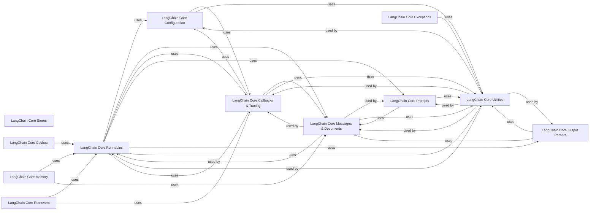

## Component Details

The `LangChain Core & Runnables` subsystem forms the backbone of the LangChain framework, providing essential abstractions and mechanisms for building and orchestrating AI applications. It defines the fundamental `Runnable` interface, enabling modular and composable units of work that can be invoked, batched, and streamed. This core component is tightly integrated with data models for messages, documents, and outputs, as well as robust callback and tracing systems for observability. It also includes utilities for configuration, prompt engineering, and output parsing, ensuring a cohesive and extensible environment for developing complex LLM-powered solutions.

### LangChain Core Runnables
The foundational component defining the `Runnable` interface and its various implementations, enabling the creation of composable and orchestratable units of work. It supports sequential, parallel, and conditional execution flows, along with functionalities for binding arguments, configuring behavior, and handling retries and fallbacks.

**Related Classes/Methods**:

- <a href="https://github.com/langchain-ai/langchain/blob/master/libs/core/langchain_core/runnables/base.py#L111-L2465" target="_blank" rel="noopener noreferrer">`langchain_core.runnables.base.Runnable` (111:2465)</a>
- <a href="https://github.com/langchain-ai/langchain/blob/master/libs/core/langchain_core/runnables/base.py#L2468-L2597" target="_blank" rel="noopener noreferrer">`langchain_core.runnables.base.RunnableSerializable` (2468:2597)</a>
- <a href="https://github.com/langchain-ai/langchain/blob/master/libs/core/langchain_core/runnables/base.py#L2673-L3466" target="_blank" rel="noopener noreferrer">`langchain_core.runnables.base.RunnableSequence` (2673:3466)</a>
- <a href="https://github.com/langchain-ai/langchain/blob/master/libs/core/langchain_core/runnables/base.py#L3469-L3979" target="_blank" rel="noopener noreferrer">`langchain_core.runnables.base.RunnableParallel` (3469:3979)</a>
- <a href="https://github.com/langchain-ai/langchain/blob/master/libs/core/langchain_core/runnables/base.py#L4284-L5022" target="_blank" rel="noopener noreferrer">`langchain_core.runnables.base.RunnableLambda` (4284:5022)</a>
- <a href="https://github.com/langchain-ai/langchain/blob/master/libs/core/langchain_core/runnables/base.py#L3986-L4281" target="_blank" rel="noopener noreferrer">`langchain_core.runnables.base.RunnableGenerator` (3986:4281)</a>
- <a href="https://github.com/langchain-ai/langchain/blob/master/libs/core/langchain_core/runnables/passthrough.py#L77-L356" target="_blank" rel="noopener noreferrer">`langchain_core.runnables.passthrough.RunnablePassthrough` (77:356)</a>
- <a href="https://github.com/langchain-ai/langchain/blob/master/libs/core/langchain_core/runnables/passthrough.py#L362-L672" target="_blank" rel="noopener noreferrer">`langchain_core.runnables.passthrough.RunnableAssign` (362:672)</a>
- <a href="https://github.com/langchain-ai/langchain/blob/master/libs/core/langchain_core/runnables/passthrough.py#L675-L837" target="_blank" rel="noopener noreferrer">`langchain_core.runnables.passthrough.RunnablePick` (675:837)</a>
- <a href="https://github.com/langchain-ai/langchain/blob/master/libs/core/langchain_core/runnables/base.py#L5155-L5264" target="_blank" rel="noopener noreferrer">`langchain_core.runnables.base.RunnableEach` (5155:5264)</a>
- <a href="https://github.com/langchain-ai/langchain/blob/master/libs/core/langchain_core/runnables/base.py#L5668-L5867" target="_blank" rel="noopener noreferrer">`langchain_core.runnables.base.RunnableBinding` (5668:5867)</a>
- <a href="https://github.com/langchain-ai/langchain/blob/master/libs/core/langchain_core/runnables/branch.py#L36-L479" target="_blank" rel="noopener noreferrer">`langchain_core.runnables.branch.RunnableBranch` (36:479)</a>

### LangChain Core Configuration
Manages configuration settings for runnable execution, including handling asynchronous operations, thread pool execution, and merging configurations. It provides a structured way to pass execution parameters and context throughout a runnable chain.

**Related Classes/Methods**:

- <a href="https://github.com/langchain-ai/langchain/blob/master/libs/core/langchain_core/runnables/config.py#L42-L91" target="_blank" rel="noopener noreferrer">`langchain_core.runnables.config.RunnableConfig` (42:91)</a>
- <a href="https://github.com/langchain-ai/langchain/blob/master/libs/core/langchain_core/runnables/config.py#L185-L235" target="_blank" rel="noopener noreferrer">`langchain_core.runnables.config.ensure_config` (185:235)</a>
- <a href="https://github.com/langchain-ai/langchain/blob/master/libs/core/langchain_core/runnables/config.py#L238-L282" target="_blank" rel="noopener noreferrer">`langchain_core.runnables.config.get_config_list` (238:282)</a>
- <a href="https://github.com/langchain-ai/langchain/blob/master/libs/core/langchain_core/runnables/config.py#L285-L328" target="_blank" rel="noopener noreferrer">`langchain_core.runnables.config.patch_config` (285:328)</a>
- <a href="https://github.com/langchain-ai/langchain/blob/master/libs/core/langchain_core/runnables/config.py#L331-L394" target="_blank" rel="noopener noreferrer">`langchain_core.runnables.config.merge_configs` (331:394)</a>
- <a href="https://github.com/langchain-ai/langchain/blob/master/libs/core/langchain_core/runnables/config.py#L584-L621" target="_blank" rel="noopener noreferrer">`langchain_core.runnables.config.run_in_executor` (584:621)</a>

### LangChain Core Messages & Documents
Defines the fundamental data structures for communication within LangChain, including various message types (Human, AI, System, Tool, Function) and document structures for information representation. These structures are central to how LLMs communicate and how information is handled.

**Related Classes/Methods**:

- <a href="https://github.com/langchain-ai/langchain/blob/master/libs/core/langchain_core/messages/base.py#L20-L138" target="_blank" rel="noopener noreferrer">`langchain_core.messages.base.BaseMessage` (20:138)</a>
- <a href="https://github.com/langchain-ai/langchain/blob/master/libs/core/langchain_core/messages/base.py#L181-L242" target="_blank" rel="noopener noreferrer">`langchain_core.messages.base.BaseMessageChunk` (181:242)</a>
- <a href="https://github.com/langchain-ai/langchain/blob/master/libs/core/langchain_core/messages/human.py#L8-L52" target="_blank" rel="noopener noreferrer">`langchain_core.messages.human.HumanMessage` (8:52)</a>
- <a href="https://github.com/langchain-ai/langchain/blob/master/libs/core/langchain_core/messages/ai.py#L149-L280" target="_blank" rel="noopener noreferrer">`langchain_core.messages.ai.AIMessage` (149:280)</a>
- <a href="https://github.com/langchain-ai/langchain/blob/master/libs/core/langchain_core/messages/system.py#L8-L46" target="_blank" rel="noopener noreferrer">`langchain_core.messages.system.SystemMessage` (8:46)</a>
- <a href="https://github.com/langchain-ai/langchain/blob/master/libs/core/langchain_core/messages/tool.py#L23-L146" target="_blank" rel="noopener noreferrer">`langchain_core.messages.tool.ToolMessage` (23:146)</a>
- <a href="https://github.com/langchain-ai/langchain/blob/master/libs/core/langchain_core/messages/function.py#L33-L62" target="_blank" rel="noopener noreferrer">`langchain_core.messages.function.FunctionMessageChunk` (33:62)</a>
- <a href="https://github.com/langchain-ai/langchain/blob/master/libs/core/langchain_core/documents/base.py#L255-L305" target="_blank" rel="noopener noreferrer">`langchain_core.documents.base.Document` (255:305)</a>
- <a href="https://github.com/langchain-ai/langchain/blob/master/libs/core/langchain_core/documents/base.py#L49-L252" target="_blank" rel="noopener noreferrer">`langchain_core.documents.base.Blob` (49:252)</a>

### LangChain Core Callbacks & Tracing
Enables comprehensive monitoring and logging of events during the execution of LangChain components, including LLM calls, chain runs, and tool invocations. This is crucial for debugging, performance analysis, and overall observability of LLM applications.

**Related Classes/Methods**:

- <a href="https://github.com/langchain-ai/langchain/blob/master/libs/core/langchain_core/callbacks/base.py#L425-L474" target="_blank" rel="noopener noreferrer">`langchain_core.callbacks.base.BaseCallbackHandler` (425:474)</a>
- <a href="https://github.com/langchain-ai/langchain/blob/master/libs/core/langchain_core/callbacks/base.py#L477-L881" target="_blank" rel="noopener noreferrer">`langchain_core.callbacks.base.AsyncCallbackHandler` (477:881)</a>
- <a href="https://github.com/langchain-ai/langchain/blob/master/libs/core/langchain_core/callbacks/manager.py#L1298-L1634" target="_blank" rel="noopener noreferrer">`langchain_core.callbacks.manager.CallbackManager` (1298:1634)</a>
- <a href="https://github.com/langchain-ai/langchain/blob/master/libs/core/langchain_core/callbacks/manager.py#L1765-L2162" target="_blank" rel="noopener noreferrer">`langchain_core.callbacks.manager.AsyncCallbackManager` (1765:2162)</a>
- <a href="https://github.com/langchain-ai/langchain/blob/master/libs/core/langchain_core/tracers/base.py#L35-L528" target="_blank" rel="noopener noreferrer">`langchain_core.tracers.base.BaseTracer` (35:528)</a>
- <a href="https://github.com/langchain-ai/langchain/blob/master/libs/core/langchain_core/tracers/langchain.py#L85-L332" target="_blank" rel="noopener noreferrer">`langchain_core.tracers.langchain.LangChainTracer` (85:332)</a>
- <a href="https://github.com/langchain-ai/langchain/blob/master/libs/core/langchain_core/tracers/log_stream.py#L181-L503" target="_blank" rel="noopener noreferrer">`langchain_core.tracers.log_stream.LogStreamCallbackHandler` (181:503)</a>
- <a href="https://github.com/langchain-ai/langchain/blob/master/libs/core/langchain_core/tracers/event_stream.py#L89-L738" target="_blank" rel="noopener noreferrer">`langchain_core.tracers.event_stream._AstreamEventsCallbackHandler` (89:738)</a>

### LangChain Core Prompts
Provides a robust set of classes and utilities for constructing and managing prompts for language models. This includes various prompt templates, message placeholders, and prompt value objects, facilitating flexible and dynamic prompt engineering.

**Related Classes/Methods**:

- <a href="https://github.com/langchain-ai/langchain/blob/master/libs/core/langchain_core/prompts/base.py#L45-L391" target="_blank" rel="noopener noreferrer">`langchain_core.prompts.base.BasePromptTemplate` (45:391)</a>
- <a href="https://github.com/langchain-ai/langchain/blob/master/libs/core/langchain_core/prompts/prompt.py#L25-L303" target="_blank" rel="noopener noreferrer">`langchain_core.prompts.prompt.PromptTemplate` (25:303)</a>
- <a href="https://github.com/langchain-ai/langchain/blob/master/libs/core/langchain_core/prompts/chat.py#L781-L1320" target="_blank" rel="noopener noreferrer">`langchain_core.prompts.chat.ChatPromptTemplate` (781:1320)</a>
- <a href="https://github.com/langchain-ai/langchain/blob/master/libs/core/langchain_core/prompts/chat.py#L58-L214" target="_blank" rel="noopener noreferrer">`langchain_core.prompts.chat.MessagesPlaceholder` (58:214)</a>
- <a href="https://github.com/langchain-ai/langchain/blob/master/libs/core/langchain_core/prompt_values.py#L24-L51" target="_blank" rel="noopener noreferrer">`langchain_core.prompt_values.PromptValue` (24:51)</a>
- <a href="https://github.com/langchain-ai/langchain/blob/master/libs/core/langchain_core/prompt_values.py#L54-L76" target="_blank" rel="noopener noreferrer">`langchain_core.prompt_values.StringPromptValue` (54:76)</a>
- <a href="https://github.com/langchain-ai/langchain/blob/master/libs/core/langchain_core/prompt_values.py#L79-L103" target="_blank" rel="noopener noreferrer">`langchain_core.prompt_values.ChatPromptValue` (79:103)</a>

### LangChain Core Output Parsers
Provides a diverse set of parsers designed to extract structured information from the raw text output of language models. This includes specialized parsers for JSON, XML, and Pydantic-based structures, enabling the conversion of unstructured text into usable data.

**Related Classes/Methods**:

- <a href="https://github.com/langchain-ai/langchain/blob/master/libs/core/langchain_core/output_parsers/base.py#L131-L332" target="_blank" rel="noopener noreferrer">`langchain_core.output_parsers.base.BaseOutputParser` (131:332)</a>
- <a href="https://github.com/langchain-ai/langchain/blob/master/libs/core/langchain_core/output_parsers/string.py#L6-L33" target="_blank" rel="noopener noreferrer">`langchain_core.output_parsers.string.StrOutputParser` (6:33)</a>
- <a href="https://github.com/langchain-ai/langchain/blob/master/libs/core/langchain_core/output_parsers/json.py#L37-L127" target="_blank" rel="noopener noreferrer">`langchain_core.output_parsers.json.JsonOutputParser` (37:127)</a>
- <a href="https://github.com/langchain-ai/langchain/blob/master/libs/core/langchain_core/output_parsers/openai_functions.py#L21-L54" target="_blank" rel="noopener noreferrer">`langchain_core.output_parsers.openai_functions.OutputFunctionsParser` (21:54)</a>
- <a href="https://github.com/langchain-ai/langchain/blob/master/libs/core/langchain_core/output_parsers/openai_tools.py#L136-L214" target="_blank" rel="noopener noreferrer">`langchain_core.output_parsers.openai_tools.JsonOutputToolsParser` (136:214)</a>
- <a href="https://github.com/langchain-ai/langchain/blob/master/libs/core/langchain_core/output_parsers/pydantic.py#L20-L114" target="_blank" rel="noopener noreferrer">`langchain_core.output_parsers.pydantic.PydanticOutputParser` (20:114)</a>

### LangChain Core Utilities
Provides foundational utility functions for various operations like JSON parsing, environment variable handling, function calling, pydantic model manipulation, and merging dictionaries/lists. These utilities are widely used across the LangChain ecosystem to ensure consistent and efficient operations.

**Related Classes/Methods**:

- <a href="https://github.com/langchain-ai/langchain/blob/master/libs/core/langchain_core/utils/input.py#L1-L50" target="_blank" rel="noopener noreferrer">`langchain_core.utils.input` (1:50)</a>
- <a href="https://github.com/langchain-ai/langchain/blob/master/libs/core/langchain_core/utils/env.py#L1-L50" target="_blank" rel="noopener noreferrer">`langchain_core.utils.env` (1:50)</a>
- <a href="https://github.com/langchain-ai/langchain/blob/master/libs/core/langchain_core/utils/function_calling.py#L1-L505" target="_blank" rel="noopener noreferrer">`langchain_core.utils.function_calling` (1:505)</a>
- <a href="https://github.com/langchain-ai/langchain/blob/master/libs/core/langchain_core/utils/json.py#L1-L150" target="_blank" rel="noopener noreferrer">`langchain_core.utils.json` (1:150)</a>
- <a href="https://github.com/langchain-ai/langchain/blob/master/libs/core/langchain_core/utils/_merge.py#L1-L100" target="_blank" rel="noopener noreferrer">`langchain_core.utils._merge` (1:100)</a>
- <a href="https://github.com/langchain-ai/langchain/blob/master/libs/core/langchain_core/utils/pydantic.py#L1-L400" target="_blank" rel="noopener noreferrer">`langchain_core.utils.pydantic` (1:400)</a>
- <a href="https://github.com/langchain-ai/langchain/blob/master/libs/core/langchain_core/utils/mustache.py#L1-L400" target="_blank" rel="noopener noreferrer">`langchain_core.utils.mustache` (1:400)</a>
- <a href="https://github.com/langchain-ai/langchain/blob/master/libs/core/langchain_core/utils/usage.py#L1-L30" target="_blank" rel="noopener noreferrer">`langchain_core.utils.usage` (1:30)</a>
- <a href="https://github.com/langchain-ai/langchain/blob/master/libs/core/langchain_core/utils/json_schema.py#L1-L80" target="_blank" rel="noopener noreferrer">`langchain_core.utils.json_schema` (1:80)</a>
- <a href="https://github.com/langchain-ai/langchain/blob/master/libs/core/langchain_core/utils/aiter.py#L1-L200" target="_blank" rel="noopener noreferrer">`langchain_core.utils.aiter` (1:200)</a>
- <a href="https://github.com/langchain-ai/langchain/blob/master/libs/core/langchain_core/utils/iter.py#L1-L150" target="_blank" rel="noopener noreferrer">`langchain_core.utils.iter` (1:150)</a>
- <a href="https://github.com/langchain-ai/langchain/blob/master/libs/core/langchain_core/utils/interactive_env.py#L1-L7" target="_blank" rel="noopener noreferrer">`langchain_core.utils.interactive_env` (1:7)</a>
- <a href="https://github.com/langchain-ai/langchain/blob/master/libs/core/langchain_core/utils/loading.py#L1-L20" target="_blank" rel="noopener noreferrer">`langchain_core.utils.loading` (1:20)</a>
- <a href="https://github.com/langchain-ai/langchain/blob/master/libs/core/langchain_core/utils/utils.py#L1-L400" target="_blank" rel="noopener noreferrer">`langchain_core.utils.utils` (1:400)</a>

### LangChain Core Stores
Provides abstract and in-memory implementations for key-value stores, serving as a foundational component for various caching, memory, and data persistence needs within LangChain. It defines the basic interface for storing and retrieving data.

**Related Classes/Methods**:

- <a href="https://github.com/langchain-ai/langchain/blob/master/libs/core/langchain_core/stores.py#L26-L171" target="_blank" rel="noopener noreferrer">`langchain_core.stores.BaseStore` (26:171)</a>
- <a href="https://github.com/langchain-ai/langchain/blob/master/libs/core/langchain_core/stores.py#L177-L280" target="_blank" rel="noopener noreferrer">`langchain_core.stores.InMemoryBaseStore` (177:280)</a>
- <a href="https://github.com/langchain-ai/langchain/blob/master/libs/core/langchain_core/stores.py#L333-L334" target="_blank" rel="noopener noreferrer">`langchain_core.stores.InvalidKeyException` (333:334)</a>

### LangChain Core Memory
Manages conversational memory for LLM applications, allowing models to retain context across multiple turns of interaction. This component includes base classes and in-memory implementations for storing and retrieving chat messages.

**Related Classes/Methods**:

- <a href="https://github.com/langchain-ai/langchain/blob/master/libs/core/langchain_core/memory.py#L28-L115" target="_blank" rel="noopener noreferrer">`langchain_core.memory.BaseMemory` (28:115)</a>
- <a href="https://github.com/langchain-ai/langchain/blob/master/libs/core/langchain_core/chat_history.py#L35-L201" target="_blank" rel="noopener noreferrer">`langchain_core.chat_history.BaseChatMessageHistory` (35:201)</a>
- <a href="https://github.com/langchain-ai/langchain/blob/master/libs/core/langchain_core/chat_history.py#L204-L247" target="_blank" rel="noopener noreferrer">`langchain_core.chat_history.InMemoryChatMessageHistory` (204:247)</a>

### LangChain Core Caches
Provides caching mechanisms to store and retrieve LLM responses, improving performance and reducing costs by avoiding redundant computations. This component includes base classes and in-memory implementations for caching frequently accessed data.

**Related Classes/Methods**:

- <a href="https://github.com/langchain-ai/langchain/blob/master/libs/core/langchain_core/caches.py#L38-L146" target="_blank" rel="noopener noreferrer">`langchain_core.caches.BaseCache` (38:146)</a>
- <a href="https://github.com/langchain-ai/langchain/blob/master/libs/core/langchain_core/caches.py#L149-L236" target="_blank" rel="noopener noreferrer">`langchain_core.caches.InMemoryCache` (149:236)</a>

### LangChain Core Retrievers
Defines the fundamental interface for retrieving relevant documents or information. This core component serves as the base for all retriever implementations, ensuring a consistent API for accessing external knowledge sources.

**Related Classes/Methods**:

- <a href="https://github.com/langchain-ai/langchain/blob/master/libs/core/langchain_core/retrievers.py#L68-L455" target="_blank" rel="noopener noreferrer">`langchain_core.retrievers.BaseRetriever` (68:455)</a>

### LangChain Core Exceptions
Defines custom exception classes used throughout the LangChain framework to handle specific error conditions, such as issues with output parsing or tracing. These exceptions provide more granular error reporting and facilitate debugging.

**Related Classes/Methods**:

- <a href="https://github.com/langchain-ai/langchain/blob/master/libs/core/langchain_core/exceptions.py#L15-L59" target="_blank" rel="noopener noreferrer">`langchain_core.exceptions.OutputParserException` (15:59)</a>
- <a href="https://github.com/langchain-ai/langchain/blob/master/libs/core/langchain_core/exceptions.py#L11-L12" target="_blank" rel="noopener noreferrer">`langchain_core.exceptions.TracerException` (11:12)</a>

### [FAQ](https://github.com/CodeBoarding/GeneratedOnBoardings/tree/main?tab=readme-ov-file#faq)