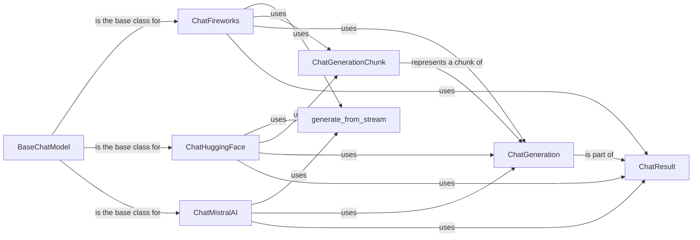

## Component Details

### BaseChatModel
BaseChatModel is an abstract class that serves as the foundation for all chat model integrations. It defines the core methods for generating chat responses, handling streaming, and managing model parameters. Concrete chat model classes, like ChatFireworks, ChatHuggingFace, and ChatMistralAI, inherit from this class and implement the specific logic for interacting with their respective LLM services.
- **Related Classes/Methods**: `langchain_core.language_models.chat_models`

### ChatFireworks
ChatFireworks is a concrete implementation of BaseChatModel that provides an interface to the Fireworks AI Chat API. It handles the specifics of formatting messages, streaming responses, and managing API calls to the Fireworks AI service. It leverages the generate_from_stream function to process streaming responses.
- **Related Classes/Methods**: `repos.langchain.libs.partners.fireworks.langchain_fireworks.chat_models.ChatFireworks`

### ChatHuggingFace
ChatHuggingFace is a concrete implementation of BaseChatModel designed to interact with Hugging Face models. It manages message formatting, handles both streaming and non-streaming responses, and integrates with LangChain's output parsing utilities like JsonOutputParser and RunnablePassthrough for structured output.
- **Related Classes/Methods**: `repos.langchain.libs.partners.huggingface.langchain_huggingface.chat_models.huggingface.ChatHuggingFace`

### ChatMistralAI
ChatMistralAI is a concrete implementation of BaseChatModel that provides an interface for interacting with the Mistral AI Chat API. It includes retry mechanisms, message formatting, and structured output. It uses generate_from_stream to handle streaming responses.
- **Related Classes/Methods**: `repos.langchain.libs.partners.mistralai.langchain_mistralai.chat_models.ChatMistralAI`

### generate_from_stream
generate_from_stream is a utility function used by several chat model implementations (e.g., ChatFireworks, ChatMistralAI) to process a stream of chat generation chunks and assemble them into a complete ChatResult. It abstracts the logic of handling streaming responses from the specific API details of each LLM service.
- **Related Classes/Methods**: `langchain_core.language_models.chat_models.generate_from_stream`

### ChatGenerationChunk
ChatGenerationChunk represents a single chunk of a chat generation, typically used in streaming scenarios. It's a data structure that carries a portion of the generated text or other information from the language model. Chat models use this to progressively return the output.
- **Related Classes/Methods**: `langchain_core.outputs.chat_generation.ChatGenerationChunk`

### ChatGeneration
ChatGeneration represents a single, complete generation from a chat model. It encapsulates the generated text, any associated metadata, and potentially information about the model's input and output. It is a core data structure for representing the result of a chat model interaction.
- **Related Classes/Methods**: `langchain_core.outputs.chat_generation.ChatGeneration`

### ChatResult
ChatResult represents the final result of a chat model generation. It contains a list of ChatGeneration objects, allowing for multiple possible responses or variations from the model. It serves as the container for the complete output of a chat model interaction.
- **Related Classes/Methods**: `langchain_core.outputs.chat_result.ChatResult`
