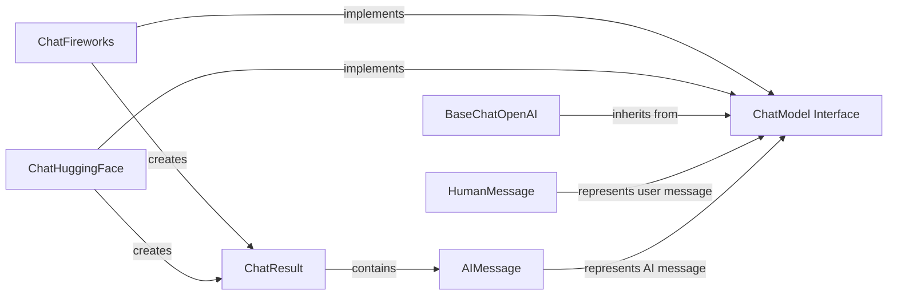

## Component Details

### ChatModel Interface
The ChatModel interface defines the abstract base class for all chat models in LangChain. It provides a unified way to interact with different chat models, regardless of the underlying provider. Key functionalities include methods for predicting chat completions, streaming responses, and managing model parameters. It serves as a contract for concrete chat model implementations.
- **Related Classes/Methods**: `langchain_core.language_models.chat_models.BaseChatModel`

### AIMessage
Represents a message originating from the AI within a chat conversation. It encapsulates the content of the message, which is the text generated by the language model. It also allows for optional metadata to be associated with the message, providing additional context or information.
- **Related Classes/Methods**: `langchain_core.messages.ai.AIMessage`

### HumanMessage
Represents a message originating from a human user within a chat conversation. Similar to AIMessage, it encapsulates the content of the message, which is the text provided by the user. It also allows for optional metadata to be associated with the message.
- **Related Classes/Methods**: `langchain_core.messages.human.HumanMessage`

### ChatResult
Represents the complete result of a call to a chat model. It contains a list of ChatGeneration objects, each representing a single generation from the model. It also includes optional metadata about the call, such as usage information or other relevant details.
- **Related Classes/Methods**: `langchain_core.outputs.chat_result.ChatResult`

### ChatFireworks
ChatFireworks is a concrete implementation of the ChatModel interface specifically designed for interacting with the Fireworks API. It handles the authentication, request formatting, and response parsing required to communicate with the Fireworks language model. It translates LangChain's generic chat model interface into the specific API calls needed for Fireworks.
- **Related Classes/Methods**: `repos.langchain.libs.partners.fireworks.langchain_fireworks.chat_models.ChatFireworks`

### ChatHuggingFace
ChatHuggingFace is a concrete implementation of the ChatModel interface for interacting with Hugging Face models. It manages the formatting of messages, tokenization, and parsing of responses specific to Hugging Face language models. It provides a bridge between LangChain's chat model abstraction and the Hugging Face ecosystem.
- **Related Classes/Methods**: `repos.langchain.libs.partners.huggingface.langchain_huggingface.chat_models.huggingface.ChatHuggingFace`

### BaseChatOpenAI
BaseChatOpenAI serves as a base class for OpenAI chat models within LangChain. It provides common functionality for interacting with OpenAI's chat completion API, including authentication, request construction, and response handling. It encapsulates the core logic for communicating with OpenAI, which is then inherited by specific OpenAI chat model implementations.
- **Related Classes/Methods**: `langchain_openai.chat_models.base.BaseChatOpenAI`
