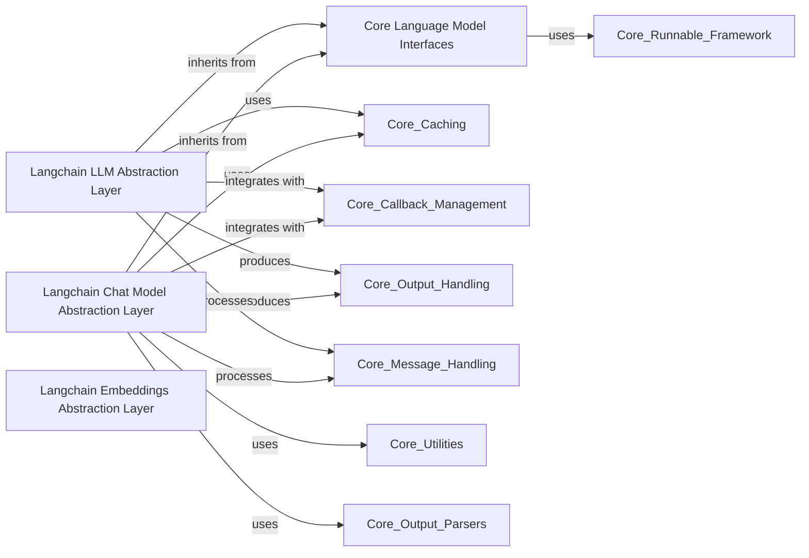

## Component Details

The 'Language Model Interfaces' component provides a unified and extensible framework for interacting with various Large Language Models (LLMs), chat-optimized LLMs, and Embedding Models within LangChain. It defines abstract base classes and common functionalities, enabling seamless integration and interchangeability of different AI model providers while handling complexities such as invocation, streaming, batch processing, caching, and callback management.

### Core Language Model Interfaces
This fundamental component defines the abstract base classes and common methods for all language models (LLMs and Chat Models) and embedding models within Langchain. It establishes the contract for how these models should behave, including methods for invocation, streaming, batch processing, and generation.

**Related Classes/Methods**:

- <a href="https://github.com/langchain-ai/langchain/blob/master/libs/core/langchain_core/language_models/base.py#L97-L401" target="_blank" rel="noopener noreferrer">`langchain_core.language_models.base.BaseLanguageModel` (97:401)</a>
- <a href="https://github.com/langchain-ai/langchain/blob/master/libs/core/langchain_core/language_models/base.py#L54-L54" target="_blank" rel="noopener noreferrer">`langchain_core.language_models.base.LanguageModelInput` (54:54)</a>
- <a href="https://github.com/langchain-ai/langchain/blob/master/libs/core/langchain_core/language_models/base.py#L55-L55" target="_blank" rel="noopener noreferrer">`langchain_core.language_models.base.LanguageModelOutput` (55:55)</a>
- <a href="https://github.com/langchain-ai/langchain/blob/master/libs/core/langchain_core/language_models/base.py#L39-L53" target="_blank" rel="noopener noreferrer">`langchain_core.language_models.base.LangSmithParams` (39:53)</a>

### Langchain LLM Abstraction Layer
This component provides a unified interface for interacting with various Large Language Models (LLMs) within the Langchain framework. It acts as a central entry point for LLM functionalities, dynamically loading specific LLM implementations as needed.

**Related Classes/Methods**:

- <a href="https://github.com/langchain-ai/langchain/blob/master/libs/core/langchain_core/language_models/llms.py#L292-L1442" target="_blank" rel="noopener noreferrer">`langchain_core.language_models.llms.BaseLLM` (292:1442)</a>
- <a href="https://github.com/langchain-ai/langchain/blob/master/libs/core/langchain_core/language_models/llms.py#L1445-L1571" target="_blank" rel="noopener noreferrer">`langchain_core.language_models.llms.LLM` (1445:1571)</a>

### Langchain Chat Model Abstraction Layer
This component offers a consistent interface for working with different Chat Models in Langchain. It handles the dynamic loading of specific chat model implementations and provides base functionalities for chat-based interactions.

**Related Classes/Methods**:

- <a href="https://github.com/langchain-ai/langchain/blob/master/libs/core/langchain_core/language_models/chat_models.py#L205-L1480" target="_blank" rel="noopener noreferrer">`langchain_core.language_models.chat_models.BaseChatModel` (205:1480)</a>
- <a href="https://github.com/langchain-ai/langchain/blob/master/libs/core/langchain_core/language_models/chat_models.py#L1483-L1526" target="_blank" rel="noopener noreferrer">`langchain_core.language_models.chat_models.SimpleChatModel` (1483:1526)</a>

### Langchain Embeddings Abstraction Layer
This component provides a standardized way to generate embeddings from text using various embedding models. It manages the dynamic loading of different embedding implementations and offers core functionalities for embedding generation.

**Related Classes/Methods**:

- <a href="https://github.com/langchain-ai/langchain/blob/master/libs/core/langchain_core/embeddings/embeddings.py#L8-L78" target="_blank" rel="noopener noreferrer">`langchain_core.embeddings.embeddings.Embeddings` (8:78)</a>

### [FAQ](https://github.com/CodeBoarding/GeneratedOnBoardings/tree/main?tab=readme-ov-file#faq)